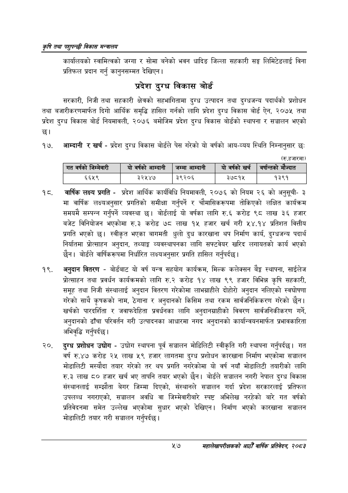

# Page 79 QA

## Rendered page


## Extracted text

```text
कृषि तथा पशुपन्छी विकास मन्वालय
कार्यालयको स्वामित्वको जग्गा र सोमा बनेको भवन धादिङ जिल्ला सहकारी सङ्घ लिमिटेडलाई विना प्रतिफल प्रदान गर्नु कानुनसम्मत देखिएन |
प्रदेश दुग्ध विकास बोर्ड
सरकारी, निजी तथा सहकारी क्षेत्रको सहभागितामा दुग्ध उत्पादन तथा दुग्धजन्य पदार्थको प्रशोधन तथा बजारीकरणमार्फत दिगो आर्थिक समृद्धि हासिल गर्नको लागि प्रदेश दुग्ध विकास बोर्ड ऐन, २०७५ तथा प्रदेश दुग्ध विकास बोर्ड नियमावली, २०७६ बमोजिम प्रदेश दुग्ध विकास बोर्डको स्थापना र सञ्चालन भएको छ।
आम्दानी र खर्च -प्रदेश दुग्ध विकास बोर्डले पेस गरेको यो वर्षको आय-व्यय स्थिति निम्नानुसार छः
(रु.हजारमा)
वार्षिक लक्ष्य प्रगति -प्रदेश आर्थिक कार्यविधि नियमावली, २०७६ को नियम २६ को अनुसूची३ मा वार्षिक लक्ष्यअनुसार प्रगतिको समीक्षा गर्नुपर्ने र चौमासिकरूपमा तोकिएको लक्षित कार्यक्रम समयमै सम्पन्न गर्नुपर्ने व्यवस्था छ। बोर्डलाई यो वर्षका लागि रु.६ करोड ९८ लाख ३६ हजार बजेट विनियोजन भएकोमा रु.३ करोड ७८ लाख १५ हजार खर्च गरी ५४.१४ प्रतिशत वित्तीय प्रगति भएको छ। स्वीकृत भएका बागमती धुलो दुध कारखाना थप निर्माण कार्य, दुग्धजन्य पदार्थ निर्यातमा प्रोत्साहन अनुदान, तथ्याङ्क व्यवस्थापनका लागि सफ्टवेयर खरिद लगायतको कार्य भएको छैन। बोर्डले वार्षिकरूपमा निर्धारित लक्ष्यअनुसार प्रगति हासिल गर्नुपर्दछ |
अनुदान वितरण -बोर्डबाट यो वर्ष यन्त्र सहयोग कार्यक्रम, मिल्क कलेक्सन बेङ्ग स्थापना, साईलेज प्रोत्साहन तथा प्रवर्धन कार्यक्रमको लागि रु.२ करोड १४ लाख ९९ हजार विभिन्न कृषि सहकारी, समूह तथा निजी संस्थालाई अनुदान वितरण गरेकोमा लाभग्राहीले दोहोरो अनुदान नलिएको स्वघोषणा गरेको साथै कृषकको नाम, ठेगाना र अनुदानको किसिम तथा रकम सार्वजनिकिकरण गरेको छैन। खर्चको पारदर्शिता र जवाफदेहिता प्रवर्धनका लागि अनुदानग्राहीको विवरण सार्वजनिकीकरण गर्ने, अनुदानको ढाँचा परिवर्तन गरी उत्पादनका आधारमा नगद अनुदानको कार्यान्वयनमार्फत प्रभावकारिता अभिवृद्धि गर्नुपर्दछ |
दुग्ध प्रशोधन उद्योग -उद्योग स्थापना पूर्व सञ्चालन मोडिलिटी स्वीकृति गरी स्थापना गर्नुपर्दछ। गत वर्ष रु.४७ करोड २५ लाख ५९ हजार लागतमा दुग्ध प्रशोधन कारखाना निर्माण भएकोमा सञ्चालन मोडालिटी मस्यौदा तयार गरेको तर थप प्रगति नगरेकोमा यो वर्ष नयाँ मोडालिटी तयारीको लागि रु.३ लाख ८० हजार खर्च भए तापनि तयार भएको छैन। बोर्डले सञ्चालन नगरी नेपाल दुग्ध विकास संस्थानलाई सम्झौता बेगर जिम्मा दिएको, संस्थानले सञ्चालन गर्दा प्रदेश सरकारलाई प्रतिफल उपलब्ध नगराएको, सञ्चालन अवधि वा जिम्मेवारीबारे स्पष्ट अभिलेख नरहेको बारे गत वर्षको प्रतिवेदनमा समेत उल्लेख भएकोमा सुधार भएको देखिएन। निर्माण भएको कारखाना सञ्चालन मोडालिटी तयार गरी सञ्चालन गर्नुपर्दछ |
५७
महालेखापरीक्षकको आठौँ वाषिकि प्रतिवेदन २०८२

|  |  |  |  |  |  |  |  |  |
| --- | --- | --- | --- | --- | --- | --- | --- | --- |
| गत वर्षको | 'जन्मनारी | योवर्षको आन्दानी | जम्मा आन्दानी | यो | वर्षको |  | षर्ान्तको भे | ज्दात |
|  | ५६५९ | ३२५४७ | ३९२०६ |  | ३७८१४५ |  | १३९१ |  |
```

## Flags
- table_page
- medium_quality_table
