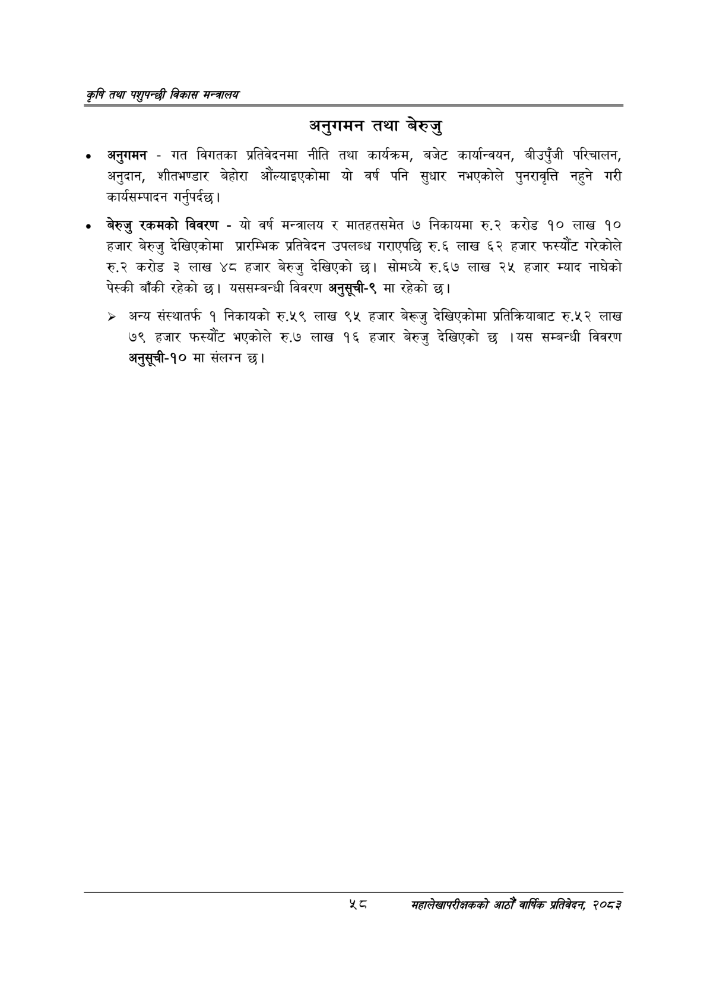

# Page 80 QA

## Rendered page


## Extracted text

```text
कृषि तथा पशुपन्छी विकास मन्वालय
अनुगमन तथा बेरुजु
अनुगमन -गत विगतका प्रतिवेदनमा नीति तथा कार्यक्रम, बजेट कार्यान्वयन, बीउपुँजी परिचालन, अनुदान, शीतभण्डार बेहोरा औंल्याइएकोमा यो वर्ष पनि सुधार नभएकोले पुनरावृत्ति नहुने गरी कार्यसम्पादन गर्नुपर्दछ |
बेरुजु रकमको विवरण -यो वर्ष मन्त्रालय र मातहतसमेत ७ निकायमा रु.२ करोड १० लाख १० हजार बेरुजु देखिएकोमा प्रारम्भिक प्रतिवेदन उपलब्ध गराएपछि रु.६ लाख ६२ हजार फस्यौट गरेकोले करोड ३ लाख ४८ हजार बेरुजु देखिएको छ। सोमध्ये रु.६७ लाख २५ हजार म्याद नाघेको पेस्की बाँकी रहेको छ। यससम्बन्धी विवरण अनुसूची-९ मा रहेको |
> अन्य संस्थातर्फ १ निकायको रु.५९ लाख ९५ हजार बेरूजु देखिएकोमा प्रतिक्रियाबाट रु.५२ लाख ७९ हजार फस्यौट भएकोले रु.७ लाख १६ हजार बेरुजु देखिएको छ।यस सम्बन्धी विवरण अनुसूची-१० मा संलग्न छ।
महालेखापरीक्षकको आठौँ वाषिकि प्रतिवेदन २०८२
```

## Flags
- None
