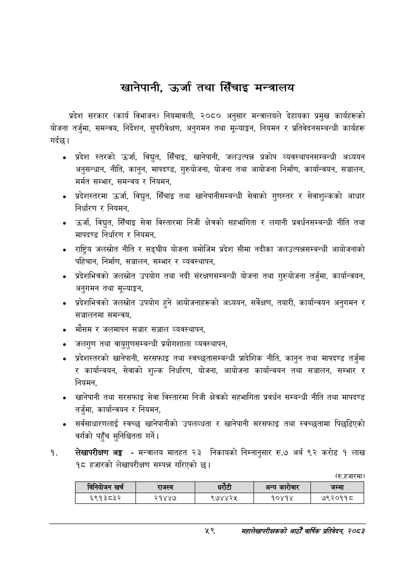

# Page 81 QA

## Rendered page


## Extracted text

```text
खानेपानी, उर्जा तथा सिँचाइ मन्त्रालय
प्रदेश सरकार (कार्य विभाजन) नियमावली, २०८० अनुसार मन्त्रालयले देहायका प्रमुख कार्यहरूको योजना तर्जुमा, समन्वय, निर्देशन, सुपरीवेक्षण, अनुगमन तथा मूल्याङ्कन, नियमन र प्रतिवेदनसम्बन्धी कार्यहरू गर्दछु।
प्रदेश स्तरको उर्जा, विद्युत, सिँचाइ, खानेपानी, जलउत्पन्न प्रकोप व्यवस्थापनसम्बन्धी अध्ययन अनुसन्धान, नीति, कानुन, मापदण्ड, गुरुयोजना, योजना तथा आयोजना निर्माण, कार्यान्वयन, सञ्चालन, मर्मत सम्भार, समन्वय र नियमन,
प्रदेशस्तरमा उर्जा, विद्युत, सिँचाइ तथा खानेपानीसम्बन्धी सेवाको गुणस्तर र सेवाशुल्कको आधार निर्धारण र नियमन,
उर्जा, विद्युत, सिँचाइ सेवा विस्तारमा निजी क्षेत्रको सहभागिता र लगानी प्रवर्धनसम्बन्धी नीति तथा मापदण्ड निर्धारण र नियमन,
राष्ट्रिय जलस्रोत नीति र सङ्घीय योजना बमोजिम प्रदेश सीमा नदीका जलउत्पन्नसम्बन्धी आयोजनाको पहिचान, निर्माण, सञ्चालन, सम्भार र व्यवस्थापन,
प्रदेशभित्रको जलस्रोत उपयोग तथा नदी संरक्षणसम्बन्धी योजना तथा गुरुयोजना तर्जुमा, कार्यान्वयन, अनुगमन तथा मूल्याङ्कन,
प्रदेशभित्रको जलस्रोत उपयोग हुने आयोजनाहरूको अध्ययन, सर्वेक्षण, तयारी, कार्यान्वयन अनुगमन र सञ्चालनमा समन्वय,
मौसम र जलमापन सञ्चार सञ्जाल व्यवस्थापन,
जलगुण तथा वायुगुणसम्बन्धी प्रयोगशाला व्यवस्थापन,
प्रदेशस्तरको खानेपानी, सरसफाइ तथा स्वच्छुतासम्बन्धी प्रादेशिक नीति, कानुन तथा मापदण्ड तर्जुमा र कार्यान्वयन, सेवाको शुल्क निर्धारण, योजना, आयोजना कार्यान्वयन तथा सञ्चालन, सम्भार र नियमन,
खानेपानी तथा सरसफाइ सेवा विस्तारमा निजी क्षेत्रको सहभागिता प्रवर्धन सम्बन्धी नीति तथा मापदण्ड तर्जुमा, कार्यान्वयन र नियमन,
सर्वसाधारणलाई स्वच्छ खानेपानीको उपलब्धता र खानेपानी सरसफाइ तथा स्वच्छतामा पिछडिएको वर्गको पहुँच सुनिश्चितता गर्ने |
लेखापरीक्षण अङ्ग -मन्त्रालय मातहत २३ निकायको निम्नानुसार रु.७ अर्ब ९२ करोड १ लाख १८ हजारको लेखापरीक्षण सम्पन्न गरिएको छ।
(रु.हजारमा)
५९
महालेखापरीक्षकको आठौँ वाषिकि प्रतिवेदन २०८२

|  |  | निनेवोजन खरी |  | राजस्व |  |  | अन्य कारोबार | जम्मा |
| --- | --- | --- | --- | --- | --- | --- | --- | --- |
|  |  | ६९१३८३२ |  | २१४४७ | ९७४८४२४५ |  | १०४१४ | ७९२०११८ |
```

## Flags
- table_page
- medium_quality_table
