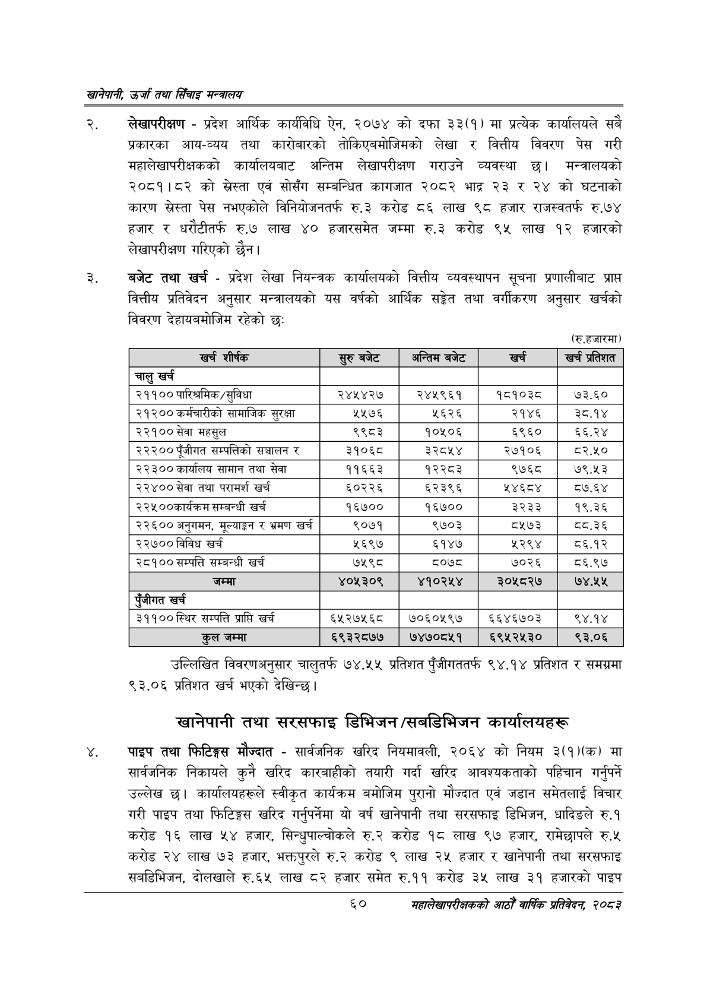

# Page 82 QA

## Rendered page


## Extracted text

```text
खानेपानी उर्जा तथा सिँचाइ मन्त्रालय
लेखापरीक्षण -प्रदेश आर्थिक कार्यविधि ऐन, २०७४ को दफा ३३(१) मा प्रत्येक कार्यालयले सबै प्रकारका आय-व्यय तथा कारोबारको तोकिएबमोजिमको लेखा र वित्तीय विवरण पेस गरी महालेखापरीक्षकको कार्यालयबाट अन्तिम लेखापरीक्षण गराउने व्यवस्था छ। मन्त्रालयको २०८१।८२ को स्रेस्ता एवं सोसँग सम्बन्धित कागजात २०८२ भाद्र २३ र २४ को घटनाको कारण स्रेस्ता पेस नभएकोले विनियोजनतर्फ रु.३ करोड ८६ लाख ९८ हजार राजस्वतर्फ रु.७४ हजार र धरौटीतर्फ रु.७ लाख ४० हजारसमेत जम्मा रु.३ करोड ९५ लाख १२ हजारको लेखापरीक्षण गरिएको छैन।
बजेट तथा खर्च -प्रदेश लेखा नियन्त्रक कार्यालयको वित्तीय व्यवस्थापन सूचना प्रणालीबाट प्राप्त वित्तीय प्रतिवेदन अनुसार मन्त्रालयको यस वर्षको आर्थिक सङ्गेत तथा वर्गीकरण अनुसार खर्चको विवरण देहायबमोजिम रहेको छ:
शकक
(रु.हजारमा)
खर्च
।]
खर्च
प्रतिशत
उल्लिखित विवरणअनुसार चालुतर्फ ७४.५५ प्रतिशत पुँजीगततर्फ ९४.१४ प्रतिशत र समग्रमा ९३.०६ प्रतिशत खर्च भएको देखिन्छ।
खानेपानी तथा सरसफाइ डिभिजन /सबडिभिजन कार्यालयहरू
पाइप तथा फिटिङ्गस मौज्दात -सार्वजनिक खरिद नियमावली, २०६४ को नियम ३(१)(क) मा सार्वजनिक निकायले कुनै खरिद कारबाहीको तयारी गर्दा खरिद आवश्यकताको पहिचान गर्नुपर्ने उल्लेख छ। कार्यालयहरूले स्वीकृत कार्यक्रम बमोजिम पुरानो मौज्दात एवं जडान समेतलाई विचार गरी पाइप तथा फिटिङ्गस खरिद गर्नुपर्नेमा यो वर्ष खानेपानी तथा सरसफाइ डिभिजन, धादिङले रु.१ करोड १६ लाख ५४ हजार, सिन्धुपाल्चोकले रु.२ करोड १८ लाख ९७ हजार, रामेछापले रु.५ करोड २४ लाख ७३ हजार, भक्तपुरले रु.२ करोड ९ लाख २५ हजार र खानेपानी तथा सरसफाइ सबडिभिजन, दोलखाले रु.६५ लाख ८२ हजार समेत रु.११ करोड ३५ लाख ३९ हजारको पाइप
६०
महालेखापरीक्षकको आठौँ वाषिकि प्रतिवेदन २०८२

| खर शीर्षक | बजेट | अन्तिम बजेट | खरी | खर्च प्रतिशत |
| --- | --- | --- | --- | --- |
| चालु खर्च |  |  |  |  |
| २११०० पारिश्रमिक/सुविधा | २४५४२७ | २४५९६१ | १८१०३८ | ७३.६० |
| २१२०० कर्मचारीको लामाजिक सुरक्षा | २५७६ | ५६२६ | २१४६ | ३८.१४ |
| २२१०० सेवा महसुल | ९९८३ | १०५०६ | ६९६० | ६६.२४ |
| २२२०० पूँजीगत कषब्पतिको सञ्चालन | ३१०६८ | ३२८५४ | २७१०६ | ८२.५० |
| २२३०० कार्यालय सामान तथा सेवा | ११६६३ | १२२८३ | ९७६८ | ७९.५३ |
| २२४०० सेवा तथा परामर्श खर्च | ६०२२६ | ६२३९६ |  | ८७.६४ |
| २२५००कार्यक्रम सम्बन्धी खर्च | १६७०० | १६७०० | ३२३३ | १९.३६ |
| २२६०० अनुगमन, २ूथाङ्कण र भ्रमण खर्च | ९०७१ | ९७०३ | ८५७३ |  |
| २२७०० विविध खर्च | २६९७ | ६१४७ | २२९४ | ८६.१२ |
| २८१०० सम्पत्ति सम्बन्धी खर्च | ७५९८ | ८०७८ | ७०२६ | ८६.९७ |
| जम्मा | ४०५३०९ | ४१०२५४ | ३०५८२७ | ७४,२४५ |
| पूँजीगत खर्च |  |  |  |  |
| ३९९०० स्थिर सम्पत्ति प्राप्ति खर्च | ६५२२७५६८ | ७०६०५९७ | ६६४६७०३ | ९४.१४ |
| कुल जम्मा | ६९३२८७७ | ७४७०८५१ | ६९५२५३० | ९३.०६ |
```

## Flags
- table_page
- medium_quality_table
