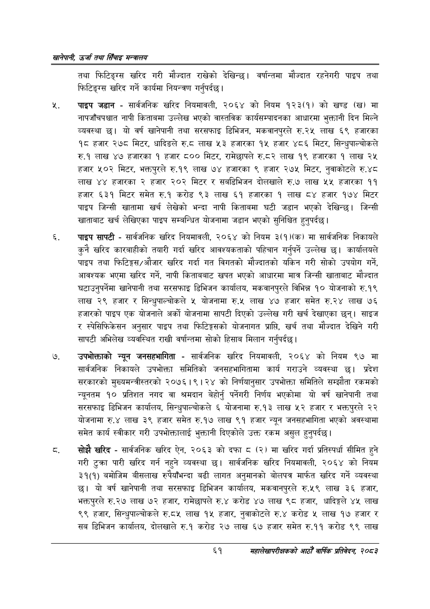

# Page 83 QA

## Rendered page


## Extracted text

```text
खानेपानी उर्जा तथा सिँचाइ मन्त्रालय
तथा फिटिङ्ग्स खरिद गरी मौज्दात राखेको देखिन्छ। वर्षान्तमा मौज्दात रहनेगरी पाइप तथा फिटिङ्ग्स खरिद गर्ने कार्यमा नियन्त्रण गर्नुपर्दछ |
पाइप जडान -सार्वजनिक खरिद नियमावली, २०६४ को नियम १२३(१) को खण्ड (ख) मा नापजाँचपश्चात नापी किताबमा उल्लेख भएको वास्तविक कार्यसम्पादनका आधारमा भुक्तानी दिन मिल्ने व्यवस्था छ। यो वर्ष खानेपानी तथा सरसफाइ डिभिजन, मकवानपुरले रु.२५ लाख ६९ हजारका १८ हजार २७८ मिटर, धादिङले रु.८ लाख ५३ हजारका १५ हजार ४८६ मिटर, सिन्धुपाल्चोकले रु.१ लाख ४७ हजारका १ हजार ८०० मिटर, रामेछापले रु.८२ लाख १९ हजारका १ लाख २५ हजार ५०२ मिटर, भक्तपुरले रु.१९ लाख ७४ हजारका ९ हजार २७५ मिटर, नुवाकोटले रु.४८ लाख ४४ हजारका २ हजार २०२ मिटर र सबडिभिजन दोलखाले रु.७ लाख ५४ हजारका ११ हजार ६३१ मिटर समेत रु.१ करोड ९३ लाख ६१ हजारका १ लाख ८४ हजार १७४ मिटर पाइप जिन्सी खातामा खर्च लेखेको भन्दा नापी किताबमा घटी जडान भएको देखिन्छ। जिन्सी खाताबाट खर्च लेखिएका पाइप सम्बन्धित योजनामा जडान भएको सुनिश्चित हुनुपर्दछ |
पाइप सापटी -सार्वजनिक खरिद नियमावली, २०६४ को नियम ३(१)(क) मा सार्वजनिक निकायले कुनै खरिद कारबाहीको तयारी गर्दा खरिद आवश्यकताको पहिचान गर्नुपर्ने उल्लेख छ। कार्यालयले पाइप तथा फिटिङ्गस/औजार खरिद गर्दा गत विगतको मौज्दातको यकिन गरी सोको उपयोग गर्ने, आवश्यक भएमा खरिद गर्ने, नापी किताबबाट खपत भएको आधारमा मात्र जिन्सी खाताबाट मौज्दात घटाउनुपर्नेमा खानेपानी तथा सरसफाइ डिभिजन कार्यालय, मकवानपुरले विभिन्न १० योजनाको रु.१९ लाख २९ हजार र सिन्धुपाल्चोकले ५ योजनामा रु.५ लाख ४७ हजार समेत रु.२४ लाख ७६ हजारको पाइप एक योजनाले अर्को योजनामा सापटी दिएको उल्लेख गरी खर्च देखाएका छन्‌। साइज र स्पेसिफिकेसन अनुसार पाइप तथा फिटिङ्गसको योजनागत प्राप्ति, खर्च तथा मौज्दात देखिने गरी सापटी अभिलेख व्यवस्थित राखी वर्षान्तमा सोको हिसाब मिलान गर्नुपर्दछ |
उपभोक्ताको न्यून जनसहभागिता -सार्वजनिक खरिद नियमावली, २०६४ को नियम ९७ मा सार्वजनिक निकायले उपभोक्ता समितिको जनसहभागितामा कार्य गराउने व्यवस्था छ। प्रदेश सरकारको मुख्यमन्त्रीस्तरको २०७६।९।२४ को निर्णयानुसार उपभोक्ता समितिले सम्झौता रकमको न्यूनतम १० प्रतिशत नगद वा श्रमदान बेहोर्नु पर्नेगरी निर्णय भएकोमा यो वर्ष खानेपानी तथा सरसफाइ डिभिजन कार्यालय, सिन्धुपाल्चोकले ६ योजनामा रु.१३ लाख ५२ हजार र भक्तपुरले २२ योजनामा € लाख ३९ हजार समेत रु.१७ लाख ९१ हजार न्यून जनसहभागिता भएको अवस्थामा समेत कार्य स्वीकार गरी उपभोक्तालाई भुक्तानी दिएकोले उक्त रकम असुल हुन्‌पर्दछ।
सोझै खरिद -सार्वजनिक खरिद ऐन, २०६३ को दफा ८ (२) मा खरिद गर्दा प्रतिस्पर्धा सीमित हुने गरी टुक्रा पारी खरिद गर्न नहुने व्यवस्था छ। सार्वजनिक खरिद नियमावली, २०६४ को नियम ३१(१) बमोजिम बीसलाख रुपैयाँभन्दा बढी लागत अनुमानको बोलपत्र मार्फत खरिद गर्ने व्यवस्था छ। यो वर्ष खानेपानी तथा सरसफाइ डिभिजन कार्यालय, मकवानपुरले रु.५९ लाख ३६ हजार, भक्तपुरले रु.२७ लाख ७२ हजार, रामेछापले रु.४ करोड ४७ लाख ९८ हजार, धादिङ्गले ४५ लाख ९९ हजार, सिन्धुपाल्चोकले रु.८५ लाख १५ हजार, नुवाकोटले रु.४ करोड ५ लाख १७ हजार र सब डिभिजन कार्यालय, दोलखाले रु.१ करोड २७ लाख ६७ हजार समेत रु.११ करोड ९९ लाख
६१
महालेखापरीक्षकको आठौँ वाषिकि प्रतिवेदन २०८२
```

## Flags
- None
