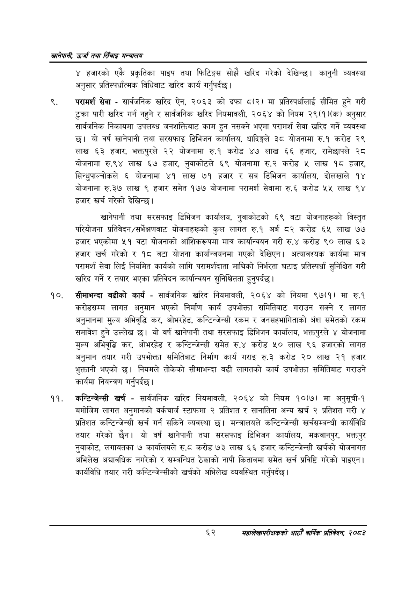

# Page 84 QA

## Rendered page


## Extracted text

```text
खानेपानी उर्जा तथा सिँचाइ मन्त्रालय
४ हजारको एकै प्रकृतिका पाइप तथा फिटिङ्गस सोझै खरिद गरेको देखिन्छ। कानुनी व्यवस्था अनुसार प्रतिस्पर्धात्मक विधिबाट खरिद कार्य गर्नुपर्दछ |
परामर्श सेवा -सार्वजनिक खरिद ऐन, २०६३ को दफा ८(२) मा प्रतिस्पर्धालाई सीमित हुने गरी टुक्रा पारी खरिद गर्न नहुने र सार्वजनिक खरिद नियमावली, २०६४ को नियम २९(१)(क) अनुसार सार्वजनिक निकायमा उपलब्ध जनशक्तिबाट काम हुन नसक्ने भएमा परामर्श सेवा खरिद गर्ने व्यवस्था छ। यो वर्ष खानेपानी तथा सरसफाइ डिभिजन कार्यालय, धादिङ्गले ३८ योजनामा रु.१ करोड २९ लाख ६३ हजार, भक्तपुरले २२ योजनामा रु.१ करोड ४७ लाख ६६ हजार, रामेछापले २८ योजनामा रु.९४ लाख ६७ हजार, नुवाकोटले ६९ योजनामा करोड ५ लाख १८ हजार, सिन्धुपाल्चोकले ६ योजनामा ४१ लाख ७१ हजार र सब डिभिजन कार्यालय, दोलखाले १४ योजनामा रु.३७ लाख ९ हजार समेत १७७ योजनामा परामर्श सेवामा रु.६ करोड ५५ लाख ९४ हजार खर्च गरेको देखिन्छ |
खानेपानी तथा सरसफाइ डिभिजन कार्यालय, नुवाकोटको ६९ वटा योजनाहरूको विस्तृत परियोजना प्रतिवेदन/सर्भेक्षणबाट योजनाहरूको कुल लागत रु.१ अर्ब ८२ करोड ६५ लाख ७७ हजार भएकोमा ५१ वटा योजनाको आंशिकरूपमा मात्र कार्यान्वयन गरी रु.४ करोड ९० लाख ६३ हजार खर्च गरेको र १८ वटा योजना कार्यान्वयनमा गएको देखिएन। अत्यावश्यक कार्यमा मात्र परामर्श सेवा लिई नियमित कार्यको लागि परामर्शदाता माथिको निर्भरता घटाइ प्रतिस्पर्धा सुनिश्चित गरी खरिद गर्ने र तयार भएका प्रतिवेदन कार्यान्वयन सुनिश्चितता हुनुपर्दछ |
सीमाभन्दा बढीको कार्य -सार्वजनिक खरिद नियमावली, २०६४ को नियमा ९७(१) मा रु.१ करोडसम्म लागत अनुमान भएको निर्माण कार्य उपभोक्ता समितिबाट गराउन सक्ने र लागत अनुमानमा मुल्य अभिवृद्धि कर, ओभरहेड, कन्टिन्जेन्सी रकम र जनसहभागिताको अंश समेतको रकम समावेश हुने उल्लेख | यो वर्ष खानेपानी तथा सरसफाइ डिभिजन कार्यालय, भक्तपुरले ४ योजनामा मुल्य अभिवृद्धि कर, ओभरहेड र कन्टिन्जेन्सी समेत रु.४ करोड ५० लाख ९६ हजारको लागत अनुमान तयार गरी उपभोक्ता समितिबाट निर्माण कार्य गराइ रु.३ करोड २० लाख २१ हजार भुक्तानी भएको छ। नियमले तोकेको सीमाभन्दा बढी लागतको कार्य उपभोक्ता समितिबाट गराउने कार्यमा नियन्त्रण गर्नुपर्दछ |
'कन्टिन्जेन्सी खर्च -सार्वजनिक खरिद नियमावली, २०६४ को नियम १०(७) मा अनुसूची-१ बमोजिम लागत अनुमानको वर्कचार्ज स्टाफमा २ प्रतिशत र सानातिना अन्य खर्च २ प्रतिशत गरी ४ प्रतिशत कन्टिन्जेन्सी खर्च गर्न सकिने व्यवस्था | मन्त्रालयले कन्टिन्जेन्सी खर्चसम्बन्धी कार्यविधि तयार गरेको छैन। यो वर्ष खानेपानी तथा सरसफाइ डिभिजन कार्यालय, मकवानपुर, भक्तपुर नुवाकोट, लगायतका ७ कार्यालयले रु.८ करोड ७३ लाख ६६ हजार कन्टिन्जेन्सी खर्चको योजनागत अभिलेख अद्यावधिक नगरेको र सम्बन्धित ठेक्काको नापी किताबमा समेत खर्च प्रविष्टि गरेको पाइएन | कार्यविधि तयार गरी कन्टिन्जेन्सीको खर्चको अभिलेख व्यवस्थित गर्नुपर्दछ |
६२
महालेखापरीक्षकको आठौँ वाषिकि प्रतिवेदन २०८२
```

## Flags
- None
