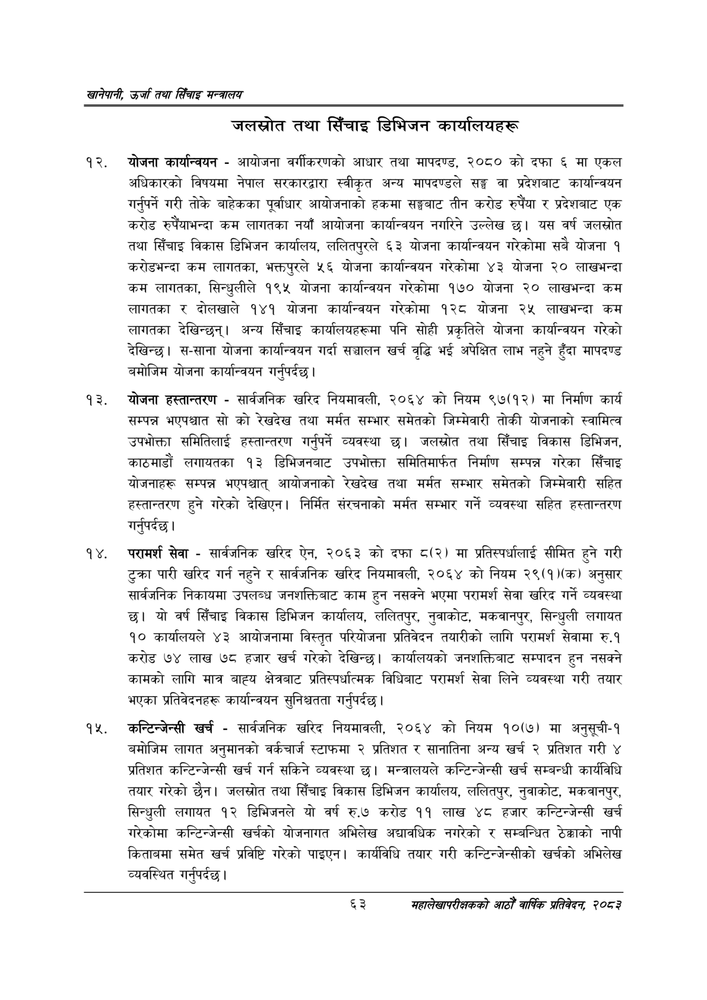

# Page 85 QA

## Rendered page


## Extracted text

```text
खानेपानी उर्जा तथा सिँचाइ मन्त्रालय
जलस्रोत तथा सिँचाइ डिभिजन कार्यालयहरू
योजना कार्यान्वयन -आयोजना वर्गीकरणको आधार तथा मापदण्ड, २०८० को दफा ६ मा एकल अधिकारको विषयमा नेपाल सरकारद्वारा स्वीकृत अन्य मापदण्डले सङ्घ वा प्रदेशबाट कार्यान्वयन गर्नुपर्ने गरी तोके बाहेकका पूर्वाधार आयोजनाको हकमा सङ्घबाट तीन करोड रुपैया र प्रदेशबाट एक करोड रुपैयाभन्दा कम लागतका नयाँ आयोजना कार्यान्वयन नगरिने उल्लेख छ। यस वर्ष जलस्रोत तथा सिँचाइ विकास डिभिजन कार्यालय, ललितपुरले ६३ योजना कार्यान्वयन गरेकोमा सबै योजना १ करोडभन्दा कम लागतका, भक्तपुरले ५६ योजना कार्यान्वयन गरेकोमा ४३ योजना २० लाखभन्दा कम लागतका, सिन्धुलीले १९५ योजना कार्यान्वयन गरेकोमा १७० योजना २० लाखभन्दा कम लागतका र दोलखाले १४१ योजना कार्यान्वयन गरेकोमा १२८ योजना २५ लाखभन्दा कम लागतका देखिन्छन्‌। अन्य सिँचाइ कार्यालयहरूमा पनि सोही प्रकृतिले योजना कार्यान्वयन गरेको देखिन्छ। स-साना योजना कार्यान्वयन गर्दा सञ्चालन खर्च वृद्धि भई अपेक्षित लाभ नहुने हुँदा मापदण्ड बमोजिम योजना कार्यान्वयन गर्नुपर्दछ |
योजना हस्तान्तरण -सार्वजनिक खरिद नियमावली, २०६४ को नियम ९७(१२) मा निर्माण कार्य सम्पन्न भएपश्चात सो को रेखदेख तथा मर्मत सम्भार समेतको जिम्मेवारी तोकी योजनाको स्वामित्व उपभोक्ता समितिलाई हस्तान्तरण गर्नुपर्ने व्यवस्था छ। जलस्रोत तथा सिँचाइ विकास डिभिजन, काठमाडौं लगायतका १३ डिभिजनबाट उपभोक्ता समितिमार्फत निर्माण सम्पन्न गरेका सिँचाइ योजनाहरू सम्पन्न भएपश्चात्‌ आयोजनाको रेखदेख तथा मर्मत सम्भार समेतको जिम्मेवारी सहित हस्तान्तरण हुने गरेको देखिएन। निर्मित संरचनाको मर्मत सम्भार गर्ने व्यवस्था सहित हस्तान्तरण गर्नुपर्दछ |
परामर्श सेवा -सार्वजनिक खरिद ऐन, २०६३ को दफा ८(२) मा प्रतिस्पर्धालाई सीमित हुने गरी टुक्रा पारी खरिद गर्न नहुने र सार्वजनिक खरिद नियमावली, २०६४ को नियम २९(१)(क) अनुसार सार्वजनिक निकायमा उपलब्ध जनशक्तिबाट काम हुन नसक्ने भएमा परामर्श सेवा खरिद गर्ने व्यवस्था छ। यो वर्ष सिँचाइ विकास डिभिजन कार्यालय, ललितपुर, नुवाकोट, मकवानपुर, सिन्धुली लगायत १० कार्यालयले ४३ आयोजनामा विस्तृत परियोजना प्रतिवेदन तयारीको लागि परामर्श सेवामा रु.१ करोड ७४ लाख ७८ हजार खर्च गरेको देखिन्छ। कार्यालयको जनशक्तिबाट सम्पादन हुन नसक्ने कामको लागि मात्र बाह्य क्षेत्रबाट प्रतिस्पर्धात्मक विधिबाट परामर्श सेवा लिने व्यवस्था गरी तयार भएका प्रतिवेदनहरू कार्यान्वयन सुनिश्चतता गर्नुपर्दछ |
'कन्टिन्जेन्सी खर्च -सार्वजनिक खरिद नियमावली, २०६४ को नियम १०(७) मा अनुसूची-१ बमोजिम लागत अनुमानको वर्कचार्ज स्टाफमा २ प्रतिशत र सानातिना अन्य खर्च २ प्रतिशत गरी ४ प्रतिशत कन्टिन्जेन्सी खर्च गर्न सकिने व्यवस्था छ। मन्त्रालयले कन्टिन्जेन्सी खर्च सम्बन्धी कार्यविधि तयार गरेको छैन। जलस्रोत तथा सिँचाइ विकास डिभिजन कार्यालय, ललितपुर, नुवाकोट, मकवानपुर, सिन्धुली लगायत १२ डिभिजनले यो वर्ष रु.७ करोड ११ लाख ४८ हजार कन्टिन्जेन्सी खर्च गरेकोमा कन्टिन्जेन्सी खर्चको योजनागत अभिलेख अद्यावधिक नगरेको र सम्बन्धित ठेक्काको नापी किताबमा समेत खर्च प्रविष्टि गरेको पाइएन। कार्यविधि तयार गरी कन्टिन्जेन्सीको खर्चको अभिलेख व्यवस्थित गर्नुपर्दछ |
६३
महालेखापरीक्षकको आठौँ वाषिकि प्रतिवेदन २०८२
```

## Flags
- None
