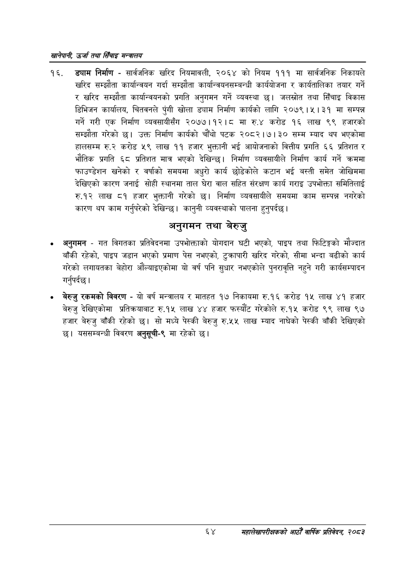

# Page 86 QA

## Rendered page


## Extracted text

```text
खानेपानी उर्जा तथा सिँचाइ मन्त्रालय
ड्याम निर्माण -सार्वजनिक खरिद नियमावली, २०६४ को नियम १११ मा सार्वजनिक निकायले खरिद सम्झौता कार्यान्वयन गर्दा सम्झौता कार्यान्वयनसम्बन्धी कार्ययोजना र कार्यतालिका तयार गर्ने र खरिद सम्झौता कार्यान्वयनको प्रगति अनुगमन गर्ने व्यवस्था छ। जलस्रोत तथा सिँचाइ विकास डिभिजन कार्यालय, चितवनले पुंगी खोला ड्याम निर्माण कार्यको लागि २०७९।५। ३१ मा सम्पन्न गर्ने गरी एक निर्माण व्यवसायीसँग २०७७।१२।८ मा रु.४ करोड १६ लाख ९९ हजारको सम्झौता गरेको | उक्त निर्माण कार्यको पटक २०८२।७। ३० सम्म म्याद थप भएकोमा हालसम्म करोड ५९ लाख ११ हजार भुक्तानी भई आयोजनाको वित्तीय प्रगति ६६ प्रतिशत र भौतिक प्रगति ६८ प्रतिशत मात्र भएको देखिन्छ। निर्माण व्यवसायीले निर्माण कार्य गर्ने क्रममा फाउण्डेशन खनेको र वर्षाको समयमा अधुरो कार्य छोडेकोले कटान भई बस्ती समेत जोखिममा देखिएको कारण जनाई सोही स्थानमा ताल घेरा वाल सहित संरक्षण कार्य गराइ उपभोक्ता समितिलाई रु.१२ लाख ८१ हजार भुक्तानी गरेको छ। निर्माण व्यवसायीले समयमा काम सम्पन्न नगरेको कारण थप काम गर्नुपरेको देखिन्छ। कानुनी व्यवस्थाको पालना हुनुपर्दछ |
अनुगमन तथा बेरुजु
० अनुगमन -गत विगतका प्रतिवेदनमा उपभोक्ताको योगदान घटी भएको, पाइप तथा फिटिङ्गको मौज्दात बाँकी रहेको, पाइप जडान भएको प्रमाण पेस नभएको, टुक्रापारी खरिद गरेको, सीमा भन्दा बढीको कार्य गरेको लगायतका बेहोरा औंल्याइएकोमा यो वर्ष पनि सुधार नभएकोले पुनरावृत्ति नहुने गरी कार्यसम्पादन गर्नुपर्दछ |
बेरुजु रकमको विवरण -यो वर्ष मन्त्रालय र मातहत १७ निकायमा रु.१६ करोड १५ लाख ४१ हजार बेरुजु देखिएकोमा प्रतिक्रयाबाट रु.१५ लाख ४४ हजार फस्यौट गरेकोले रु.१५ करोड ९९ लाख ९७ हजार बेरुजु बाँकी रहेको छ। सो मध्ये पेस्की बेरुजु रु.५५ लाख म्याद नाघेको पेस्की बाँकी देखिएको छ। यससम्बन्धी विवरण अनुसूची-९ मा रहेको
६४
महालेखापरीक्षकको आठौँ वाषिकि प्रतिवेदन २०८२
```

## Flags
- None
