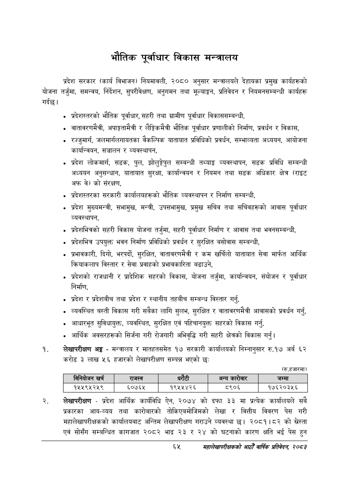

# Page 87 QA

## Rendered page


## Extracted text

```text
भौतिक पूर्वाधार विकास मन्त्रालय
गर्दछ | प्रदेश सरकार (कार्य विभाजन) नियमावली, २०८० अनुसार मन्त्रालयले देहायका प्रमुख कार्यहरूको योजना तर्जुमा, समन्वय, निर्देशन, सुपरीवेक्षण, अनुगमन तथा मूल्याङ्कन, प्रतिवेदन र नियमनसम्बन्धी कार्यहरू
प्रदेशस्तरको भौतिक पूर्वाधार, सहरी तथा ग्रामीण पूर्वाधार विकाससम्बन्धी,
वातावरणमैत्री, अपाङ्गतामैत्री र लैङ्गिकमैत्री भौतिक पूर्वाधार प्रणालीको निर्माण, प्रवर्धन र विकास,
रज्जुमार्ग, जलमार्गलगायतका वैकल्पिक यातायात प्रविधिको प्रवर्धन, सम्भाव्यता अध्ययन, आयोजना कार्यान्वयन, सञ्चालन र व्यवस्थापन,
प्रदेश लोकमार्ग, सडक, पुल, झोलुङ्गेपुल सम्बन्धी तथ्याङ्क व्यवस्थापन, सडक प्रविधि सम्बन्धी अध्ययन अनुसन्धान, यातायात सुरक्षा, कार्यान्वयन र नियमन तथा सडक अधिकार क्षेत्र (राइट अफ वे) को संरक्षण,
प्रदेशस्तरका सरकारी कार्यालयहरूको भौतिक व्यवस्थापन र निर्माण सम्बन्धी,
प्रदेश मुख्यमन्त्री, सभामुख, मन्त्री, उपसभामुख, प्रमुख सचिव तथा सचिवहरूको आवास पूर्वाधार व्यवस्थापन,
प्रदेशभित्रको सहरी विकास योजना तर्जुमा, सहरी पूर्वाधार निर्माण र आवास तथा भवनसम्बन्धी,
प्रदेशभित्र उपयुक्त भवन निर्माण प्रविधिको प्रवर्धन र सुरक्षित बसोवास सम्बन्धी,
प्रभावकारी, दिगो, भरपर्दो, सुरक्षित, वातावरणमैत्री र कम खर्चिलो यातायात सेवा मार्फत आर्थिक क्रियाकलाप विस्तार र सेवा प्रवाहको प्रभावकारिता बढाउने,
प्रदेशको राजधानी र प्रादेशिक सहरको विकास, योजना तर्जुमा, कार्यान्वयन, संयोजन र पूर्वाधार निर्माण,
प्रदेश र प्रदेशबीच तथा प्रदेश र स्थानीय तहबीच सम्बन्ध विस्तार गर्नु,
व्यवस्थित बस्ती विकास गरी सबैका लागि सुलभ, सुरक्षित र वातावरणमैत्री आवासको प्रवर्धन गर्न,
आधारभूत सुविधायुक्त, व्यवस्थित, सुरक्षित एवं पहिचानयुक्त सहरको विकास गर्नु,
आर्थिक अवसरहरूको सिर्जना गरी रोजगारी अभिवृद्धि गरी सहरी क्षेत्रको विकास गर्नु।
लेखापरीक्षण अङ्ग -मन्त्रालय र मातहतसमेत १७ सरकारी कार्यालयको निम्नानुसार रु.१७ अर्ब ६२ करोड ३ लाख ५६ हजारको लेखापरीक्षण सम्पन्न भएको छ:
(रु.हजारमा)
लेखापरीक्षण -प्रदेश आर्थिक कार्यविधि ऐन, २०७४ को दफा ३३ मा प्रत्येक कार्यालयले सबै प्रकारका आय-व्यय तथा कारोबारको तोकिएबमोजिमको लेखा र वित्तीय विवरण पेस गरी महालेखापरीक्षकको कार्यालयबाट अन्तिम लेखापरीक्षण गराउने व्यवस्था छ। २०८१।८२ को स्लेस्ता एवं सोसँग सम्बन्धित कागजात २०८२ भाद्र २३ र २४ को घटनाको कारण क्षति भई पेस हुन
६५
महालेखापरीक्षकको आठौँ वाषिकि प्रतिवेदन २०८२

|  |  | ननिबोजन खरी |  | राजस्व |  |  | अन्य कारोबार | जम्मा |
| --- | --- | --- | --- | --- | --- | --- | --- | --- |
|  |  | १५५९५२५९ |  | ६०७६४५ | १९५४५४२६ |  | ८९०६ | १७६२०३५६ |
```

## Flags
- table_page
- medium_quality_table
