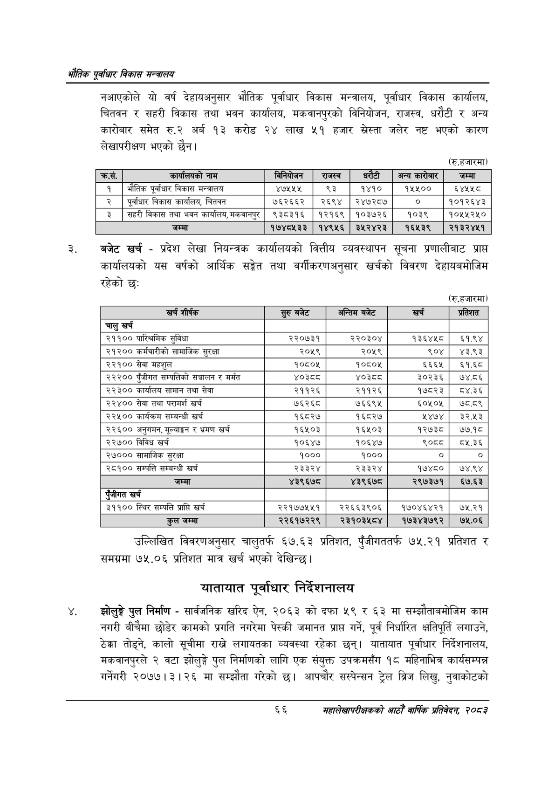

# Page 88 QA

## Rendered page


## Extracted text

```text
एवधार विकास मन्त्रालय
नआएकोले यो वर्ष देहायअनुसार भौतिक पूर्वाधार विकास मन्त्रालय, पूर्वाधार विकास कार्यालय, चितवन र सहरी विकास तथा भवन कार्यालय, मकवानपुरको विनियोजन, राजस्व, धरौटी र अन्य कारोबार समेत रु.२ अर्ब १३ करोड २४ लाख ५१ हजार सस्ता जलेर नष्ट भएको कारण लेखापरीक्षण भएको छैन।
(रु.हजारमा)
बजेट खर्च -प्रदेश लेखा नियन्त्रक कार्यालयको वित्तीय व्यवस्थापन सूचना प्रणालीबाट प्राप्त कार्यालयको यस वर्षको आर्थिक सङ्गेत तथा वर्गीकरणअनुसार खर्चको विवरण देहायबमोजिम रहेको छः
(रु.हजारमा)
उल्लिखित विवरणअनुसार चालुतर्फ ६७.६३ प्रतिशत, पुँजीगततर्फ ७५.२१ प्रतिशत र समग्रमा ७५.०६ प्रतिशत मात्र खर्च भएको देखिन्छ |
यातायात पूर्वाधार निर्देशनालय
झोलुङ्गे पुल निर्माण -सार्वजनिक खरिद ऐन, २०६३ को दफा ५९ र ६३ मा सम्झौताबमोजिम काम नगरी बीचैमा छोडेर कामको प्रगति नगरेमा पेस्की जमानत प्राप्त गर्ने, पूर्व निर्धारित क्षतिपूर्ति लगाउने, ठेक्का तोड्ने, कालो सूचीमा राख्ने लगायतका व्यवस्था रहेका छन्‌। यातायात पूर्वाधार निर्देशनालय, मकवानपुरले २ वटा झोलुङ्गे पुल निर्माणको लागि एक संयुक्त उपक्रमसँग १८ महिनाभित्र कार्यसम्पन्न गर्नेगरी २०७७।३। २६ मा सम्झौता गरेको छ। आपचौर सस्पेन्सन ट्रेल ब्रिज लिखु, नुवाकोटको
६६
महालेखापरीक्षकको आठौँ वाषिकि प्रतिवेदन २०८२

|  | कार्कालवको नाम | नबिनकोणन | राजस्व | धरेटी | अन्यकारोबार | जम्मा |
| --- | --- | --- | --- | --- | --- | --- |
| १ | भौतिक पूर्वाधार विकास भन्त्रालय | ४७५५५ | ९३ | १४१० | १५५०० | ६४५५ ८ |
| २ | पूर्वाधार विकास कार्यालय, चितवन | ७६२६६२ | २६९४ | २४७२८७ | ० | १०१२६४३ |
| ३ | सहरी विकास तथा भवन कार्यालय, कर | ९३८३१६ | १२१६९ | १०३७२६ | १०३९ | १०१५५२५० |
| ४ | जम्मा | १७४८५३३ | १४९५६ | ३५२४२३ | १६५३९ | २१३२४५१ |

| खर्च शीर्षक | सुरु बजेट | अन्तिम बजेट | खर्च | प्रतिशत |
| --- | --- | --- | --- | --- |
| चालु खर्च |  |  |  |  |
| २११०० पारिश्रमिक सुविधा | २२०७३१ | २२०३०४ | १३६४५८० | ६१.९४ |
| २१२०० कर्मचारीको सामाजिक सुरक्षा | २०५९ | २०५९ | ९०४ | ४३.९३ |
| २२१०० सेवा महशुल | १०८०४५ | १०८०४५ | ६६६५ | ६१.६८ |
| २३३०० पुँजीगत क“्पतिको सञ्चालन र मर्मत | ४०३८ | ४०३्व्व | ३०२३६ | ७४.८६ |
| २२३०० कार्यालय सामान तथा सेवा | २११२६ | २११२६ | १७८२३ | ८०४.३६ |
| २२४०० सेवा तथा परामर्श खर्च | ७६२६८ | ७६६९५ | ६०५०५ |  |
| २२५०० कार्यक्रम सम्बन्धी खर्च | १६८२७ | १६८२७ | ५४७४ | ३२.५३ |
| '२२६०० अनुगमन, मूल्याङ्कन र भ्रमण खर्च | १६५०३ | १६५०३ | १२७३८ | ७७.१८ |
| २२७०० विविध खर्च | १०६४७ | १०६४७ | ९०८८ | ८१.३६ |
| २७००० सामाजिक सुरक्षा | १००० | १००० |  |  |
| २८१०० सम्पत्ति सम्बन्धी खर्च | २३३२४ | २३३२४ | १७४८० | ७४.९४ |
| जम्मा | ४३९६७८ | ४३९६७८ | २९७३७१ | ६७.६३ |
| एंजीगत खर्च |  |  |  |  |
| ३११०० स्थिर सम्पत्ति प्राप्ति खर्च | २२१७७५४५१ | २२६६३९०६ | १७०४६४२१ | ७५.२१ |
| कुल जम्मा | २२६१७२२९ | २३१०३५८४ | १७३४३७९२ | ७५.०६ |
```

## Flags
- table_page
- medium_quality_table
