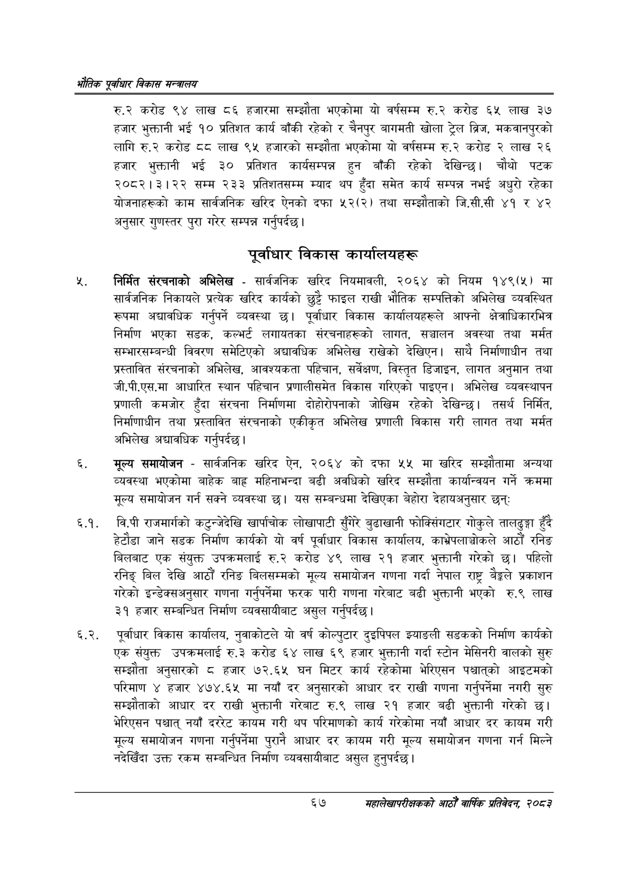

# Page 89 QA

## Rendered page


## Extracted text

```text
एवधार विकास मन्त्रालय
रु.२ करोड ९४ लाख ८६ हजारमा सम्झौता भएकोमा यो वर्षसम्म रु.२ करोड ६५ लाख ३७ हजार भुक्तानी भई १० प्रतिशत कार्य बाँकी रहेको र चैनपुर बागमती खोला ट्रेल ब्रिज, मकवानपुरको लागि रु.२ करोड दद लाख ९५ हजारको सम्झौता भएकोमा यो वर्षसम्म रु.२ करोड २ लाख २६ हजार भुक्तानी भई ३० प्रतिशत कार्यसम्पन्न हुन बाँकी रहेको देखिन्छ। चौथो पटक २०८२।३।२२ सम्म २३३ प्रतिशतसम्म म्याद थप हुँदा समेत कार्य सम्पन्न नभई अधुरो रहेका योजनाहरूको काम सार्वजनिक खरिद ऐनको दफा ५२(२) तथा सम्झौताको जि.सी.सी ४१ र ४२ अनुसार गुणस्तर पुरा गरेर सम्पन्न गर्नुपर्दछ |
पूर्वाधार विकास कार्यालयहरू
निर्मित संरचनाको अभिलेख -सार्वजनिक खरिद नियमावली, २०६४ को नियम १४९(५) मा सार्वजनिक निकायले प्रत्येक खरिद कार्यको छुट्टै फाइल राखी भौतिक सम्पत्तिको अभिलेख व्यवस्थित रूपमा अद्यावधिक गर्नुपर्ने व्यवस्था छ। पूर्वाधार विकास कार्यालयहरूले आफ्नो क्षेत्राधिकारभित्र निर्माण भएका सडक, कल्भर्ट लगायतका संरचनाहरूको लागत, सञ्चालन अवस्था तथा मर्मत सम्भारसम्बन्धी विवरण समेटिएको अद्यावधिक अभिलेख राखेको देखिएन। साथै निर्माणाधीन तथा प्रस्तावित संरचनाको अभिलेख, आवश्यकता पहिचान, सर्वेक्षण, विस्तृत डिजाइन, लागत अनुमान तथा जी.पी.एस.मा आधारित स्थान पहिचान प्रणालीसमेत विकास गरिएको पाइएन। अभिलेख व्यवस्थापन प्रणाली कमजोर हुँदा संरचना निर्माणमा दोहोरोपनाको जोखिम रहेको देखिन्छ। तसर्थ निर्मित, निर्माणाधीन तथा प्रस्तावित संरचनाको एकीकृत अभिलेख प्रणाली विकास गरी लागत तथा मर्मत अभिलेख अद्यावधिक |
गर्नुपर्दछ
मूल्य समायोजन -सार्वजनिक खरिद ऐन, २०६४ को दफा ५५ मा खरिद सम्झौतामा अन्यथा व्यवस्था भएकोमा बाहेक बाह्र महिनाभन्दा बढी अवधिको खरिद सम्झौता कार्यान्वयन गर्ने क्रममा मूल्य समायोजन गर्न सक्ने व्यवस्था छ। यस सम्बन्धमा देखिएका बेहोरा देहायअनुसार छन्‌:
६.१. वि.पी राजमार्गको कटुन्जेदेखि खार्पाचोक लोखापाटी सुँगेरै बुढाखानी फोक्सिंगटार गोकुले तालढुङ्गा हुँदै हेटौडा जाने सडक निर्माण कार्यको यो वर्ष पूर्वाधार विकास कार्यालय, काभ्रेपलाञ्चोकले आठौं रनिङ बिलबाट एक संयुक्त उपक्रमलाई करोड ४९ लाख २१ हजार भुक्तानी गरेको छ। पहिलो रनिङ्‌ बिल देखि आठौं रनिङ बिलसम्मको मूल्य समायोजन गणना गर्दा नेपाल राष्ट्र बैङ्कले प्रकाशन गरेको इन्डेक्सअनुसार गणना गर्नुपर्नेमा फरक पारी गणना गरेबाट बढी भुक्तानी भएको रु.९ लाख ३१ हजार सम्बन्धित निर्माण व्यवसायीबाट असुल गर्नुपर्दछ।
६.२. पूर्वाधार विकास कार्यालय, नुवाकोटले यो वर्ष कोल्पुटार दुइपिपल झ्याङली सडकको निर्माण कार्यको एक संयुक्त उपक्रमलाई रु.३ करोड ६४ लाख ६९ हजार भुक्तानी गर्दा स्टोन मेसिनरी वालको सुरु सम्झौता अनुसारको ८ हजार ७२.६५ घन मिटर कार्य रहेकोमा भेरिएसन पश्चात्‌को आइटमको परिमाण ४ हजार ४७४.६५ मा नयाँ दर अनुसारको आधार दर राखी गणना गर्नुपर्नेमा नगरी सुरु सम्झौताको आधार दर राखी भुक्तानी गरेबाट रु.९ लाख २१ हजार बढी भुक्तानी गरेको छ। भेरिएसन पश्चात्‌ नयाँ दररेट कायम गरी थप परिमाणको कार्य गरेकोमा नयाँ आधार दर कायम गरी मूल्य समायोजन गणना गर्नुपर्नेमा पुरानै आधार दर कायम गरी मूल्य समायोजन गणना गर्न मिल्ने नदेखिँदा उक्त रकम सम्बन्धित निर्माण व्यवसायीबाट असुल हुनुपर्दछ |
६७
महालेखापरीक्षकको आठौँ वाषिकि प्रतिवेदन २०८२
```

## Flags
- None
