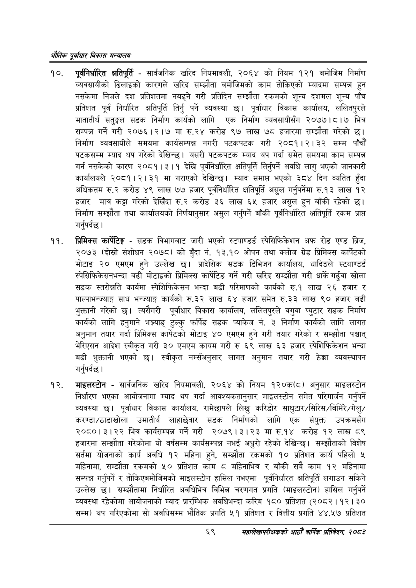

# Page 91 QA

## Rendered page


## Extracted text

```text
एवधार विकास मन्त्रालय
पूर्वनिर्धारित क्षतिपूर्ति -सार्वजनिक खरिद नियमावली, २०६४ को नियम १२१ बमोजिम निर्माण व्यवसायीको ढिलाइको कारणले खरिद सम्झौता बमोजिमको काम तोकिएको म्यादमा सम्पन्न हुन नसकेमा निजले दश प्रतिशतमा नबढ्ने गरी प्रतिदिन सम्झौता रकमको शून्य दशमल शून्य पाँच प्रतिशत पूर्व निर्धारित क्षतिपूर्ति तिर्नु पर्ने व्यवस्था छ। पूर्वाधार विकास कार्यालय, ललितपुरले मातातीर्थ सतुङ्गल सडक निर्माण कार्यको लागि एक निर्माण व्यवसायीसँग २०७७।८।७ भित्र सम्पन्न गर्ने गरी २०७६।२।७ मा रु.२४ करोड ९७ लाख ७८ हजारमा सम्झौता गरेको | निर्माण व्यवसायीले समयमा कार्यसम्पन्न नगरी पटकपटक गरी २०८१।२।३२ सम्म पाँचौं पटकसम्म म्याद थप गरेको देखिन्छ। यसरी पटकपटक म्याद थप गर्दा समेत समयमा काम सम्पन्न गर्न नसकेको कारण २०८१।३।१ देखि पूर्वनिर्धारित क्षतिपूर्ति तिर्नुपर्ने अवधि लागु भएको जानकारी कार्यालयले २०८१।२।३१ मा गराएको देखिन्छ। म्याद समाप्त भएको ३८४ दिन व्यतित हुँदा अधिकतम रु.२ करोड ४९ लाख ७७ हजार पूर्वनिर्धारित क्षतिपूर्ति असुल गर्नुपर्नेमा रु.१३ लाख १२ हजार मात्र कट्टा गरेको देखिँदा करोड ३६ लाख ६५ हजार असुल हुन बाँकी रहेको छ। निर्माण सम्झौता तथा कार्यालयको निर्णयानुसार असुल गर्नुपर्ने बाँकी पूर्वनिर्धारित क्षतिपूर्ति रकम प्राप्त गर्नुपर्दछ |
प्रिमिक्स कार्पेटिङ्ग -सडक विभागबाट जारी भएको स्ट्याण्डर्ड स्पेसिफिकेशन अफ रोड एण्ड ब्रिज, २०७३ (दोस्रो संशोधन २०७८) को बुँदा नं. १३.१० ओपन तथा क्लोज ग्रेड प्रिमिक्स कार्पेटको मोटाइ २० एमएम हुने उल्लेख छ। प्रादेशिक सडक डिभिजन कार्यालय, धादिङले स्ट्याण्डर्ड स्पेसिफिकेसनभन्दा बढी मोटाइको प्रिमिक्स कार्पेटिङ गर्ने गरी खरिद सम्झौता गरी धार्के गर्दुवा खोला सडक स्तरोन्नति कार्यमा स्पेशिफिकेसन भन्दा बढी परिमाणको कार्यको रु.१ लाख २६ हजार र पाल्पाभन्ज्याङ्ग साध भन्ज्याङ्ग कार्यको रु.३२ लाख ६४ हजार समेत रु.३३ लाख ९० हजार बढी भुक्तानी गरेको छ। त्यसैगरी पूर्वाधार विकास कार्यालय, ललितपुरले वगुवा प्युटार सडक निर्माण कार्यको लागि हनुमाने भन््याङ्‌ टुल्कु फर्पिङ सडक प्याकेज नं. ३ निर्माण कार्यको लागि लागत अनुमान तयार गर्दा प्रिमिक्स कार्पेटको मोटाइ ४० एमएम हुने गरी तयार गरेको र सम्झौता पश्चात्‌ भेरिएसन आदेश स्वीकृत गरी ३० एमएम कायम गरी रु ६९ लाख ६३ हजार स्पेशिफिकेशन भन्दा बढी भुक्तानी भएको छ। स्वीकृत नर्म्सअनुसार लागत अनुमान तयार गरी ठेक्का व्यवस्थापन गर्नुपर्दछ |
माइलस्टोन -सार्वजनिक खरिद नियमावली, २०६४ को नियम १२०क(८) अनुसार माइलस्टोन निर्धारण भएका आयोजनामा म्याद थप गर्दा आवश्यकतानुसार माइलस्टोन समेत परिमार्जन गर्नुपर्ने व्यवस्था पूर्वाधार विकास कार्यालय, रामेछापले लिखु करिडोर साधुटार/सिरिस/बिमिरे/गेलु/ करण्डा/ठाडाखोला उमार्तीर्थ लाहाछेवार सडक निर्माणको लागि एक संयुक्त उपक्रमसँग २०८०।३।२२ भित्र कार्यसम्पन्न गर्ने गरी २०७९।३।२३ मा रु.१४ करोड लाख ८९ हजारमा सम्झौता गरेकोमा यो वर्षसम्म कार्यसम्पन्न नभई अधुरो रहेको देखिन्छ। सम्झौताको विशेष सर्तमा योजनाको कार्य अवधि १२ महिना हुने, सम्झौता रकमको १० प्रतिशत कार्य पहिलो ५ महिनामा, सम्झौता रकमको ५० प्रतिशत काम © महिनाभित्र र बाँकी सबै काम १२ महिनामा सम्पन्न गर्नुपर्ने र तोकिएबमोजिमको माइलस्टोन हासिल नभएमा पूर्वनिर्धारत क्षतिपूर्ति लगाउन सकिने उल्लेख छ। सम्झौतामा निर्धारित अवधिभित्र विभिन्न चरणगत प्रगति (माइलस्टोन) हासिल गर्नुपर्ने व्यवस्था रहेकोमा आयोजनाको म्याद प्रारम्भिक अवधिभन्दा करिब १८० प्रतिशत (२०८२।१२। ३० सम्म) थप गरिएकोमा सो अवधिसम्म भौतिक प्रगति ५१ प्रतिशत र वित्तीय प्रगति ४४.५७ प्रतिशत
६९
महालेखापरीक्षकको आठौँ वाषिकि प्रतिवेदन २०८२
```

## Flags
- None
