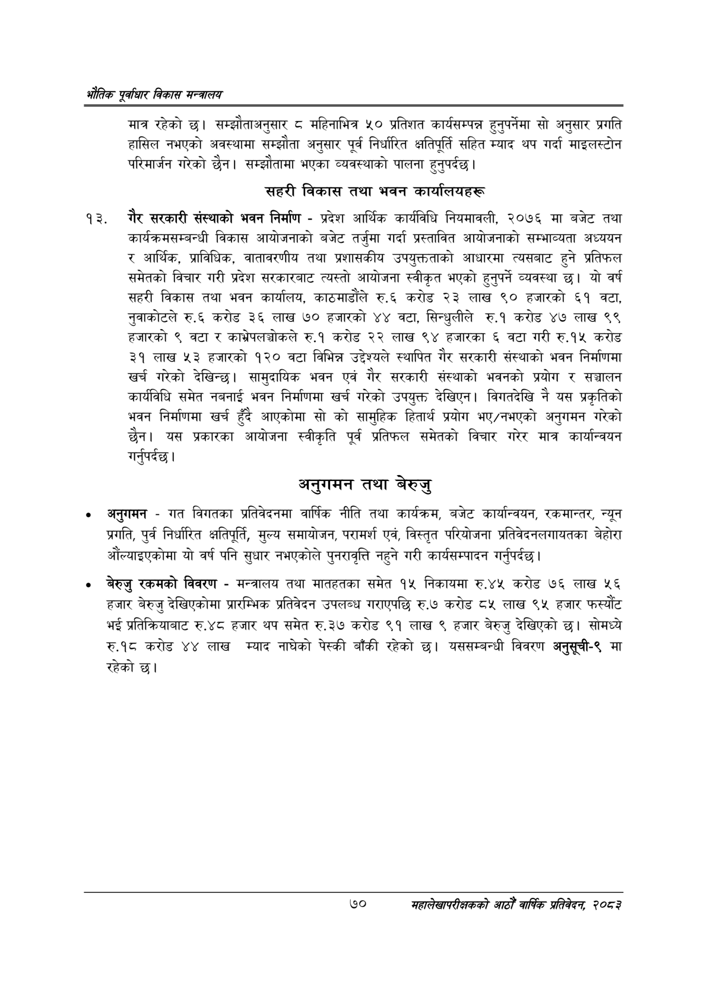

# Page 92 QA

## Rendered page


## Extracted text

```text
एवधार विकास मन्त्रालय
मात्र रहेको छ। सम्झौताअनुसार ८ महिनाभित्र ५० प्रतिशत कार्यसम्पन्न हुनुपर्नेमा सो अनुसार प्रगति हासिल नभएको अवस्थामा सम्झौता अनुसार पूर्व निर्धारित क्षतिपूर्ति सहित म्याद थप गर्दा माइलस्टोन परिमार्जन गरेको छैन। सम्झौतामा भएका व्यवस्थाको पालना हुनुपर्दछ।
सहरी विकास तथा भवन कार्यालयहरू
गैर सरकारी संस्थाको भवन निर्माण -प्रदेश आर्थिक कार्यविधि नियमावली, २०७६ मा बजेट तथा कार्यक्रमसम्बन्धी विकास आयोजनाको बजेट तर्जुमा गर्दा प्रस्तावित आयोजनाको सम्भाव्यता अध्ययन र आर्थिक, प्राविधिक, वातावरणीय तथा प्रशासकीय उपयुक्तताको आधारमा त्यसबाट हुने प्रतिफल समेतको विचार गरी प्रदेश सरकारबाट त्यस्तो आयोजना स्वीकृत भएको हुनुपर्ने व्यवस्था छ। यो वर्ष सहरी विकास तथा भवन कार्यालय, काठमाडौंले रु.६ करोड २३ लाख ९० हजारको ६१ वटा, नुवाकोटले रु.६ करोड ३६ लाख ७० हजारको ४४ वटा, सिन्धुलीले रु.१ करोड ४७ लाख ९९ हजारको ९ वटा र काभ्रेपलञ्चोकले रु.१ करोड २२ लाख ९४ हजारका ६ वटा गरी रु.१५ करोड ३१ लाख ५३ हजारको १२० वटा विभिन्न उद्देश्यले स्थापित गैर सरकारी संस्थाको भवन निर्माणमा खर्च गरेको देखिन्छ। सामुदायिक भवन एवं गैर सरकारी संस्थाको भवनको प्रयोग र सञ्चालन कार्यविधि समेत नबनाई भवन निर्माणमा खर्च गरेको उपयुक्त देखिएन। विगतदेखि नै यस प्रकृतिको भवन निर्माणमा खर्च हुँदै आएकोमा सो को सामुहिक हितार्थ प्रयोग भए/नभएको अनुगमन गरेको छैन। यस प्रकारका आयोजना स्वीकृति पूर्व प्रतिफल समेतको विचार गरेर मात्र कार्यान्वयन गर्नुपर्दछ |
अनुगमन तथा बेरुजु
अनुगमन -गत विगतका प्रतिवेदनमा वार्षिक नीति तथा कार्यक्रम, बजेट कार्यान्वयन, रकमान्तर, न्यून प्रगति, पुर्व निर्धारित क्षतिपूर्ति, मुल्य समायोजन, परामर्श एवं, विस्तृत परियोजना प्रतिवेदनलगायतका बेहोरा औंल्याइएकोमा यो वर्ष पनि सुधार नभएकोले पुनरावृत्ति नहुने गरी कार्यसम्पादन गर्नुपर्दछ |
बेरुजु रकमको विवरण -मन्त्रालय तथा मातहतका समेत १५ निकायमा रु.४५ करोड ७६ लाख ५६ हजार बेरुजु देखिएकोमा प्रारम्भिक प्रतिवेदन उपलब्ध गराएपछि रु.७ करोड ८५ लाख ९५ हजार फस्यौट भई प्रतिक्रियाबाट रु.४८ हजार थप समेत रु.३७ करोड ९१ लाख ९ हजार बेरुजु देखिएको छ। सोमध्ये रु.१८ करोड ४४ लाख म्याद नाघेको पेस्की बाँकी रहेको छ। यससम्बन्धी विवरण अनुसूची-९ मा रहेको छ।
७०
महालेखापरीक्षकको आठौँ वाषिकि प्रतिवेदन २०८२
```

## Flags
- None
