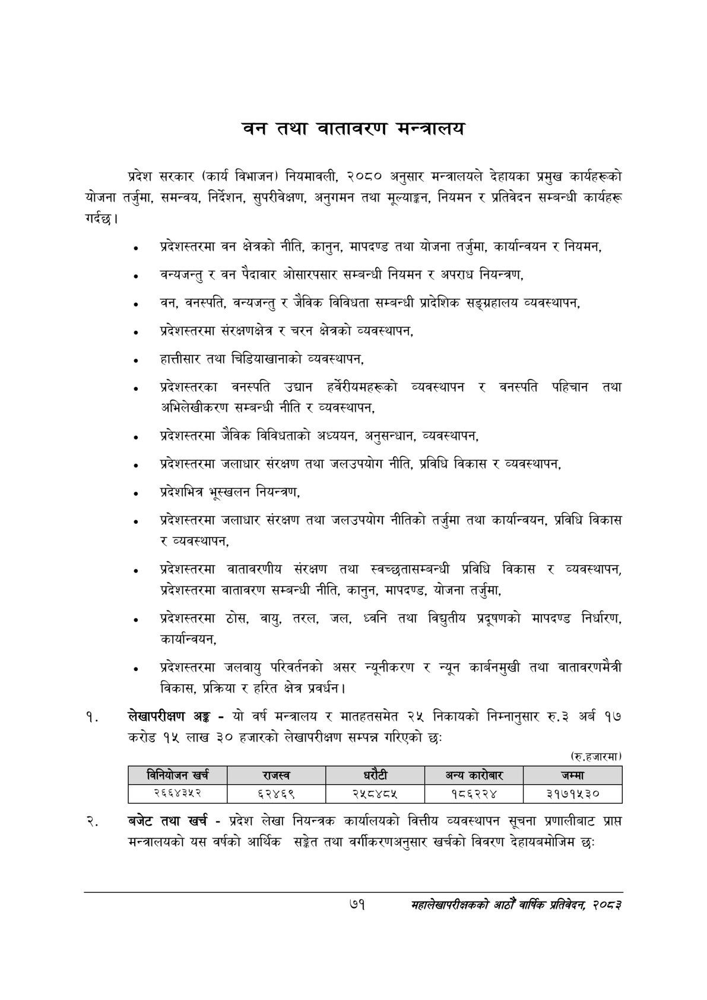

# Page 93 QA

## Rendered page


## Extracted text

```text
बन तथा वातावरण मन्त्रालय
प्रदेश सरकार (कार्य विभाजन) नियमावली, २०८० अनुसार मन्त्रालयले देहायका प्रमुख कार्यहरूको योजना तर्जुमा, समन्वय, निर्देशन, सुपरीवेक्षण, अनुगमन तथा मूल्याङ्कन, नियमन र प्रतिवेदन सम्बन्धी कार्यहरू गर्दछ |
«० प्रदेशस्तरमा वन क्षेत्रको नीति, कानुन, मापदण्ड तथा योजना तर्जुमा, कार्यान्वयन र नियमन,
१ वन्यजन्तु र वन पैदावार ओसारपसार सम्बन्धी नियमन र अपराध नियन्त्रण,
१ वन, वनस्पति, वन्यजन्तु र जैविक विविधता सम्बन्धी प्रादेशिक सङ्ग्रहालय व्यवस्थापन,
«० प्रदेशस्तरमा संरक्षणक्षेत्र र चरन क्षेत्रको व्यवस्थापन,
१ हात्तीसार तथा चिडियाखानाको व्यवस्थापन,
० प्रदेशस्तरका वनस्पति उद्यान हर्वेरीयमहरूको व्यवस्थापन र वनस्पति पहिचान तथा अभिलेखीकरण सम्बन्धी नीति र व्यवस्थापन,
० प्रदेशस्तरमा जेविक विविधताको अध्ययन, अनुसन्धान, व्यवस्थापन,
० प्रदेशस्तरमा जलाधार संरक्षण तथा जलउपयोग नीति, प्रविधि विकास र व्यवस्थापन,
० प्रदेशभित्र भूसखलन नियन्त्रण,
«० प्रदेशस्तरमा जलाधार संरक्षण तथा जलउपयोग नीतिको तर्जुमा तथा कार्यान्वयन, प्रविधि विकास र व्यवस्थापन,
० प्रदेशस्तरमा वातावरणीय संरक्षण तथा स्वच्छुतासम्बन्धी प्रविधि विकास र व्यवस्थापन, प्रदेशस्तरमा वातावरण सम्बन्धी नीति, कानुन, मापदण्ड, योजना तर्जुमा,
« प्रदेशस्तरमा ठोस, वायु, तरल, जल, ध्वनि तथा विद्युतीय प्रदूषणको मापदण्ड निर्धारण, कार्यान्वयन,
१ प्रदेशस्तरमा जलवायु परिवर्तनको असर न्यूनीकरण र न्यून कार्बनमुखी तथा वातावरणमैत्री विकास, प्रक्रिया र हरित क्षेत्र प्रवर्धन |
लेखापरीक्षण अङ्ग -यो वर्ष मन्त्रालय र मातहतसमेत २५ निकायको निम्नानुसार रु.३ अर्ब १७ करोड १५ लाख ३० हजारको लेखापरीक्षण सम्पन्न गरिएको छः
(रु.हजारमा)
बजेट तथा खर्च -प्रदेश लेखा नियन्त्रक कार्यालयको वित्तीय व्यवस्थापन सूचना प्रणालीबाट प्राप्त मन्त्रालयको यस वर्षको आर्थिक सङ्ेत तथा वर्गीकरणअनुसार खर्चको विवरण देहायबमोजिम छः
७१
महालेखापरीक्षकको आठौँ वाषिकि प्रतिवेदन २०८२

|  | निनिवोजन खर्च | राजस्व |  |  | अन्य कारोबार | जम्मा |
| --- | --- | --- | --- | --- | --- | --- |
|  | २६६४३४५२ | ६२४६९ | २५८४८५ |  | १८६२२४ | ३१७१५३० |
```

## Flags
- table_page
- medium_quality_table
