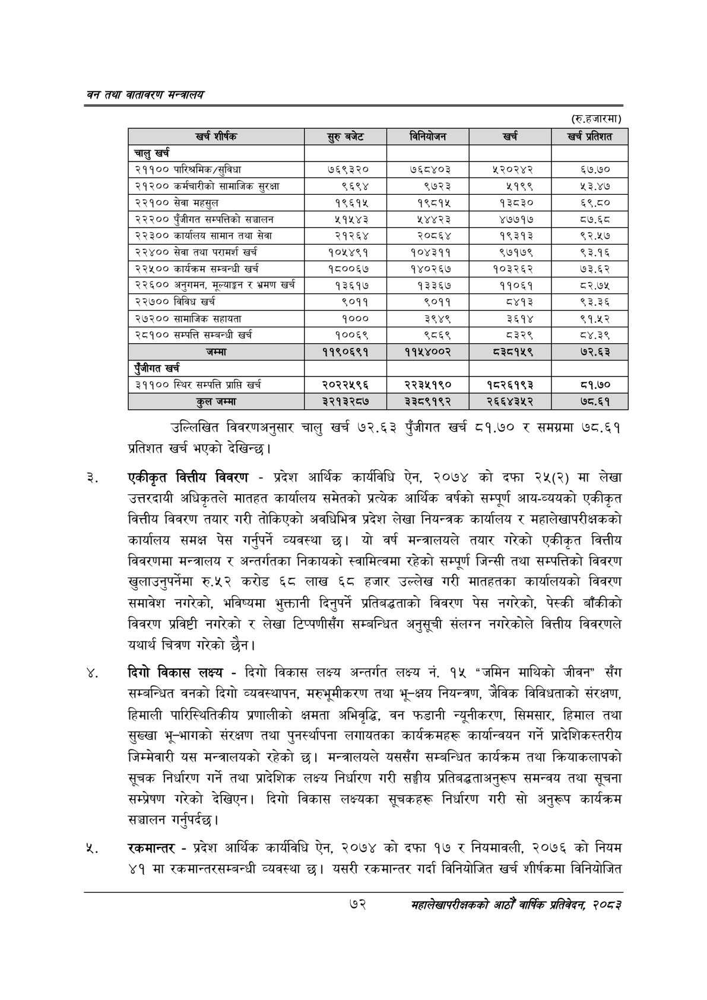

# Page 94 QA

## Rendered page


## Extracted text

```text
वन तथा वातावरण मन्त्रालय
(रु.हजारमा)
उल्लिखित विवरणअनुसार चालु खर्च ७२.६३ पुँजीगत खर्च ८१.७० र समग्रमा ७८.६१ प्रतिशत खर्च भएको देखिन्छ |
एकीकृत वित्तीय विवरण -प्रदेश आर्थिक कार्यविधि ऐन, २०७४ को दफा २५(२) मा लेखा उत्तरदायी अधिकृतले मातहत कार्यालय समेतको प्रत्येक आर्थिक वर्षको सम्पूर्ण आय-व्ययको एकीकृत वित्तीय विवरण तयार गरी तोकिएको अवधिभित्र प्रदेश लेखा नियन्त्रक कार्यालय र महालेखापरीक्षकको कार्यालय समक्ष पेस गर्नुपर्ने व्यवस्था यो वर्ष मन्त्रालयले तयार गरेको एकीकृत वित्तीय विवरणमा मन्त्रालय र अन्तर्गतका निकायको स्वामित्वमा रहेको सम्पूर्ण जिन्सी तथा सम्पत्तिको विवरण खुलाउनुपर्नेमा रु.५२ करोड ६८ लाख ६८ हजार उल्लेख गरी मातहतका कार्यालयको विवरण समावेश नगरेको, भविष्यमा भुक्तानी दिनुपर्ने प्रतिबद्धताको विवरण पेस नगरेको, पेस्की बाँकीको विवरण प्रविष्टी नगरेको र लेखा टिप्पणीसँग सम्बन्धित अनुसूची संलग्न नगरेकोले वित्तीय विवरणले यथार्थ चित्रण गरेको छैन।
दिगो विकास लक्ष्य -दिगो विकास लक्ष्य अन्तर्गत लक्ष्य नं. १५ "जमिन माथिको जीवन" सँग सम्बन्धित वनको दिगो व्यवस्थापन, मरुभूमीकरण तथा भू-क्षय नियन्त्रण, जैविक विविधताको संरक्षण, हिमाली पारिस्थितिकीय प्रणालीको क्षमता अभिवृद्धि, वन फडानी न्यूनीकरण, सिमसार, हिमाल तथा सुख्खा भू-भागको संरक्षण तथा पुनर्स्थापना लगायतका कार्यक्रमहरू कार्यान्वयन गर्ने प्रादेशिकस्तरीय जिम्मेवारी यस मन्त्रालयको रहेको छ। मन्त्रालयले यससँग सम्बन्धित कार्यक्रम तथा क्रियाकलापको सूचक निर्धारण गर्ने तथा प्रादेशिक लक्ष्य निर्धारण गरी सङ्घीय प्रतिबद्धताअनुरूप समन्वय तथा सूचना सम्प्रेषण गरेको देखिएन। दिगो विकास लक्ष्यका सूचकहरू निर्धारण गरी सो अनुरूप कार्यक्रम सञ्चालन गर्नुपर्दछ |
रकमान्तर -प्रदेश आर्थिक कार्यविधि ऐन, २०७४ को दफा १७ र नियमावली, २०७६ को नियम ४१ मा रकमान्तरसम्बन्धी व्यवस्था छ। यसरी रकमान्तर गर्दा विनियोजित खर्च शीर्षकमा विनियोजित
७२
महालेखापरीक्षकको आठौँ वाषिकि प्रतिवेदन २०८२

| खर्च शीर्षक | सुरु बजेट | निनिकोजणन | खर्च | खर्च प्रतिशत |
| --- | --- | --- | --- | --- |
| चालु खर्च |  |  |  |  |
| २११०० पारिश्रमिक /सुविधा | ७६९३२० | ७६८४०३ | श५२०२४२ | ६७.७० |
| २१२०० कर्मचारीको सामाजिक सुरक्षा | ९६९४ | ९७२३ | ५१९९ | ५३.४७ |
| २२१०० सेवा महसुल | १९६१५ | १९८१४५ | १३८३० | ६९.८० |
| २३३०० पुँजीगत खषन्पततिको सञ्चालन | ५१५४३ | १४४२३ | ४७७१७ | ८७.६८ |
| २२३०० कार्यालय सामान तथा सेवा | २१२६४ | २०८६४ | १९३१३ | ९२.५७ |
| २२४०० सेवा तथा परामर्श खर्च | १०४५४९१ | १०४३११ | ९७१७९ | ९३.१६ |
| २२५०० कार्यक्रम सम्बन्धी खर्च | १८००६४७ | १४०२६४ | १०३२६२ | ७३.६२ |
| २२६०० अनुगमन, मूल्याङ्कन र भ्रमण खर्च | १३६१७ | १३३६७ | ११०६१ | ८२.७५ |
| २२७०० विविध खर्च | ९०११ | ९०११ | ८४१३ | ९३.३६ |
| २७२०० सामाजिक सहायता | १००० | ३९४९ | ३६१४ | ९१.५२ |
| २८१०० सम्पत्ति सम्बन्धी खर्च | १००६९ | ९८६९ | ८३२९ | ८४.३९ |
| जम्मा | ११९०६९१ | ११५४००२ | ८३८१५९ | ७२.६३ |
| पुँजीगत खर्च |  |  |  |  |
| ३११०० स्थिर सम्पत्ति प्राप्ति खर्च | २०२२५९६ | २२३४५१९० | १८२६१९३ | ८१.७० |
| कुल जम्मा | ३२१३२८७ | ३३८९१९२ | २६६४३५२ | ७८.६१ |
```

## Flags
- table_page
- medium_quality_table
