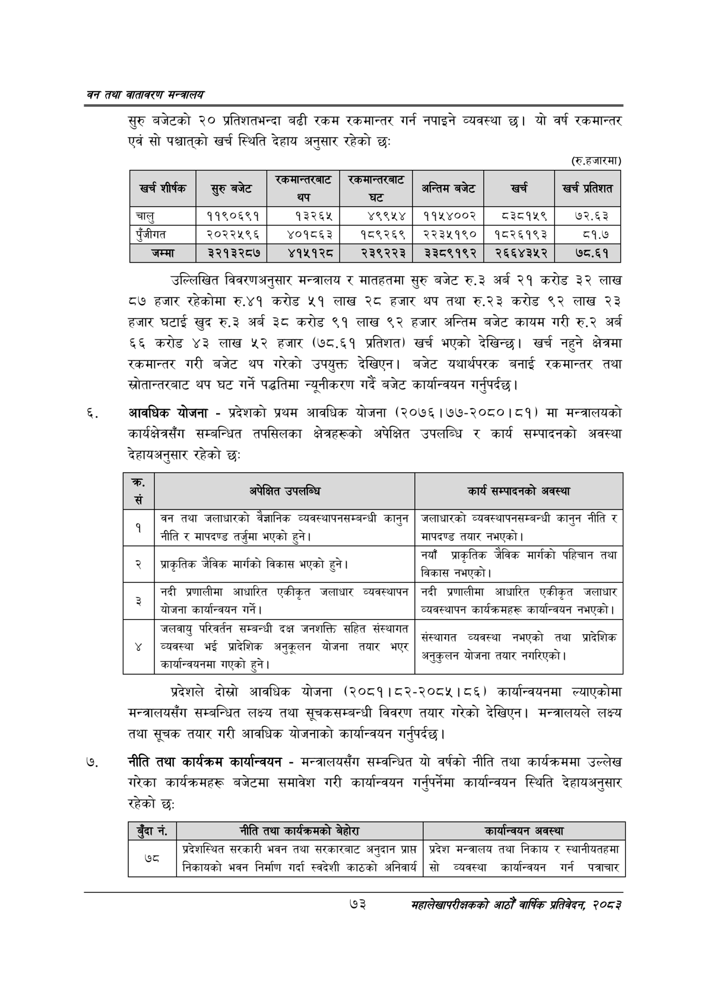

# Page 95 QA

## Rendered page


## Extracted text

```text
वन तथा वातावरण मन्त्रालय
सुरु बजेटको २० प्रतिशतभन्दा बढी रकम रकमान्तर गर्न नपाइने व्यवस्था यो वर्ष रकमान्तर एवं सो पश्चात्‌को खर्च स्थिति देहाय अनुसार रहेको छः
(रु.हजारमा)
उल्लिखित विवरणअनुसार मन्त्रालय र मातहतमा सुरु बजेट रु.३ अर्ब २१ करोड ३२ लाख ८७ हजार रहेकोमा रु.४१ करोड ५१ लाख २८ हजार थप तथा रु.२३ करोड ९२ लाख २३ हजार घटाई खुद रु.३ अर्ब ३८ करोड ९१ लाख ९२ हजार अन्तिम बजेट कायम गरी रु.२ अर्ब ६६ करोड ४३ लाख ५२ हजार (७८.६१ प्रतिशत) खर्च भएको देखिन्छ। खर्च नहुने क्षेत्रमा रकमान्तर गरी बजेट थप गरेको उपयुक्त देखिएन। बजेट यथार्थपरक बनाई रकमान्तर तथा स्रोतान्तरबाट थप घट गर्ने पद्धतिमा न्यूनीकरण गर्दै बजेट कार्यान्वयन गर्नुपर्दछ |
आवधिक योजना -प्रदेशको प्रथम आवधिक योजना (२०७६।७७-२०८०।८१) मा मन्त्रालयको कार्यक्षेत्रसँग सम्बन्धित तपसिलका क्षेत्रहरूको अपेक्षित उपलब्धि र कार्य सम्पादनको अवस्था देहायअनुसार रहेको छः
प्रदेशले दो्रो आवधिक योजना (२०८१।८२-२०८५।८६) कार्यान्वयनमा ल्याएकोमा मन्त्रालयसँग सम्बन्धित लक्ष्य तथा सूचकसम्बन्धी विवरण तयार गरेको देखिएन। मन्त्रालयले लक्ष्य तथा सूचक तयार गरी आवधिक योजनाको कार्यान्वयन गर्नुपर्दछ |
नीति तथा कार्यक्रम कार्यान्वयन -मन्त्रालयसँग सम्वन्धित यो वर्षको नीति तथा कार्यक्रममा उल्लेख गरेका कार्यक्रमहरू बजेटमा समावेश गरी कार्यान्वयन गर्नुपर्नेमा कार्यान्वयन स्थिति देहायअनुसार
७३
महालेखापरीक्षकको आठौँ वाषिकि प्रतिवेदन २०८२

| = शीर्षक | र्रु बजेट | सा | न | अन्तिम बजेट | खर्च | खर्च प्रतेशत |
| --- | --- | --- | --- | --- | --- | --- |
| चालु | ११९०६९१ | १३२६५ | ४९९१४ | १११४००२ | वइ१५९ | ७२.६३ |
| पुँजीगत | २०२२५९६ | ४०१८६३ | १८९२६९ | २२३५१९० | १८२६१९३ | ब८१.७ |
| जम्मा | २२१३२८७ | ४१५१२८ | २३९२२३ | ३३८९१९२ | २६६४३५२ | ७८.६१ |

| क्र. सं | = अपेक्षित उपलब्धि | कार्य सन्धादनको अवस्था |
| --- | --- | --- |
|  |  |  |
| १ | बन तथा जलाघारको बेशानिक व्यवस्थापनक्षम्बन्धी कानुन नीति र ५५० तर्जुमा भएको हुने। | जलाधारको व्ववस्थापनसम्जन्धी कानुन नीति र नाषदण्ड तयार नभएको \| |
| २ | ~ ज्राकृतिक जैविक मार्गको विकास भएको हुने। | नयाँ श्राकृतिक जैविक मार्गको पहिचान तथा विकास नभएको। |
|  |  |  |
| रड | नदी भ्रणालीमा आधारित एकीकृत जलाघार व्यवस्थापन | नदी त्रणालीमा आधारित एकीकृत जलाचार |
|  | योजना कार्यान्वयन गर्ने। | व्यवस्थापन कार्यक्रमहरू कार्यान्ववन नभएको \| |
| ४ | जलवायु परिवर्तन सम्बन्धी दक्ष जनशक्ति सहित संस्थागत ५ - व्यवस्था भइ जादाशेक अनुकूलन योजना तयार भएर ० ने कार्वान्वकनमा गएको हुने। | _ व्यवस्था नभएको २०. संस्थागत ठ नभएको तथा प्रादेशिक ~ अनुकुलन योजना तयार नभारएका। |

|  | ड्दान॑, | रीति तथा क्ार्षजःनको बेहोरा | कार्षान्चषन अवस्था |
| --- | --- | --- | --- |
|  |  |  |  |
|  | उठ | ्रदेशस्थित सरकारी भवन तथा सरकारजाट अनुदान प्राप्त २ स्वदेशी निकावको भवन निर्माण गर्दा स्वदेशी काठको अनिवार्य | प्रदेश मन्त्रालय तथा निकाय र स्थानीयतहमा . सो व्ववस्था कार्यान्वयन गर्न पत्राचार |
```

## Flags
- table_page
- medium_quality_table
