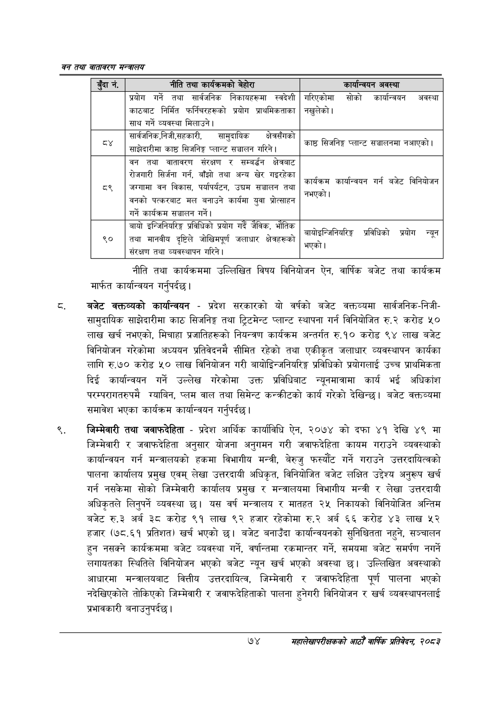

# Page 96 QA

## Rendered page


## Extracted text

```text
वन तथा वातावरण मन्त्रालय
नीति तथा कार्यक्रममा उल्लिखित विषय विनियोजन ऐन, वार्षिक बजेट तथा कार्यक्रम मार्फत कार्यान्वयन गर्नुपर्दछ |
बजेट कक्तव्यको कार्यान्वयन -प्रदेश सरकारको यो वर्षको बजेट वक्तव्यमा सार्वजनिक-निजीसामुदायिक साझेदारीमा काठ सिजनिङ्ग तथा ट्रिटमेन्ट प्लान्ट स्थापना गर्न विनियोजित रु.२ करोड ५० लाख खर्च नभएको, मिचाहा प्रजातिहरूको नियन्त्रण कार्यक्रम अन्तर्गत रु.१० करोड ९४ लाख बजेट विनियोजन गरेकोमा अध्ययन प्रतिवेदनमै सीमित रहेको तथा एकीकृत जलाधार व्यवस्थापन कार्यका लागि रु.७० करोड ५० लाख विनियोजन गरी बायोडिन्जनियरिङ्ग प्रविधिको प्रयोगलाई उच्च प्राथमिकता दिई कार्यान्वयन गर्ने उल्लेख गरेकोमा उक्त प्रविधिबाट न्युनमात्रामा कार्य भई अधिकांश परम्परागतरुपमै ग्याबिन, प्लम वाल तथा सिमेन्ट कन्क्रीटको कार्य गरेको देखिन्छ। बजेट वक्तव्यमा समावेश भएका कार्यक्रम कार्यान्वयन गर्नुपर्दछ |
जिम्मेवारी तथा जवाफदेहिता -प्रदेश आर्थिक कार्याविधि ऐन, २०७४ को दफा ४१ देखि ४९ मा जिम्मेवारी र जवाफदेहिता अनुसार योजना अनुगमन गरी जवाफदेहिता कायम गराउने व्यवस्थाको कार्यान्वयन गर्न मन्त्रालयको हकमा विभागीय मन्त्री, बेरुजु फस्यौंट गर्ने गराउने उत्तरदायित्वको पालना कार्यालय प्रमुख एवम्‌ लेखा उत्तरदायी अधिकृत, विनियोजित बजेट लक्षित उद्देश्य अनुरूप खर्च गर्न नसकेमा सोको जिम्मेवारी कार्यालय प्रमुख र मन्त्रालयमा विभागीय मन्त्री र लेखा उत्तरदायी अधिकृतले लिनुपर्ने व्यवस्था छ। यस वर्ष मन्त्रालय र मातहत २५ निकायको विनियोजित अन्तिम बजेट रु.३ अर्ब ३८ करोड ९१ लाख ९२ हजार रहेकोमा रु.२ अर्ब ६६ करोड ४३ लाख ५२ हजार (७८.६१ प्रतिशत) खर्च भएको छ। बजेट बनाउँदा कार्यान्वयनको सुनिश्चितता नहुने, सञ्चालन हुन नसक्ने कार्यक्रममा बजेट व्यवस्था गर्ने, वर्षान्तमा रकमान्तर गर्ने, समयमा बजेट समर्पण नगर्ने लगायतका स्थितिले विनियोजन भएको बजेट न्यून खर्च भएको अवस्था छ। उल्लिखित अवस्थाको आधारमा मन्त्रालयबाट वित्तीय उत्तरदायित्व, जिम्मेवारी र जवाफदेहिता पूर्ण पालना भएको नदेखिएकोले तोकिएको जिम्मेवारी र जवाफदेहिताको पालना हुनेगरी विनियोजन र खर्च व्यवस्थापनलाई प्रभावकारी बनाउनुपर्दछ |
७४
महालेखापरीक्षकको आठौँ वाषिकि प्रतिवेदन २०८२

| ड्दार्न, | नीति तथा बेहोरा | कार्यान्वणन अवस्था |
| --- | --- | --- |
|  |  |  |
|  | प्रयोग गर्ने तथा धार्षणनिक निकायहरूमा स्वदेशी काठमाट निर्मित फर्नचरहरूको प्रयोग प्राथमिकताका साथ गर्ने व्यवस्था मिलाउने। | गरिएकोमा सोको कार्यान्ववन अवस्था नखुलेको \| |
|  | सार्वजनिक,निजी,लहकारी, चामुदाषिक क्षेत्रसँगको प्लान्ट साझेदारीमा काठ सिजनिङ्ग प्लान्ट सञ्चालन \| | न. आएको काष्ठ सिजनिङ्ग प्लान्ट सञ्चालनमा \| |
| ८९ | बन तथा वातावरण संरक्षण र सम्बर्न क्षेत्रबाट सेजभारी सिर्जना गर्न, बाँझो तथा अन्य खेर ९हेका.. जस्मामा वन विकास, पर्थापर्यटन, उद्यम सञ्चालन तथा वनको ५०क२१।८ मल बनाउने कार्यमा युवा श्रोत्साहन गर्ने कार्यक्रम सञ्चालन | .. कार्यक्रम कार्यान्वथन गर्न बजेट विनिवोजन नभएको। |
| ९० | बायो इन्जिनियरिङ्ग प्रविधिको प्रयोग गर्दै जैविक भौतिक दृष्टिले - तथा मानवीय दृष्टिले जोखिमपूर्ण जलाधार क्षेत्रहरूको संरक्षण तथा व्यवस्थापन गरिने। | -. ८.८ नाधाझान्जानबारङ्ग त्रावाचिका प्रयाग न्यून भएको। |
```

## Flags
- table_page
- medium_quality_table
