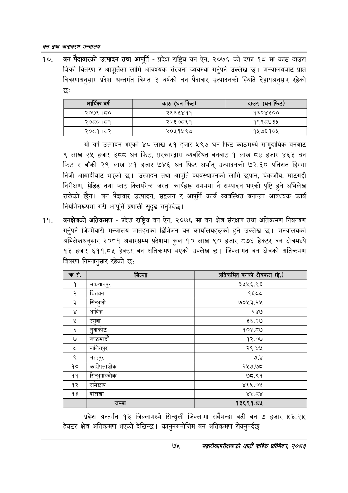

# Page 97 QA

## Rendered page


## Extracted text

```text
वन तथा वातावरण मन्त्रालय
वन पैदावारको उत्पादन तथा आपूर्ति -प्रदेश राष्ट्रिय वन ऐन, २०७६ को दफा १८ मा काठ दाउरा बिक्री वितरण र आपूर्तिका लागि आवश्यक संरचना व्यवस्था गर्नुपर्ने उल्लेख छ। मन्त्रालयबाट प्राप्त विवरणअनुसार प्रदेश अन्तर्गत विगत ३ वर्षको वन पैदावार उत्पादनको स्थिति देहायअनुसार रहेको छः
यो वर्ष उत्पादन भएको ४० लाख ५१ हजार ५९७ घन फिट काठमध्ये सामुदायिक वनबाट ९ लाख २५ हजार ३८८ घन फिट, सरकारद्वारा व्यवस्थित वनबाट १ लाख ८४ हजार ४६३ घन फिट र बाँकी २९ लाख ४१ हजार ७४६ घन फिट अर्थात्‌ उत्पादनको ७२.६० प्रतिशत हिस्सा निजी आबादीबाट भएको छ। उत्पादन तथा आपूर्ति व्यवस्थापनको लागि छपान, चेकजाँच, घाटगदी निरीक्षण, ग्रेडिङ तथा प्लट क्लियरेन्स जस्ता कार्यहरू समयमा नै सम्पादन भएको पुष्टि हुने अभिलेख राखेको छैन। वन पैदावार उत्पादन, सङ्कलन र आपूर्ति कार्य व्यवस्थित बनाउन आवश्यक कार्य नियमितरूपमा गरी आपूर्ति प्रणाली सुदृढ गर्नुपर्दछ |
वनक्षेत्रको अतिक्रमण -प्रदेश राष्ट्रिय वन ऐन, २०७६ मा वन क्षेत्र संरक्षण तथा अतिक्रमण नियन्त्रण गर्नुपर्ने जिम्मेवारी मन्त्रालय मातहतका डिभिजन वन कार्यालयहरूको हुने उल्लेख छ। मन्त्रालयको अभिलेखअनुसार २०८१ असारसम्म प्रदेशमा कुल १० लाख ९० हजार ८७६ हेक्टर वन क्षेत्रमध्ये ९३ हजार ६११.८४५ हेक्टर वन अतिक्रमण भएको उल्लेख छ। जिल्लागत वन क्षेत्रको अतिक्रमण विवरण निम्नानुसार रहेको छ:
प्रदेश अन्तर्गत १३ जिल्लामध्ये सिन्धुली जिल्लामा सबैभन्दा बढी वन ७ हजार ५३.२५ हेक्टर क्षेत्र अतिक्रमण भएको देखिन्छ। कानुनबमोजिम वन अतिक्रमण रोक्नुपर्दछ।
७४
महालेखापरीक्षकको आठौँ वाषिकि प्रतिवेदन २०८२

| आर्थिक वर्ष | 'काठ (घन फिट) | दाउरा (घन फिट) |
| --- | --- | --- |
| २०७९।८० | २६३५४११ | १३२४५०० |
| २०८०।८१ | २४६०८९१ | १११८७३५ |
| २०८१।८२ | ४०५१५९७ | १५७६१०४५ |

| क्रस | जिल्ला | अतिन्रभेत वनको क्षेत्रफल हि.) |
| --- | --- | --- |
| १ | मकवानपुर | ३५५६.९६ |
| २ | चितवन | १६८८ |
| ३ | सिन्धुली | ७०५३.२५ |
| ४ | धादिङ्ग | २४७ |
| ५ | रसुवा | ३६.२७ |
| ६ | नुवाकोट | १०४.८४ |
| ७ | काठमाडौं | १२.०७ |
| ८ | ललितपुर | २९.४४५ |
| ९ | भक्तपुर | ७.४ |
| १० | काभ्रेपलाञ्चोक | २५७.७८ |
| ११ | सिन्धुपाल्चोक | ७८.९१ |
| १२ | समेछाप | ४९५.०५ |
| १३ | दोलखा | ४४. |
| १४ | जम्मा | १३६११.८५ |
```

## Flags
- table_page
- medium_quality_table
