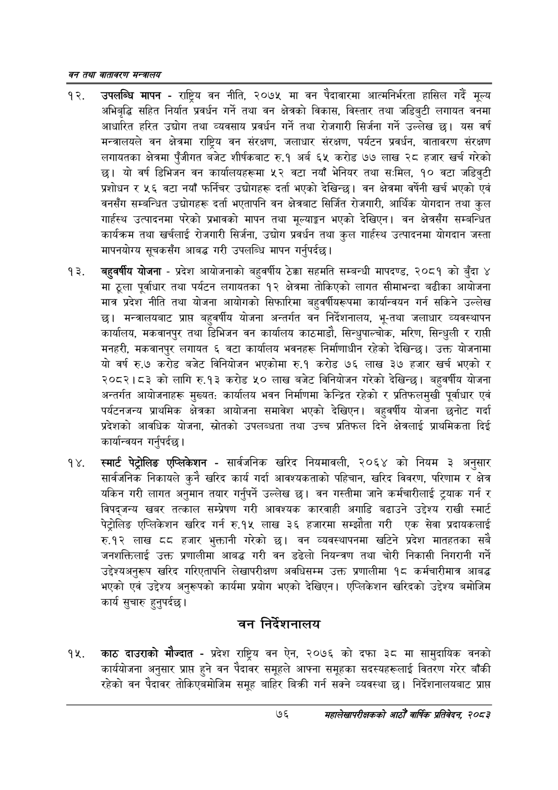

# Page 98 QA

## Rendered page


## Extracted text

```text
वन तथा वातावरण मन्त्रालय
उपलब्धि मापन -राष्ट्रिय वन नीति, २०७५ मा वन पैदावारमा आत्मनिर्भरता हासिल गर्दै मूल्य अभिबृद्धि सहित निर्यात प्रवर्धन गर्ने तथा वन क्षेत्रको विकास, विस्तार तथा जडिबुटी लगायत वनमा आधारित हरित उद्योग तथा व्यवसाय प्रवर्धन गर्ने तथा रोजगारी सिर्जना गर्ने उल्लेख छु। यस वर्ष मन्त्रालयले वन क्षेत्रमा राष्ट्रिय वन संरक्षण, जलाधार संरक्षण, पर्यटन प्रवर्धन, वातावरण संरक्षण लगायतका क्षेत्रमा पुँजीगत बजेट शीर्षकबाट रु.१ अर्ब ६५ करोड ७७ लाख २८ हजार खर्च गरेको छ। यो वर्ष डिभिजन वन कार्यालयहरूमा ५२ वटा नयाँ भेनियर तथा स:ःमिल, १० वटा जडिबुटी प्रशोधन र ५६ वटा नयाँ फर्निचर उद्योगहरू दर्ता भएको देखिन्छ। वन क्षेत्रमा वर्षेनी खर्च भएको एवं वनसँग सम्बन्धित उद्योगहरू दर्ता भएतापनि वन क्षेत्रबाट सिर्जित रोजगारी, आर्थिक योगदान तथा कुल गार्हस्थ उत्पादनमा परेको प्रभावको मापन तथा मूल्याङ्कन भएको देखिएन। वन क्षेत्रसँग सम्बन्धित कार्यक्रम तथा खर्चलाई रोजगारी सिर्जना, उद्योग प्रवर्धन तथा कुल गार्हस्थ उत्पादनमा योगदान जस्ता मापनयोग्य सूचकसँग आबद्ध गरी उपलब्धि मापन गर्नुपर्दछ |
बहुवर्षीय योजना -प्रदेश आयोजनाको बहुवर्षीय ठेक्का सहमति सम्बन्धी मापदण्ड, २०८१ को बुँदा ४ मा ठूला पूर्वाधार तथा पर्यटन लगायतका १२ क्षेत्रमा तोकिएको लागत सीमाभन्दा बढीका आयोजना मात्र प्रदेश नीति तथा योजना आयोगको सिफारिमा बहुवर्षीयरूपमा कार्यान्वयन गर्न सकिने उल्लेख | मन्त्रालयबाट प्राप्त बहुवर्षीय योजना अन्तर्गत वन निर्देशनालय, भू-तथा जलाधार व्यवस्थापन कार्यालय, मकवानपुर तथा डिभिजन वन कार्यालय काठमाडौ, सिन्धुपाल्चोक, मरिण, सिन्धुली र रापी मनहरी, मकवानपुर लगायत ६ वटा कार्यालय भवनहरू निर्माणाधीन रहेको देखिन्छ। उक्त योजनामा यो वर्ष रु.७ करोड बजेट विनियोजन भएकोमा रु.१ करोड ७६ लाख ३७ हजार खर्च भएको र २०८२।८३ को लागि रु.१३ करोड ५० लाख बजेट विनियोजन गरेको देखिन्छ। बहुवर्षीय योजना अन्तर्गत आयोजनाहरू मुख्यत: कार्यालय भवन निर्माणमा केन्द्रित रहेको र प्रतिफलमुखी पूर्वाधार एवं पर्यटनजन्य प्राथमिक क्षेत्रका आयोजना समावेश भएको देखिएन। बहुवर्षीय योजना छनोट गर्दा प्रदेशको आवधिक योजना, स्रोतको उपलब्धता तथा उच्च प्रतिफल दिने क्षेत्रलाई प्राथमिकता दिई कार्यान्वयन गर्नुपर्दछ।
स्मार्ट पेट्रोलिङ एप्लिकेशन -सार्वजनिक खरिद नियमावली, २०६४ को नियम ३ अनुसार सार्वजनिक निकायले कुनै खरिद कार्य गर्दा आवश्यकताको पहिचान, खरिद विवरण, परिणाम र क्षेत्र यकिन गरी लागत अनुमान तयार गर्नुपर्ने उल्लेख | वन गस्तीमा जाने कर्मचारीलाई ट्रयाक गर्न र विपद्जन्य खबर तत्काल सम्प्रेषण गरी आवश्यक कारवाही अगाडि बढाउने उद्देश्य राखी स्मार्ट पेट्रोलिङ एप्लिकेशन खरिद गर्न रु.१५ लाख ३६ हजारमा सम्झौता गरी एक सेवा प्रदायकलाई रु.१२ लाख हजार भुक्तानी गरेको छ। वन व्यवस्थापनमा खटिने प्रदेश मातहतका सबै जनशक्तिलाई उक्त प्रणालीमा आबद्ध गरी वन डढेलो नियन्त्रण तथा चोरी निकासी निगरानी गर्ने उद्देश्यअनुरूप खरिद गरिएतापनि लेखापरीक्षण अवधिसम्म उक्त प्रणालीमा १८ कर्मचारीमात्र आबद्ध भएको एवं उद्देश्य अनुरूपको कार्यमा प्रयोग भएको देखिएन। एप्लिकेशन खरिदको उद्देश्य बमोजिम कार्य सुचारु हुनुपर्दछ |
वन निर्देशनालय
काठ दाउराको मौज्दात -प्रदेश राष्ट्रिय वन ऐन, २०७६ को दफा ३८ मा सामुदायिक वनको कार्ययोजना अनुसार प्राप्त हुने वन पैदावर समूहले आफ्ना समूहका सदस्यहरूलाई वितरण गरेर बाँकी रहेको वन पैदावर तोकिएबमोजिम समूह बाहिर बिक्री गर्न सक्ने व्यवस्था छ। निर्देशनालयबाट प्राप्त
७६
महालेखापरीक्षकको आठौँ वाषिकि प्रतिवेदन २०८२
```

## Flags
- None
