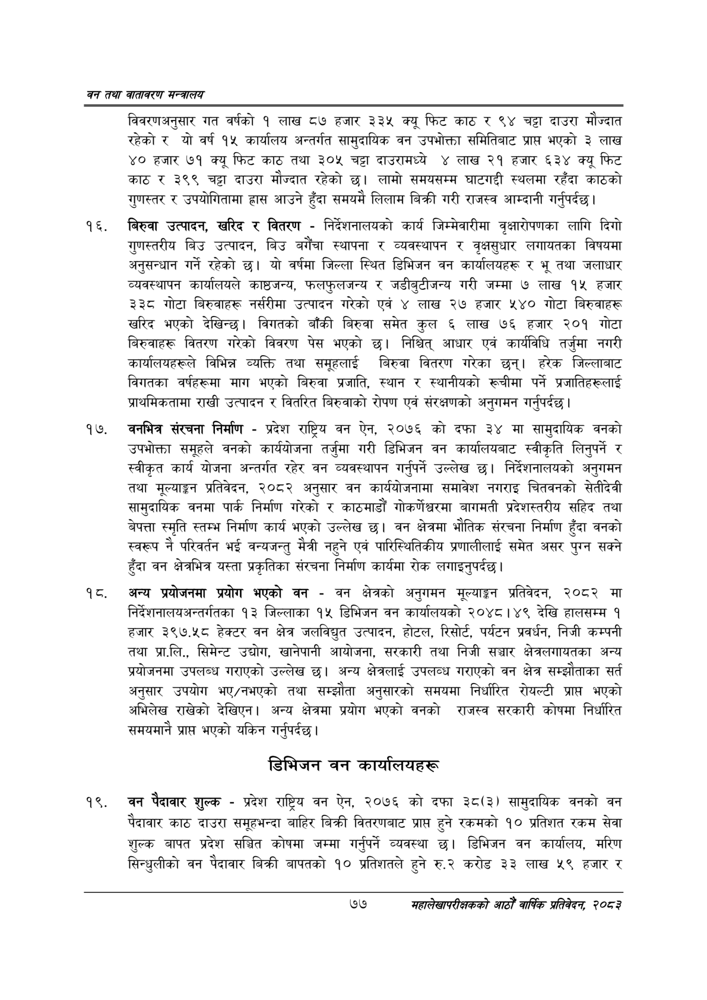

# Page 99 QA

## Rendered page


## Extracted text

```text
वन तथा वातावरण मन्त्रालय
विवरणअनुसार गत वर्षको १ लाख ८७ हजार ३३५ क्यू फिट काठ र ९४ चट्टा दाउरा मौज्दात रहेकोर यो वर्ष १५ कार्यालय अन्तर्गत सामुदायिक वन उपभोक्ता समितिबाट प्रापत भएको ३ लाख ४० हजार ७१ क्यू फिट काठ तथा ३०५ चट्टा दाउरामध्ये लाख २१ हजार ६३४ क्यू फिट काठ र ३९९ चट्टा दाउरा मौज्दात रहेको छ। लामो समयसम्म घाटगद्दी स्थलमा रहँदा काठको गुणस्तर र उपयोगितामा हास आउने हुँदा समयमै लिलाम बिक्री गरी राजस्व आम्दानी गर्नुपर्दछ।
बिरुवा उत्पादन, खरिद र वितरण -निर्देशनालयको कार्य जिम्मेवारीमा वृक्षारोपणका लागि दिगो गुणस्तरीय बिउ उत्पादन, बिउ बगैँचा स्थापना र व्यवस्थापन र वृक्षसुधार लगायतका विषयमा अनुसन्धान गर्ने रहेको छ। यो वर्षमा जिल्ला स्थित डिभिजन वन कार्यालयहरू र भू तथा जलाधार व्यवस्थापन कार्यालयले काष्ठजन्य, फलफुलजन्य र जडीबुटीजन्य गरी जम्मा ७ लाख १५ हजार ३३८ गोटा बिरुवाहरू नर्सरीमा उत्पादन गरेको एवं ४ लाख २७ हजार ५४० गोटा बिरुवाहरू खरिद भएको देखिन्छ। विगतको बाँकी बिरुवा समेत कुल ६ लाख ७६ हजार २०१ गोटा बिरुवाहरू वितरण गरेको विवरण पेस भएको छ। निश्चित्‌ आधार एवं कार्यविधि तर्जुमा नगरी कार्यालयहरूले विभिन्न व्यक्ति तथा समूहलाई बिरुवा वितरण गरेका छन्‌। हरेक जिल्लाबाट विगतका वर्षहरूमा माग भएको बिरुवा प्रजाति, स्थान र स्थानीयको ख्चीमा पर्ने प्रजातिहरूलाई प्राथमिकतामा राखी उत्पादन र वितरित बिरुवाको रोपण एवं संरक्षणको अनुगमन गर्नुपर्दछ |
वनभित्र संरचना निर्माण -प्रदेश राष्ट्रिय वन ऐन, २०७६ को दफा ३४ मा सामुदायिक वनको उपभोक्ता समूहले वनको कार्ययोजना तर्जुमा गरी डिभिजन वन कार्यालयबाट स्वीकृति लिनुपर्ने र स्वीकृत कार्य योजना अन्तर्गत रहेर वन व्यवस्थापन गर्नुपर्ने उल्लेख छ। निर्देशनालयको अनुगमन तथा मूल्याङ्कन प्रतिवेदन, २०८२ अनुसार वन कार्ययोजनामा समावेश नगराइ चितवनको सेतीदेवी सामुदायिक वनमा पार्क निर्माण गरेको र काठमाडौं गोकर्णेश्वरमा बागमती प्रदेशस्तरीय सहिद तथा बेपत्ता स्मृति स्तम्भ निर्माण कार्य भएको उल्लेख छ। वन क्षेत्रमा भौतिक संरचना निर्माण हुँदा वनको स्वरूप नै परिवर्तन भई वन्यजन्तु मैत्री नहुने एवं पारिस्थितिकीय प्रणालीलाई समेत असर पुग्न सक्ने हुँदा वन क्षेत्रभित्र यस्ता प्रकृतिका संरचना निर्माण कार्यमा रोक लगाइन्‌ुपर्दछ।
अन्य प्रयोजनमा प्रयोग भएको वन -वन क्षेत्रको अनुगमन मूल्याङ्कन प्रतिवेदन, २०८२ मा निर्देशनालयअन्तर्गतका ९३ जिल्लाका १५ डिभिजन वन कार्यालयको २०४८।४९ देखि हालसम्म १ हजार ३९७.५८ हेक्टर वन क्षेत्र जलविद्युत उत्पादन, होटल, रिसोर्ट, पर्यटन प्रवर्धन, निजी कम्पनी तथा प्रा.लि. सिमेन्ट उद्योग, खानेपानी आयोजना, सरकारी तथा निजी सञ्चार क्षेत्रलगायतका अन्य प्रयोजनमा उपलब्ध गराएको उल्लेख | अन्य क्षेत्रलाई उपलव्ध गराएको वन क्षेत्र सम्झौताका सर्त अनुसार उपयोग भए/नभएको तथा सम्झौता अनुसारको समयमा निर्धारित रोयल्टी प्राप्त भएको अभिलेख राखेको देखिएन। अन्य क्षेत्रमा प्रयोग भएको वनको राजस्व सरकारी कोषमा निर्धारित समयमानै प्रापत भएको यकिन गर्नुपर्दछ |
डिभिजन वन कार्यालयहरू
वन पैदावार शुल्क -प्रदेश राष्ट्रिय वन ऐन, २०७६ को दफा ३८(३) सामुदायिक वनको वन पैदावार काठ दाउरा समूहभन्दा बाहिर बिक्री वितरणबाट प्राप्त हुने रकमको १० प्रतिशत रकम सेवा शुल्क बापत प्रदेश सञ्चित कोषमा जम्मा गर्नुपर्ने व्यवस्था छ। डिभिजन वन कार्यालय, मरिण सिन्धुलीको वन पैदावार बिक्री बापतको १० प्रतिशतले हुने रु.२ करोड ३३ लाख ५९ हजार र
७७
महालेखापरीक्षकको आठौँ वाषिकि प्रतिवेदन २०८२
```

## Flags
- None
