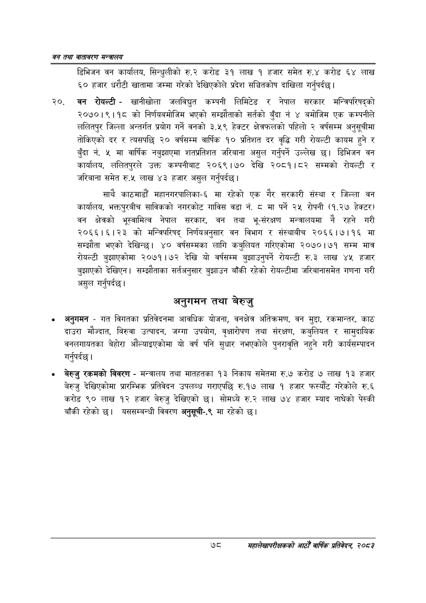

# Page 100 QA

## Rendered page


## Extracted text

```text
वन तथा वातावरण मन्त्रालय
डिभिजन वन कार्यालय, सिन्धुलीको रु.२ करोड ३१ लाख १ हजार समेत रु.४ करोड ६४ ६० हजार धरौटी खातामा जम्मा गरेको देखिएकोले प्रदेश सञ्चितकोष दाखिला गर्नुपर्दछ |
लाख
०, बन रोयल्टी -खानीखोला जलविद्युत कम्पनी लिमिटेड र नेपाल सरकार मन्त्रिपरिषद्को २०७०।९।१८ को निर्णयबमोजिम भएको सम्झौताको सर्तको बुँदा नं ४ बमोजिम एक कम्पनीले ललितपुर जिल्ला अन्तर्गत प्रयोग गर्ने वनको ३.५९ हेक्टर क्षेत्रफलको पहिलो २ वर्षसम्म अनुसूचीमा तोकिएको दर र त्यसपछि २० वर्षसम्म वार्षिक १० प्रतिशत दर वृद्धि गरी रोयल्टी कायम हुने र बुँदा नं. ५ मा वार्षिक नबुझाएमा शतप्रतिशत जरिबाना असुल गर्नुपर्ने उल्लेख छ। डिभिजन वन कार्यालय, ललितपुरले उक्त कम्पनीबाट २०६९।७० देखि २०८१।८२ सम्मको रोयल्टी र जरिबाना समेत रु.५ लाख ४३ हजार असुल गर्नुपर्दछ |
साथै काठमाडौं महानगरपालिका-६ मा रहेको एक गैर सरकारी संस्था र जिल्ला वन कार्यालय, भक्तपुरबीच साविकको नगरकोट गाविस वडा नं. ८ मा पर्ने २५ रोपनी (१.२७ हेक्टर) वन क्षेत्रको भूस्वामित्व नेपाल सरकार, वन तथा भू-संरक्षण मन्त्रालयमा नै रहने गरी २०६६।६।२३ को मन्त्रिपरिषद्‌ निर्णयअनुसार वन विभाग र संस्थाबीच २०६६।७।१६ मा सम्झौता भएको देखिन्छ। ४० वर्षसम्मका लागि कबुलियत गरिएकोमा २०७०।७१ सम्म मात्र रोयल्टी बुझाएकोमा २०७१।७२ देखि यो वर्षसम्म बुझाउनुपर्ने रोयल्टी €.३ लाख ४५ हजार बुझाएको देखिएन। सम्झौताका सर्तअनुसार बुझाउन बाँकी रहेको रोयल्टीमा जरिबानासमेत गणना गरी असुल गर्नुपर्दछ।
अनुगमन तथा बेरुजु
० अनुगमन -गत विगतका प्रतिवेदनमा आवधिक योजना, वनक्षेत्र अतिक्रमण, वन मुद्दा, रकमान्तर, काठ दाउरा मौज्दात, बिरुवा उत्पादन, जग्गा उपयोग, वृक्षारोपण तथा संरक्षण, कबुलियत र सामुदायिक वनलगायतका बेहोरा औंल्याइएकोमा यो वर्ष पनि सुधार नभएकोले पुनरावृत्ति नहुने गरी कार्यसम्पादन |
गर्नुपर्दछ
० बेरुजु रकमको विवरण -मन्त्रालय तथा मातहतका १३ निकाय समेतमा रु.७ करोड ७ लाख १३ हजार बेरुजु देखिएकोमा प्रारम्भिक प्रतिवेदन उपलब्ध गराएपछि रु.१७ लाख १ हजार फस्यौट गरेकोले रु.६ करोड ९० लाख १२ हजार बेरुजु देखिएको छ। सोमध्ये रु.२ लाख ७४ हजार म्याद नाघेको पेस्की बाँकी रहेको छ। यससम्बन्धी विवरण अनुसूची-.९ मा रहेको |
७८
महालेखापरीक्षकको आठौँ वाषिकि प्रतिवेदन २०८२
```

## Flags
- None
