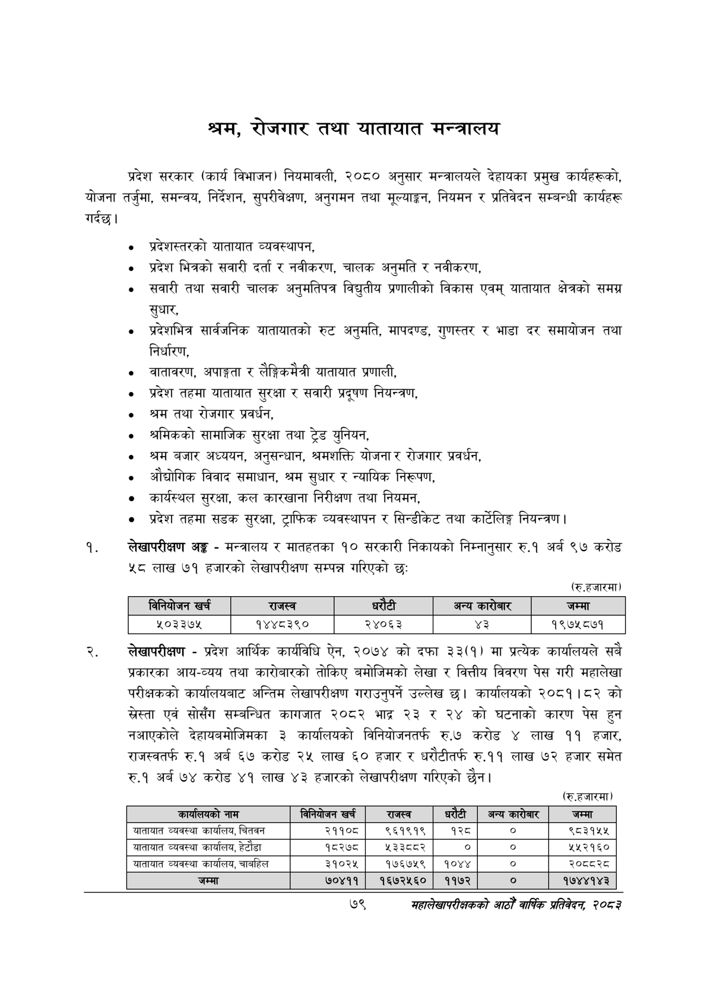

# Page 101 QA

## Rendered page


## Extracted text

```text
श्रम, रोजगार तथा यातायात मन्त्रालय
प्रदेश सरकार (कार्य विभाजन) नियमावली, २०८० अनुसार मन्त्रालयले देहायका प्रमुख कार्यहरूको, योजना तर्जुमा, समन्वय, निर्देशन, सुपरीवेक्षण, अनुगमन तथा मूल्याङ्कन, नियमन र प्रतिवेदन सम्बन्धी कार्यहरू गर्दछ |
० प्रदेशस्तरको यातायात व्यवस्थापन,
प्रदेश भित्रको सवारी दर्ता र नवीकरण, चालक अनुमति र नवीकरण,
सवारी तथा सवारी चालक अनुमतिपत्र विद्युतीय प्रणालीको विकास एवम्‌ यातायात क्षेत्रको समग्र सुधार,
० प्रदेशभित्र सार्वजनिक यातायातको रुट अनुमति, मापदण्ड, गुणस्तर र भाडा दर समायोजन तथा निर्धारण,
० वातावरण, अपाङ्गता र लैङ्गिकमैत्री यातायात प्रणाली,
० प्रदेश तहमा यातायात सुरक्षा र सवारी प्रदूषण नियन्त्रण,
० श्रम तथा रोजगार प्रवर्धन,
० श्रमिकको सामाजिक सुरक्षा तथा ट्रेड युनियन,
श्रम बजार अध्ययन, अनुसन्धान, श्रमशक्ति योजना र रोजगार प्रवर्धन,
० औद्योगिक विवाद समाधान, श्रम सुधार र न्यायिक निरूपण,
कार्यस्थल सुरक्षा, कल कारखाना निरीक्षण तथा नियमन,
प्रदेश तहमा सडक सुरक्षा, ट्राफिक व्यवस्थापन र सिन्डीकेट तथा कार्टेलिङ्ग नियन्त्रण।
लेखापरीक्षण अङ्ग -मन्त्रालय र मातहतका १० सरकारी निकायको निम्नानुसार रु.१ अर्ब ९७ करोड ४८ लाख ७१ हजारको लेखापरीक्षण सम्पन्न गरिएको छः
(रु.हजारमा)
लेखापरीक्षण -प्रदेश आर्थिक कार्यविधि ऐन, २०७४ को दफा ३३(१) मा प्रत्येक कार्यालयले सबै प्रकारका आय-व्यय तथा कारोबारको तोकिए बमोजिमको लेखा र वित्तीय विवरण पेस गरी महालेखा परीक्षकको कार्यालयबाट अन्तिम लेखापरीक्षण गराउनुपर्ने उल्लेख | कार्यालयको २०८१।८२ को स्रेस्ता एवं सोसँग सम्बन्धित कागजात २०८२ भाद्र २३ र २४ को घटनाको कारण पेस हुन नआएकोले देहायबमोजिमका ३ कार्यालयको विनियोजनतर्फ रु.७ करोड लाख ११ हजार, राजस्वतर्फ रु.१ अर्ब ६७ करोड २५ लाख ६० हजार र धरीटीतर्फ रु.११ लाख ७२ हजार समेत रु.१ अर्ब ७४ करोड ४१ लाख ४३ हजारको लेखापरीक्षण गरिएको छैन।
(रु.हजारमा)
७९
महालेखापरीक्षकको आठौँ वार्षिक प्रतिवेदन २०८२

|  | न | नेकोजन खर्च | राजस्व | ५ १ १ १ १ ६ ५५१ १२ ३२ १४ ९६.२१३२७२ अन्य ५ १ १ १ १ ७ ५९१ ६ ५६ २० ६२.५४८१३८ कारोबार ५ १ १ १ १ ८ ७४० १२ ४० १४ ८९.१७०८६८ जम्मा ४ १ १ १ २ ० ५१ ४३ ७५० १५ -१ ५ १ १ १ २ १ ५१ ४३ ७५ १५ ६८.०७३५०९ ५०३३७५ ५ १ १ १ २ २ २१८ ४३ ८७ १५ ८९.९५६०३९ १४४८३९० ५ १ १ १ २ ३ ४०२ ४३ ६० १५ ९२.८८६६१२ २४०६३ ५ १ १ १ २ ४ ५८६ ४३ २३ १४ ९०.१०४०५० ३ ५ १ १ १ २ ५ ७१६ ४३ ८५ १५ ८६.४९८२९१ १९७५८७१ |  |  |  |
| --- | --- | --- | --- | --- | --- | --- | --- |
|  |  |  |  |  |  |  |  |

| कार्यालयको नाम | विनिबोजन खर्च | राजस्व |  | अन्य कारोबार | जम्मा |
| --- | --- | --- | --- | --- | --- |
| यातायात व्यवस्था कार्यालय, चितवन | २११०८ | ९६१९१९ | १२८ | ० | ९८३१५५ |
| यातायात व्यवस्था कार्यालय, हेटौडा | १८२७८ | ५३३८०२ | ० |  | ५४५२१६० |
| यातायात व्यवस्था कार्यालय, चाबहिल | ३१०२५ | १७६७५९ | १०४४ |  | २०५८३८ |
| जम्मा | ७०४११ | १६७२५६० | ११७२ |  | १७४४१४३ |
```

## Flags
- table_page
- medium_quality_table
