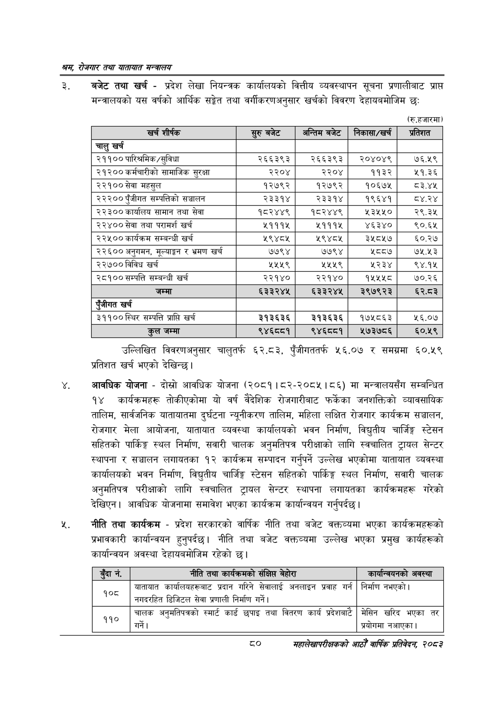

# Page 102 QA

## Rendered page


## Extracted text

```text
श्रय रोजगार तथा यातायात मन्त्रालय
बजेट तथा खर्च -प्रदेश लेखा नियन्त्रक कार्यालयको वित्तीय व्यवस्थापन सूचना प्रणालीबाट प्राप्त मन्त्रालयको यस वर्षको आर्थिक सङ्गेत तथा वर्गीकरणअनुसार खर्चको विवरण देहायबमोजिम छः
(रु.हजारमा)
उल्लिखित विवरणअनुसार चालुतर्फ ६२.८३, पुँजीगततर्फ ५६.०७ र समग्रमा ६०.५९ प्रतिशत खर्च भएको देखिन्छ।
आवधिक योजना -दोस्रो आवधिक योजना (२०८१। ८२-२०८५। ८६) मा मन्त्रालयसँग सम्बन्धित १४ कार्यक्रमहरू तोकीएकोमा यो वर्ष वैदेशिक रोजगारीबाट फर्केका जनशक्तिको व्यावसायिक तालिम, सार्वजनिक यातायातमा दुर्घटना न्यूनीकरण तालिम, महिला लक्षित रोजगार कार्यक्रम सञ्चालन, रोजगार मेला आयोजना, यातायात व्यवस्था कार्यालयको भवन निर्माण, विद्युतीय चार्जिङ्ग स्टेसन सहितको पार्किङ्ग स्थल निर्माण, सवारी चालक अनुमतिपत्र परीक्षाको लागि स्वचालित ट्रायल सेन्टर स्थापना र सञ्चालन लगायतका १२ कार्यक्रम सम्पादन गर्नुपर्ने उल्लेख भएकोमा यातायात व्यवस्था कार्यालयको भवन निर्माण, विद्युतीय चार्जिङ्ग स्टेसन सहितको पार्किङ्ग स्थल निर्माण, सवारी चालक अनुमतिपत्र परीक्षाको लागि स्वचालित ट्रायल सेन्टर स्थापना लगायतका कार्यक्रमहरू गरेको देखिएन। आवधिक योजनामा समावेश भएका कार्यक्रम कार्यान्वयन गर्नुपर्दछ |
नीति तथा कार्यक्रम -प्रदेश सरकारको वार्षिक नीति तथा बजेट वक्तव्यमा भएका कार्यक्रमहरूको प्रभावकारी कार्यान्वयन हुनुपर्दछ। नीति तथा बजेट वक्तव्यमा उल्लेख भएका प्रमुख कार्यहरूको कार्यान्वयन अवस्था देहायबमोजिम रहेको छ।
८०
महालेखापरीक्षकको आठौँ वाषिकि प्रतिवेदन २०८२

| खर्च शीर्षक | सुरु बजेट | अन्तिम बजेट | निकासा/खरः | प्रतिशत |
| --- | --- | --- | --- | --- |
| चालु खर्च |  |  |  |  |
| २११०० पारिश्रमिक/सुविधा | २६६३९३ | २६६३९३ | २०४०४९ | ७६.५९ |
| २१२०० कर्मचारीको सामाजिक सुरक्षा | २२०४ | २२०४ | ११३२ | ५१.३६ |
| २२१०० सेवा महसुल | १२७९२ | १२७९२ | १०६७५ | ८३.४५ |
| २२२०० पुँजीगत सम्पतिको सञ्चालन | २३३१४ | २३३१४ | १९६४१ | ८४.२४ |
| २२३०० कार्वालय सामान तथा सेवा | १८२४४९ | १८२४४९ | ५३५५० | २९.३५ |
| २२४०० सेवा तथा परामर्श खर्च | ५१११५ | २५१११५ | ४६३४० | ९०.६४५ |
| २२४५०० कार्यक्रम सम्बन्धी खर्च | ५९४८५ | ५९४८४५ | ३५८५७ | ६०.२७ |
| २२६०० अनुगमन, र भ्रमण खर्च | ७७९४ | ७७९४ |  | ७५.५३ |
| २२७०० विविध खर्च | २५५९ | २५५९ | २२३४ | ९४.१५ |
| २८१०० सम्पत्ति सम्बन्धी खर्च | २२१४० | २२१४० | १५४५४५८ | ७०.२६ |
| जम्मा | ६३३२४५ | ६३३२४५ | २९७९२३ | ६२.८ठ३ |
| खर्च |  |  |  |  |
| ३११००स्थिर सम्पत्ति प्राप्ति खर्च | ३१३६३६ | ३१३६३६ | १७५८६३ | ५६.०७ |
| जम्मा | ९४६८८१ | ९४६८०८१ | २७३७८६ | ६०.५९ |

|  | नीति तथा संक्षिप्त बेहोरा | कार्षान्चषनको अवस्था |
| --- | --- | --- |
|  |  |  |
| १०८ | यातायात कार्यालबहरूनाट प्रदान गरिने सेवालाई अनलाइन प्रवाह गर्न नगदरहित डिजिटल सेवा प्रणाली निर्माण गर्ने। | निर्माण नभएको। |
| ११० | चालक अनुभतिषत्रको स्मार्ट कार्ड छुपाइ तथा वितरण कार्य रदेशबाटे | मेसिन खरिद भएका तर श्रयोगमा नआएका \| |
```

## Flags
- table_page
- medium_quality_table
