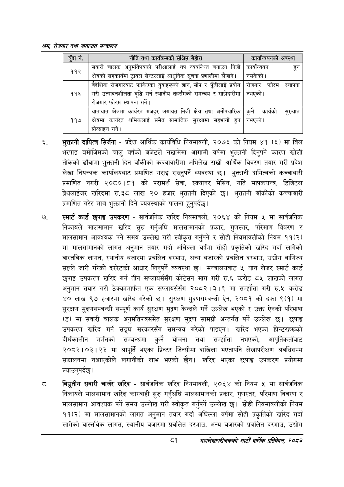

# Page 103 QA

## Rendered page


## Extracted text

```text
श्रय रोजगार तथा यातायात मन्त्रालय
भुक्तानी दायित्व सिर्जना -प्रदेश आर्थिक कार्यविधि नियमावली, २०७६ को नियम ४१ (६) मा बिल भरपाइ बमोजिमको चालु वर्षको बजेटले नखामेमा आगामी वर्षमा भुक्तानी दिनुपर्ने कारण खोली तोकेको ढाँचामा भुक्तानी दिन बाँकीको कच्चावारीमा अभिलेख राखी आर्थिक विवरण तयार गरी प्रदेश लेखा नियन्त्रक कार्यालयबाट प्रमाणित गराइ राख्नुपर्ने व्यवस्था छ। भुक्तानी दायित्वको कच्चाबारी प्रमाणित नगरी २०८०।८१ को परामर्श सेवा, स्क्यानर मेसिन, गति मापकयन्त्र, डिजिटल ब्रेथलाईजर खरिदमा रु.३८ लाख २० हजार भुक्तानी दिएको छ। भुक्तानी बाँकीको कच्चाबारी प्रमाणित गरेर मात्र भुक्तानी दिने व्यवस्थाको पालना हुनुपर्दछ |
स्मार्ट कार्ड छपाइ उपकरण -सार्वजनिक खरिद नियमावली, २०६४ को नियम ५ मा सार्वजनिक निकायले मालसामान खरिद सुरु गर्नुअघि मालसामानको प्रकार, गुणस्तर, परिमाण विवरण र मालसामान आवश्यक पर्ने समय उल्लेख गरी स्वीकृत गर्नुपर्ने र सोही नियमावलीको नियम ११(२) मा मालसामानको लागत अनुमान तयार गर्दा अघिल्ला वर्षमा सोही प्रकृतिको खरिद गर्दा लागेको वास्तविक लागत, स्थानीय बजारमा प्रचलित दरभाउ, अन्य बजारको प्रचलित दरभाउ, उद्योग वाणिज्य सङ्घले जारी गरेको दररेटको आधार लिनुपर्ने व्यवस्था छ। मन्त्रालयबाट ५ थान लेजर स्मार्ट कार्ड छपाइ उपकरण खरिद गर्न तीन सप्लायर्ससँग कोटेसन माग गरी रु.६ करोड ८५ लाखको लागत अनुमान तयार गरी ठेक्कामार्फत एक सप्लायर्ससँग २०८२।३।९ मा सम्झौता गरी रु.५ करोड ४० लाख ९७ हजारमा खरिद गरेको छ। सुरक्षण मुद्रणसम्बन्धी ऐन, २०८१ को दफा ९(१) मा सुरक्षण मुद्रणसम्बन्धी सम्पूर्ण कार्य सुरक्षण मुद्रण केन्द्रले गर्ने उल्लेख भएको र उक्त ऐनको परिभाषा (ड) मा सवारी चालक अनुमतिपत्रसमेत सुरक्षण मुद्रण सामग्री अन्तर्गत पर्ने उल्लेख छ। छपाइ उपकरण खरिद गर्न सङ्घ सरकारसँग समन्वय गरेको पाइएन। खरिद भएका प्रिन्टरहरूको दीर्घकालीन मर्मतको सम्बन्धमा कुनै योजना तथा सम्झौता नभएको, आपूर्तिकर्ताबाट २०८२।०३।२३ मा आपूर्ति भएका प्रिन्टर जिन्सीमा दाखिला भएतापनि लेखापरीक्षण अवधिसम्म सञ्चालनमा नआएकोले लगानीको लाभ भएको छैन। खरिद भएका छपाइ उपकरण प्रयोगमा ल्याउनुपर्दछ।
विद्युतीय सवारी चार्जर खरिद -सार्वजनिक खरिद नियमावली, २०६४ को नियम ५ मा सार्वजनिक निकायले मालसामान खरिद कारबाही सुरु गर्नुअघि मालसामानको प्रकार, गुणस्तर, परिमाण विवरण र मालसामान आवश्यक पर्ने समय उल्लेख गरी स्वीकृत गर्नुपर्ने उल्लेख छ। सोही नियमावलीको नियम ११(२) मा मालसामानको लागत अनुमान तयार गर्दा अघिल्ला वर्षमा सोही प्रकृतिको खरिद गर्दा लागेको वास्तविक लागत, स्थानीय बजारमा प्रचलित दरभाउ, अन्य बजारको प्रचलित दरभाउ, उद्योग
१
महालेखापरीक्षकको आठौँ वाषिकि प्रतिवेदन २०८२

|  |  |  |
| --- | --- | --- |
| ड्दान॑, | नीति तथा कार्यजःनको संक्षिप्त बेहोरा | कार्यान्वयनको अवस्था |
|  | सवारी चालक अनुमतिपत्रको परीक्षालाई थप व्यवस्थित बनाउन निजी क्षेत्रको सहकार्यमा ट्रायल सेन्टरलाई आधुनिक सूचना प्रणालीमा लैजान। | कार्यान्वयन हुन नसकेको \| |
|  |  |  |
|  | बैदेशिक रोजभारबाट फर्किएका थुवाहरूको ज्ञान, सीप र एऔलाई प्रयोग | रोजगार फोरम स्थापना |
| ११६ | गरी उत्पादनशीलता वृद्धि गर्न स्थानीय तहसँगको समन्वय र साझेदारीमा रोजगार फोरम स्थापना गर्ने \| | नभएको \| |
| ११७ | बाताबात क्षेत्रमा कार्यरत मजदुर लगायत निजी क्षेत्र तथा अनोपघारिक क्षेत्रमा कार्यरत श्रमिकलाई समेत सामाजिक सुरक्षामा सहभागी हुन श्रोत्साहन \| | कुनै कार्यको सुरुवात नभएको। |
```

## Flags
- table_page
- medium_quality_table
