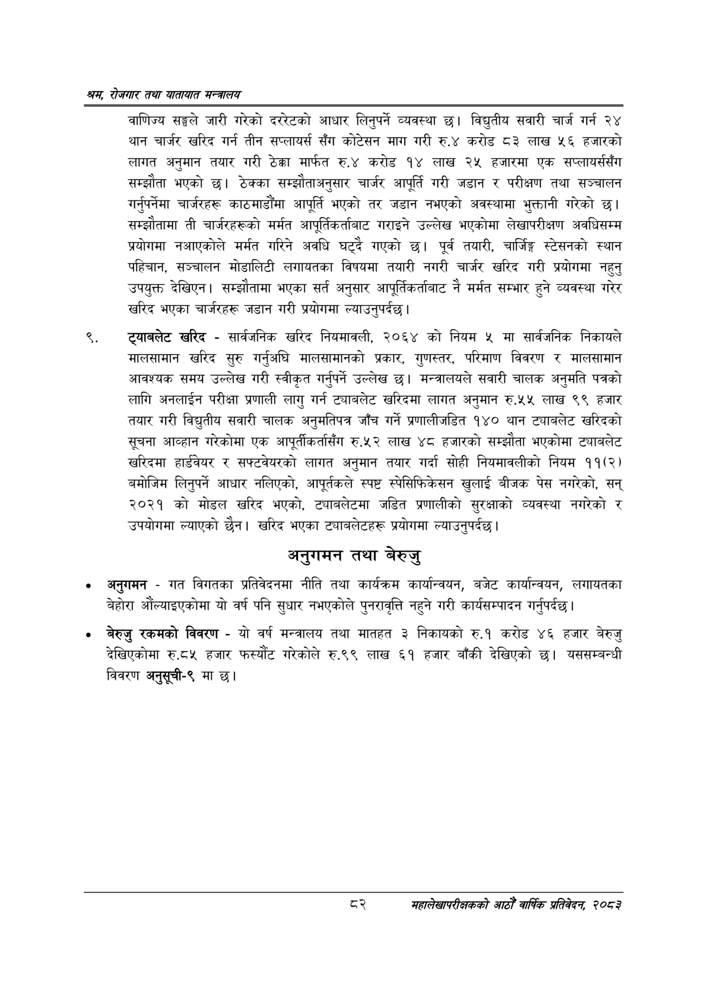

# Page 104 QA

## Rendered page


## Extracted text

```text
श्रय रोजगार तथा यातायात मन्त्रालय
वाणिज्य सङ्घले जारी गरेको दररेटको आधार लिनुपर्ने व्यवस्था छ। विद्युतीय सवारी चार्ज गर्न २४ थान चार्जर खरिद गर्न तीन सप्लायर्स सँग कोटेसन माग गरी रु.४ करोड ८३ लाख ५६ हजारको लागत अनुमान तयार गरी ठेक्का मार्फत रु.४ करोड १४ लाख २५ हजारमा एक सप्लायर्ससँग सम्झौता भएको छ। ठेक्का सम्झौताअनुसार चार्जर आपूर्ति गरी जडान र परीक्षण तथा सञ्चालन गर्नुपर्नेमा चार्जरहरू काठमाडौंमा आपूर्ति भएको तर जडान नभएको अवस्थामा भुक्तानी गरेको छ। सम्झौतामा ती चार्जरहरूको मर्मत आपूर्तिकर्ताबाट गराइने उल्लेख भएकोमा लेखापरीक्षण अवधिसम्म प्रयोगमा नआएकोले मर्मत गरिने अवधि घट्दै गएको छ। पूर्व तयारी, चार्जिङ्ग स्टेसनको स्थान पहिचान, सञ्चालन मोडालिटी लगायतका विषयमा तयारी नगरी चार्जर खरिद गरी प्रयोगमा नहुनु उपयुक्त देखिएन। सम्झौतामा भएका सर्त अनुसार आपूर्तिकर्ताबाट नै मर्मत सम्भार हुने व्यवस्था गरेर खरिद भएका चार्जरहरू जडान गरी प्रयोगमा ल्याउनुपर्दछ।
ट्याबलेट खरिद -सार्वजनिक खरिद नियमावली, २०६४ को नियम ५ मा सार्वजनिक निकायले मालसामान खरिद सुरु गर्नुअघि मालसामानको प्रकार, गुणस्तर, परिमाण विवरण र मालसामान आवश्यक समय उल्लेख गरी स्वीकृत गर्नुपर्ने उल्लेख छ। मन्त्रालयले सवारी चालक अनुमति पत्रको लागि अनलाईन परीक्षा प्रणाली लागु गर्न ट्याबलेट खरिदमा लागत अनुमान रु.५५ लाख ९९ हजार तयार गरी विद्युतीय सवारी चालक अनुमतिपत्र जाँच गर्ने प्रणालीजडित १४० थान ट्याबलेट खरिदको सूचना आव्हान गरेकोमा एक आपूर्तीकर्तासँग रु.५२ लाख ४८ हजारको सम्झौता भएकोमा ट्याबलेट खरिदमा हार्डवेयर र सफ्टवेयरको लागत अनुमान तयार गर्दा सोही नियमावलीको नियम ११(२) बमोजिम लिनुपर्ने आधार नलिएको, आपूर्तकले स्पष्ट स्पेसिफिकेसन खुलाई बीजक पेस नगरेको, सन्‌ २०२१ को मोडल खरिद भएको, ट्याबलेटमा जडित प्रणालीको सुरक्षाको व्यवस्था नगरेको र उपयोगमा ल्याएको छैन। खरिद भएका ट्याबलेटहरू प्रयोगमा ल्याउनुपर्दछ।
अनुगमन तथा बेरुजु
अनुगमन -गत विगतका प्रतिवेदनमा नीति तथा कार्यक्रम कार्यान्वयन, बजेट कार्यान्वयन, लगायतका बेहोरा औंल्याइएकोमा यो वर्ष पनि सुधार नभएकोले पुनरावृत्ति नहुने गरी कार्यसम्पादन गर्नुपर्दछ |
बेरुजु रकमको विवरण -यो वर्ष मन्त्रालय तथा मातहत ३ निकायको रु.१ करोड ४६ हजार बेरुजु देखिएकोमा रु.८५ हजार फस्यौट गरेकोले रु.९९ लाख ६१ हजार बाँकी देखिएको छ। यससम्बन्धी विवरण अनुसूची-९ मा छ।
महालेखापरीक्षकको आठौँ वाषिकि प्रतिवेदन २०८२
```

## Flags
- None
