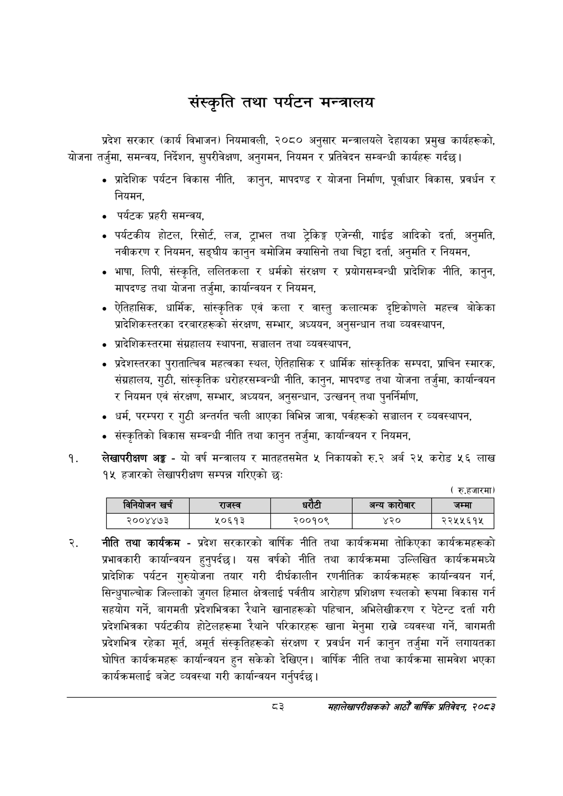

# Page 105 QA

## Rendered page


## Extracted text

```text
संस्कृति तथा पर्यटन मन्त्रालय
प्रदेश सरकार (कार्य विभाजन) नियमावली, २०८० अनुसार मन्त्रालयले देहायका प्रमुख कार्यहरूको, योजना तर्जुमा, समन्वय, निर्देशन, सुपरीवेक्षण, अनुगमन, नियमन र प्रतिवेदन सम्बन्धी कार्यहरू गर्दछ।
प्रादेशिक पर्यटन विकास नीति, कानुन, मापदण्ड र योजना निर्माण, पूर्वाधार विकास, प्रवर्धन र नियमन,
पर्यटक प्रहरी समन्वय,
पर्यटकीय होटल, रिसोर्ट, लज, ट्राभल तथा ट्रेकिङ्ग एजेन्सी, गाईड आदिको दर्ता, अनुमति, नवीकरण र नियमन, सङ्घीय कानुन बमोजिम क्यासिनो तथा चिट्टा दर्ता, अनुमति र नियमन,
भाषा, लिपी, संस्कृति, ललितकला र धर्मको संरक्षण र प्रयोगसम्बन्धी प्रादेशिक नीति, कानुन, मापदण्ड तथा योजना तर्जुमा, कार्यान्वयन र नियमन,
ऐतिहासिक, धार्मिक, सांस्कृतिक एवं कला र वास्तु कलात्मक दृष्टिकोणले महत्त्व बोकेका प्रादेशिकस्तरका दरबारहरूको संरक्षण, सम्भार, अध्ययन, अनुसन्धान तथा व्यवस्थापन,
प्रादेशिकस्तरमा संग्रहालय स्थापना, सञ्चालन तथा व्यवस्थापन,
प्रदेशस्तरका पुराताल्विव महत्वका स्थल, ऐतिहासिक र धार्मिक सांस्कृतिक सम्पदा, प्राचिन स्मारक, संग्रहालय, गुठी, सांस्कृतिक धरोहरसम्बन्धी नीति, कानुन, मापदण्ड तथा योजना तर्जुमा, कार्यान्वयन र नियमन एवं संरक्षण, सम्भार, अध्ययन, अनुसन्धान, उत्खनन्‌ तथा पुनर्निर्माण,
धर्म, परम्परा र गुठी अन्तर्गत चली आएका विभिन्न जात्रा, पर्वहरूको सञ्चालन र व्यवस्थापन,
संस्कृतिको विकास सम्बन्धी नीति तथा कानुन तर्जुमा, कार्यान्वयन र नियमन,
लेखापरीक्षण अङ्ग -यो वर्ष मन्त्रालय र मातहतसमेत ५ निकायको रु.२ अर्ब २५ करोड ५६ लाख १५ हजारको लेखापरीक्षण सम्पन्न गरिएको छ:
( रु.हजारमा)
नीति तथा कार्यक्रम -प्रदेश सरकारको वार्षिक नीति तथा कार्यक्रममा तोकिएका कार्यक्रमहरूको प्रभावकारी कार्यान्वयन हुनुपर्दछ। यस वर्षको नीति तथा कार्यक्रममा उल्लिखित कार्यक्रममध्ये प्रादेशिक पर्यटन गुरुयोजना तयार गरी दीर्घकालीन रणनीतिक कार्यक्रमहरू कार्यान्वयन गर्न, सिन्धुपाल्चोक जिल्लाको जुगल हिमाल क्षेत्रलाई पर्वतीय आरोहण प्रशिक्षण स्थलको रूपमा विकास गर्न सहयोग गर्ने, बागमती प्रदेशभित्रका रेथाने खानाहरूको पहिचान, अभिलेखीकरण र पेटेन्ट दर्ता गरी प्रदेशभित्रका पर्यटकीय होटेलहरूमा रेथाने परिकारहरू खाना मेनुमा राखे व्यवस्था गर्ने, बागमती प्रदेशभित्र रहेका मूर्त, अमूर्त संस्कृतिहरूको संरक्षण र प्रवर्धन गर्न कानुन तर्जुमा गर्ने लगायतका घोषित कार्यक्रमहरू कार्यान्वयन हुन सकेको देखिएन। वार्षिक नीति तथा कार्यक्रमा सामवेश भएका कार्यक्रमलाई बजेट व्यवस्था गरी कार्यान्वयन गर्नुपर्दछ |
द३
महालेखापरीक्षकको आठौं वाषिकि प्रतिवेदन २०८२

|  |  | निनेबोजन |  | राजस्व | ५ १ १ १ १ ५ ५५९ १२ ३२ १४ ९३.२७७६९५ अन्य ५ १ १ १ १ ६ ५९९ ६ ५६ २० २०.६५८४१७ कारेणार ५ १ १ १ १ ७ ७३६ १२ ४० १४ ९६.०७८८७३ जम्मा ४ १ १ १ २ ० ४६ ४४ ७५३ १५ -१ ५ १ १ १ २ १ ४६ ४४ ८७ १५ ९२.२२९९५० २००४४७३ ५ १ १ १ २ २ २३३ ४४ ६० १५ ६७.८५५३५४ ५०६१३ ५ १ १ १ २ ३ ३९८ ४४ ७५ १५ ९२.६१९५५३ २००१०९ ५ १ १ १ २ ४ ५८७ ४४ ३७ १५ ९६.७९५३५७ ४२० ५ १ १ १ २ ५ ७१२ ४४ ८७ १५ ४७.२७२६४४ २२५४५६१५ |  |  |  |
| --- | --- | --- | --- | --- | --- | --- | --- | --- |
|  |  |  |  |  |  |  |  |  |
```

## Flags
- table_page
- medium_quality_table
