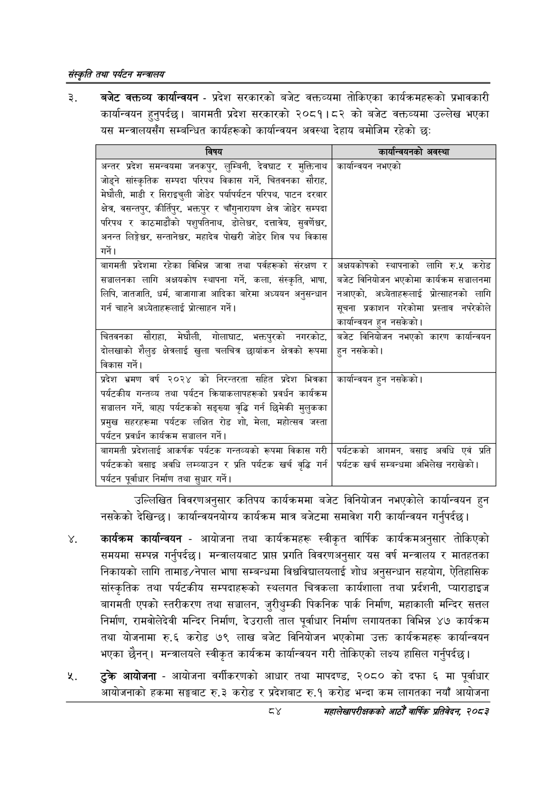

# Page 106 QA

## Rendered page


## Extracted text

```text
संस्कृति तथा पर्यटन मन्त्रालय
बजेट वक्तव्य कार्यान्वयन -प्रदेश सरकारको बजेट वक्तव्यमा तोकिएका कार्यक्रमहरूको प्रभावकारी कार्यान्वयन हुनुपर्दछ। बागमती प्रदेश सरकारको २०८१।८२ को बजेट वक्तव्यमा उल्लेख भएका यस मन्त्रालयसँग सम्बन्धित कार्यहरूको कार्यान्वयन अवस्था देहाय बमोजिम रहेको छः:
उल्लिखित विवरणअनुसार कतिपय कार्यक्रममा बजेट विनियोजन नभएकोले कार्यान्वयन हुन नसकेको देखिन्छ। कार्यान्वयनयोग्य कार्यक्रम मात्र बजेटमा समावेश गरी कार्यान्वयन गर्नुपर्दछ |
कार्यक्रम कार्यान्वयन -आयोजना तथा कार्यक्रमहरू स्वीकृत वार्षिक कार्यक्रमअनुसार तोकिएको समयमा सम्पन्न गर्नुपर्दछ। मन्त्रालयबाट प्राप्त प्रगति विवरणअनुसार यस वर्ष मन्त्रालय र मातहतका निकायको लागि तामाङ/नेपाल भाषा सम्बन्धमा विश्वविद्यालयलाई शोध अनुसन्धान सहयोग, ऐतिहासिक सांस्कृतिक तथा पर्यटकीय सम्पदाहरूको स्थलगत चित्रकला कार्यशाला तथा प्रर्दशनी, प्याराडाइज बागमती एपको स्तरीकरण तथा सञ्चालन, जुरीथुम्की पिकनिक पार्क निर्माण, महाकाली मन्दिर सत्तल निर्माण, रामवोलेदेवी मन्दिर निर्माण, देउराली ताल पूर्वाधार निर्माण लगायतका विभिन्न ४७ कार्यक्रम तथा योजनामा रु.६ करोड ७९ लाख बजेट विनियोजन भएकोमा उक्त कार्यक्रमहरू कार्यान्वयन भएका छैनन्‌। मन्त्रालयले स्वीकृत कार्यक्रम कार्यान्वयन गरी तोकिएको लक्ष्य हासिल गर्नुपर्दछ |
आयोजना -आयोजना वर्गीकरणको आधार तथा मापदण्ड, २०८० को दफा ६ मा पूर्वाधार आयोजनाको हकमा सङ्घबाट रु.३ करोड र प्रदेशबाट रु.१ करोड भन्दा कम लागतका नयाँ आयोजना
महालेखापरीक्षकको वाषिकि प्रतिवेदन २०८२

| विषय | बरर्वान्चबनको अवस्था |
| --- | --- |
| अन्तर प्रदेश समन्वयमा जनकपुर, लुम्बिनी, देवघाट र मुक्तिनाथ जोड्ने ाल्कृतिक सम्पदा परिपथ विकास गर्ने, चितवनका सौराह, मेघौली, माडी र सिराइनुली जोडेर पर्थापर्कटन परिपथ, पाटन दरबार क्षेत्र, बक्षन्तपुर, कीर्तिपुर, भक्तपुर र घाँगुनार॥४ण क्षेत्र जोडेर सम्पदा परिपथय र काठमाडौंको पशुपतिनाथ, डोलेश्वर, दत्तात्ेय, सुवर्णेचर, अनन्त लिङ्गेशर, सन्ताने्र, महादेव पोखरी जोडेर शिव पथ विकास गर्ने। | कार्यान्ववन नभएको |
| जागमती प्रदेशमा रहेका विभिन्न जात्रा तथा पर्नहरूको संरक्षण र सञ्चालनका लागि अक्षयकोष स्थापना गर्ने, कला, संस्कृति, भाषा, | अक्षथकोषको स्थापनाको लागि रु.५ करोड बजेट विनियोजन भएकोमा कार्यक्रम सञ्चालनमा |
| लिपि, जातजाति, धर्म, नाजाभाजा आदिका बारेमा अध्ययन अनुसन्धान गर्न चाहने अध्येताहरूलाई ्रोत्साहन गर्ने। | नआएको, अध्येताहरूलाई त्रोत्साहनको लागि सूचना प्रकाशन भरकोमा प्रस्ताव नपरकोले कार्यान्चकन हुन नसकेको \| |
|  |  |
| चितवनका सौराहा, मेघौली, भोलाबाट, भक्तपुरको नगरकोट, कोलखाको शैलुङ क्षेत्रलाई खुला चलचित्र छ।ाक" क्षेत्रको रूपमा विकास गर्ने। | बजेट विनियोजन नभएको कारण कार्यान्वयन हुन नसकेको \| |
| प्रदेश भ्रमण वर्ष २०२४ को निरन्तरता सहित प्रदेश भित्रका पर्यटकीष गन्तव्य तथा पर्यटन न्रिवाकलापहरूको प्रवर्धन कार्यक्रम सञ्चालन गर्ने, बाहा पर्८८कको सङ्ख्या वृद्धि गर्न छिमेकी मुलुकका प्रमुख ह९हभा पर्यटक लक्षित रोड शो, मेला, भहोत्ण जस्ता पर्यटन प्रवर्धन का१र्थजःम सञ्चालन \| | कार्यान्वयन हुन नसकेको \| |
| बागमती त्रदेशलाई आकर्षक पर्यटक भन्तव्थको रूपमा विकास गरी पर्यटकको बसाइ अवधि लम्ब्याउन र प्रति पर्यटक खर्च वृद्धि गर्न पर्यटन पूर्वाधार निर्माण तथा सुधार गर्ने। | पर्यटकको आगमन, बसाइ अवधि एवं प्रति पर्यटक खर्च सम्बन्धमा अभिलेख नराखको \| |
```

## Flags
- table_page
- medium_quality_table
