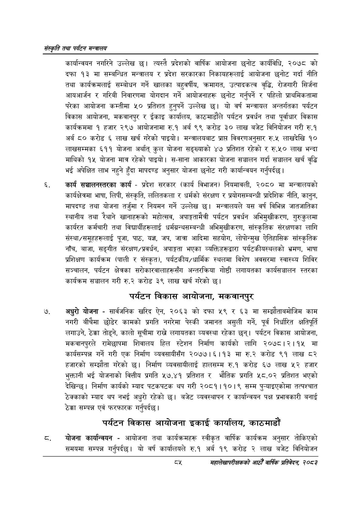

# Page 107 QA

## Rendered page


## Extracted text

```text
संस्कृति तथा पर्यटन मन्त्रालय
कार्यान्वयन नगरिने उल्लेख | त्यस्तै प्रदेशको वार्षिक आयोजना छनोट कार्यविधि, २०७८ को दफा १३ मा सम्बन्धित मन्त्रालय र प्रदेश सरकारका निकायहरूलाई आयोजना छनोट गर्दा नीति तथा कार्यक्रमलाई सम्बोधन गर्ने खालका बहुवर्षीय, क्रमागत, उत्पादकत्व वृद्धि, रोजगारी सिर्जना आयआर्जन र गरिबी निवारणमा योगदान गर्ने आयोजनाहरू छनोट गर्नुपर्ने र पहिलो प्राथमिकतामा परेका आयोजना कम्तीमा ५० प्रतिशत हुनुपर्ने उल्लेख छ। यो वर्ष मन्त्रायल अन्तर्गतका पर्यटन विकास आयोजना, मकवानपुर र ईकाइ कार्यालय, काठमाडौंले पर्यटन प्रवर्धन तथा पूर्वाधार विकास कार्यक्रममा १ हजार २९७ आयोजनामा रु.१ अर्ब ९९ करोड ३० लाख बजेट विनियोजन गरी रु.१ अर्ब ८० करोड ६ लाख खर्च गरेको पाइयो। मन्त्रालयबाट प्राप्त विवरणअनुसार रु.५ लाखदेखि १० लाखसम्मका ६११ योजना अर्थात्‌ कुल योजना सङ्ख्याको ४७ प्रतिशत रहेको र रु.५० लाख भन्दा माथिको १५ योजना मात्र रहेको पाइयो। स-साना आकारका योजना सञ्चालन गर्दा सञ्चालन खर्च वृद्धि भई अपेक्षित लाभ नहुने हुँदा मापदण्ड अनुसार योजना छनोट गरी कार्यान्वयन गर्नुपर्दछ |
कार्य सञ्चालनस्तरका कार्य -प्रदेश सरकार (कार्य विभाजन) नियमावली, २०८० मा मन्त्रालयको कार्यक्षेत्रमा भाषा, लिपी, संस्कृति, ललितकला र धर्मको संरक्षण र प्रयोगसम्बन्धी प्रादेशिक नीति, कानुन, मापदण्ड तथा योजना तर्जुमा र नियमन गर्ने उल्लेख छ। मन्त्रालयले यस वर्ष विभिन्न जातजातिका स्थानीय तथा रैथाने खानाहरूको महोत्सव, अपाङ्गतामैत्री पर्यटन प्रवर्धन अभिमुखीकरण, गुरुकुलमा कार्यरत कर्मचारी तथा विद्यार्थीहरूलाई धर्मग्रन्थसम्बन्धी अभिमुखीकरण, सांस्कृतिक संरक्षणका लागि संस्था/समूहहरूलाई पूजा, पाठ, यज्ञ, जप, जात्रा आदिमा सहयोग, लोपोन्मुख ऐतिहासिक सांस्कृतिक नाँच, बाजा, सङ्गीत संरक्षण/प्रवर्धन, अपाङ्गता भएका व्यक्तिहरूद्वारा पर्यटकीयस्थलको भ्रमण, भाषा प्रशिक्षण कार्यक्रम (पाली र संस्कृत), पर्यटकीय/धार्मिक स्थलमा विशेष अवसरमा स्वास्थ्य शिविर सञ्चालन, पर्यटन क्षेत्रका सरोकारवालाहरूसँग अन्तरक्रिया गोष्ठी लगायतका कार्यसञ्चालन स्तरका कार्यक्रम सञ्चालन गरी रु.२ करोड ३९ लाख खर्च गरेको छ।
पर्यटन विकास आयोजना, मकवानपुर
अधुरो योजना -सार्वजनिक खरिद ऐन, २०६३ को दफा ५९ र ६३ मा सम्झौताबमोजिम काम नगरी बीचैमा छोडेर कामको प्रगति नगरेमा पेस्की जमानत असुली गर्ने, पूर्व निर्धारित क्षतिपूर्ति लगाउने, ठेक्का तोड्ने, कालो सूचीमा लगायतका व्यवस्था रहेका छन्‌। पर्यटन विकास आयोजना, मकवानपुरले रामेछापमा शिवालय हिल स्टेशन निर्माण कार्यको लागि २०७८।२।१५ मा कार्यसम्पन्न गर्ने गरी एक निर्माण व्यवसायीसँग २०७७।६।१३ मा रु.२ करोड ९१ लाख ८२ हजारको सम्झौता गरेको छ। निर्माण व्यवसायीलाई हालसम्म रु.१ करोड ६७ लाख ५२ हजार भुक्तानी भई योजनाको वित्तीय प्रगति ५७.४१ प्रतिशत र भौतिक प्रगति ५८.०२ प्रतिशत भएको देखिन्छ। निर्माण कार्यको म्याद पटकपटक थप गरी २०८१।१०।९ सम्म पुन्याइएकोमा तत्पश्चात रेक्काको म्याद थप नभई अधुरो रहेको छ। बजेट व्यवस्थापन र कार्यान्वयन पक्ष प्रभावकारी बनाई ठेक्का सम्पन्न एवं फरफारक गर्नुपर्दछ |
पर्यटन विकास आयोजना इकाई कार्यालय, काठमाडौं
योजना कार्यान्वयन -आयोजना तथा कार्यक्रमहरू स्वीकृत वार्षिक कार्यक्रम अनुसार तोकिएको समयमा सम्पन्न गर्नुपर्दछ। यो वर्ष कार्यालयले रु.१ अर्ब १९ करोड २ लाख बजेट विनियोजन
दश
महालेखापरीक्षकको आठौ वाषिकि प्रतिवेदन २०८२
```

## Flags
- None
