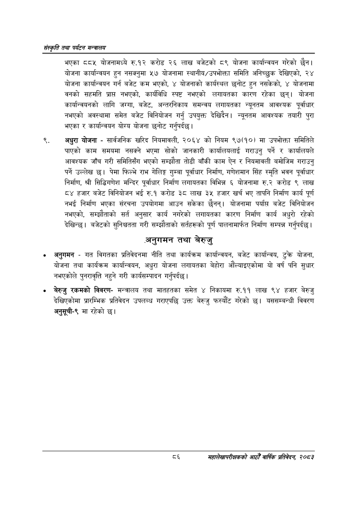

# Page 108 QA

## Rendered page


## Extracted text

```text
संस्कृति तथा पर्यटन मन्त्रालय
९.
भएका ८८५ योजनामध्ये रु.१२ करोड २६ लाख बजेटको ८९ योजना कार्यान्वयन गरेको छैन। योजना कार्यान्वयन हुन नसक्नुमा ५७ योजनामा स्थानीय/उपभोक्ता समिति अनिच्छुक देखिएको, २४ योजना कार्यान्वयन गर्न बजेट कम भएको, ४ योजनाको कार्यस्थल छनोट हुन नसकेको, ४ योजनामा वनको सहमति प्राप्त नभएको, कार्यविधि स्पष्ट नभएको लगायतका कारण रहेका छन्‌। योजना कार्यान्वयनको लागि जग्गा, बजेट, अन्तरनिकाय समन्वय लगायतका न्यूनतम आवश्यक पूर्वाधार नभएको अवस्थामा समेत बजेट विनियोजन गर्नु उपयुक्त देखिदैन। न्यूनतम आवश्यक तयारी पुरा भएका र कार्यान्वयन योग्य योजना छनोट गर्नुपर्दछ |
अधुरा योजना -सार्वजनिक खरिद नियमावली, २०६४ को नियम ९७(१०) मा उपभोक्ता समितिले पाएको काम समयमा नसक्ने भएमा सोको जानकारी कार्यालयलाई गराउनु पर्ने र कार्यालयले आवश्यक जाँच गरी समितिसँग भएको सम्झौता तोडी बाँकी काम ऐन र नियमावली बमोजिम गराउनु पर्ने उल्लेख छ। पेमा फिल्भे राभ गेलिङ्ग गुम्बा पूर्वाधार निर्माण, गणेशमान सिंह स्मृति भवन पूर्वाधार निर्माण, श्री सिद्धिगणेश मन्दिर पूर्वाधार निर्माण लगायतका विभिन्न ६ योजनामा रु.२ करोड ९ लाख ८४ हजार बजेट विनियोजन भई रु.१ करोड ३८ लाख ३५ हजार खर्च भए तापनि निर्माण कार्य पूर्ण नभई निर्माण भएका संरचना उपयोगमा आउन सकेका छैनन्‌। योजनामा पर्याप्त बजेट विनियोजन नभएको, सम्झौताको सर्त अनुसार कार्य नगरेको लगायतका कारण निर्माण कार्य अधुरो रहेको देखिन्छ। बजेटको सुनिश्चतता गरी सम्झौताको सर्तहरूको पूर्ण पालनामार्फत निर्माण सम्पन्न गर्नुपर्दछ |
अनुगमन तथा बेरुजु
अनुगमन -गत विगतका प्रतिवेदनमा नीति तथा कार्यक्रम कार्यान्वयन, बजेट कार्यान्वय, टुक्रे योजना, योजना तथा कार्यक्रम कार्यान्वयन, अधुरा योजना लगायतका बेहोरा औंल्याइएकोमा यो वर्ष पनि सुधार नभएकोले पुनरावृत्ति नहुने गरी कार्यसम्पादन गर्नुपर्दछ |
बेरुजु रकमको विवरणमन्त्रालय तथा मातहतका समेत ४ निकायमा रु.११ लाख ९४ हजार बेरुजु देखिएकोमा प्रारम्भिक प्रतिवेदन उपलब्ध गराएपछि उक्त बेरुजु फस्यौट गरेको छ। यससम्बन्धी विवरण अनुसूची-९ मा रहेको छ।
महालेखापरीक्षकको वाषिकि प्रतिवेदन २०८२
```

## Flags
- None
