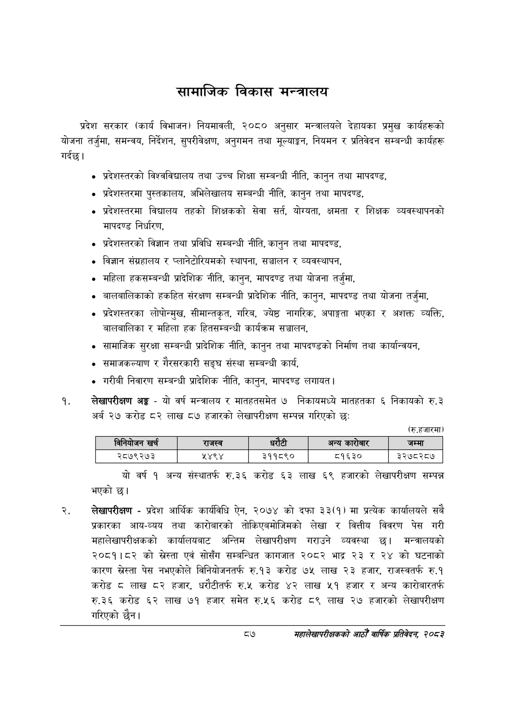

# Page 109 QA

## Rendered page


## Extracted text

```text
सामाजिक विकास मन्त्रालय
प्रदेश सरकार (कार्य विभाजन) नियमावली, २०८० अनुसार मन्त्रालयले देहायका प्रमुख कार्यहरूको योजना तर्जुमा, समन्वय, निर्देशन, सुपरीवेक्षण, अनुगमन तथा मूल्याङ्कन, नियमन र प्रतिवेदन सम्बन्धी कार्यहरू गर्दछ |
प्रदेशस्तरको विश्वविद्यालय तथा उच्च शिक्षा सम्बन्धी नीति, कानुन तथा मापदण्ड,
प्रदेशस्तरमा पुस्तकालय, अभिलेखालय सम्बन्धी नीति, कानुन तथा मापदण्ड,
प्रदेशस्तरमा विद्यालय तहको शिक्षकको सेवा सर्त, योग्यता, क्षमता र शिक्षक व्यवस्थापनको मापदण्ड निर्धारण,
प्रदेशस्तरको विज्ञान तथा प्रविधि सम्बन्धी नीति, कानुन तथा मापदण्ड,
विज्ञान संग्रहालय र प्लानेटोरियमको स्थापना, सञ्चालन र व्यवस्थापन,
महिला हकसम्बन्धी प्रादेशिक नीति, कानुन, मापदण्ड तथा योजना तर्जुमा,
बालबालिकाको हकहित संरक्षण सम्बन्धी प्रादेशिक नीति, कानुन, मापदण्ड तथा योजना तर्जुमा,
प्रदेशस्तरका लोपोन्मुख, सीमान्तकृत, गरिब, ज्येष्ठ नागरिक, अपाङ्गता भएका र अशक्त व्यक्ति, बालबालिका र महिला हक हितसम्बन्धी कार्यक्रम सञ्चालन,
सामाजिक सुरक्षा सम्बन्धी प्रादेशिक नीति, कानुन तथा मापदण्डको निर्माण तथा कार्यान्वयन,
समाजकल्याण र गैरसरकारी सङ्घ संस्था सम्बन्धी कार्य,
गरीबी निवारण सम्बन्धी प्रादेशिक नीति, कानुन, मापदण्ड लगायत |
लेखापरीक्षण अङ्ग -यो वर्ष मन्त्रालय र मातहतसमेत ७ निकायमध्ये मातहतका ६ निकायको रु.३ अर्ब २७ करोड ८२ लाख ८७ हजारको लेखापरीक्षण सम्पन्न गरिएको छ:
(रुू.हजारमा)
यो वर्ष १ अन्य संस्थातर्फ रु.३६ करोड ६३ लाख ६९ हजारको लेखापरीक्षण सम्पन्न भएको छ।
लेखापरीक्षण -प्रदेश आर्थिक कार्यविधि ऐन, २०७४ को दफा ३३(१) मा प्रत्येक कार्यालयले सबै प्रकारका आय-व्यय तथा कारोबारको तोकिएबमोजिमको लेखा र वित्तीय विवरण पेस गरी महालेखापरीक्षकको कार्यालयबाट अन्तिम लेखापरीक्षण गराउने व्यवस्था छ। मन्त्रालयको २०८१।८२ को स्रेस्ता एवं सोसँग सम्बन्धित कागजात २०८२ भाद्र २३ र २४ को घटनाको कारण स्रेस्ता पेस नभएकोले विनियोजनतर्फ रु.१३ करोड ७५ लाख २३ हजार, राजस्वतर्फ रु.१ करोड ८ लाख ८२ हजार, धरौटीतर्फ रु.५ करोड ४२ लाख ५१ हजार र अन्य कारोबारतर्फ रु.३६ करोड ६२ लाख ७१ हजार समेत रु.५६ करोड ८९ लाख २७ हजारको लेखापरीक्षण गरिएको छैन।
८७
सहालेखापरीक्षकको आठौँ वा्िकै प्रतिवेदन; २०८२

|  | ।नानिकोजन खर्च | राजस्व |  |  | अन्य | जम्मा |
| --- | --- | --- | --- | --- | --- | --- |
|  | २८७९२७३ | २४९४ | ३११८९० |  | ८१६३० | ३२७८२८७ |
```

## Flags
- table_page
- medium_quality_table
