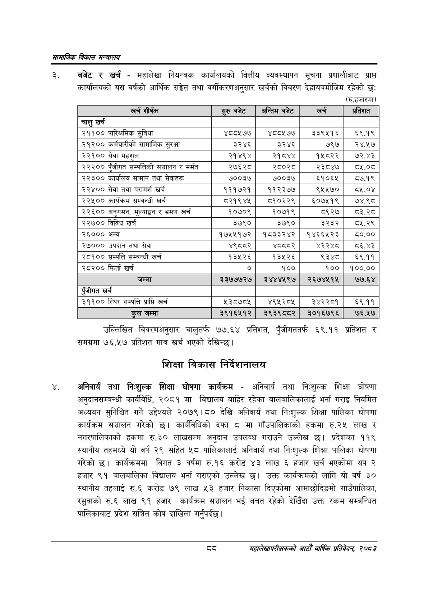

# Page 110 QA

## Rendered page


## Extracted text

```text
सायाजिक विकास
बजेट र खर्च -महालेखा नियन्त्रक कार्यालयको वित्तीय व्यवस्थापन सूचना प्रणालीबाट प्राप्त कार्यालयको यस वर्षको आर्थिक सङ्गेत तथा वर्गीकरणअनुसार खर्चको विवरण देहायबमोजिम रहेको छः
(रु.हजारमा)
उल्लिखित विवरणअनुसार चालुतर्फ ७७.६४ प्रतिशत, पुँजीगततर्फ ६९.११ प्रतिशत र समग्रमा ७६.५७ प्रतिशत मात्र खर्च भएको देखिन्छ |
शिक्षा विकास निर्देशनालय
अनिवार्य तथा निःशुल्क शिक्षा घोषणा कार्यक्रम -अनिवार्य तथा निःशुल्क शिक्षा घोषणा अनुदानसम्बन्धी कार्यविधि, २०८१ मा विद्यालय बाहिर रहेका बालबालिकालाई भर्ना गराइ नियमित अध्ययन सुनिश्चित गर्ने उद्देश्यले २०७९।८० देखि अनिवार्य तथा नि:शुल्क शिक्षा पालिका घोषणा कार्यक्रम सञ्चालन गरेको छ। कार्यविधिको दफा मा गाँउपालिकाको हकमा रु.२४ लाख र नगरपालिकाको हकमा रु.३० लाखसम्म अनुदान उपलब्ध गराउने उल्लेख छ। प्रदेशका ११९ स्थानीय तहमध्ये यो वर्ष २९ सहित ५८ पालिकालाई अनिवार्य तथा निःशुल्क शिक्षा पालिका घोषणा गरेको छ। कार्यक्रममा विगत ३ वर्षमा रु.१६ करोड ४३ लाख ६ हजार खर्च भएकोमा थप २ हजार ९१ बालबालिका विद्यालय भर्ना गराएको उल्लेख छ। उक्त कार्यक्रमको लागि यो वर्ष ३० स्थानीय तहलाई रु.६ करोड ७९ लाख ५३ हजार निकासा दिएकोमा आमाछोदिङमो गाउँपालिका, रसुवाको रु.६ लाख ९१ हजार कार्यक्रम सञ्चालन भई बचत रहेको देखिँदा उक्त रकम सम्बन्धित पालिकाबाट प्रदेश सञ्चित कोष दाखिला गर्नुपर्दछ |
दद
महालेखापरीक्षकको आठौँ वाषिकि प्रतिवेदन २०८२

| खच शीर्षक | सुरु बबेट | अन्तिम बजेट | खर्च | प्रतिशत |
| --- | --- | --- | --- | --- |
| चालु खर्च |  |  |  |  |
| २११०० पारिश्रमिक सुविधा | ४८८५७७ | ४८८५७७ | २३३९५१६ | ६९.१९ |
| २१२०० कर्मचारीको सामाजिक सुरक्षा | ३२४६ | ३२४६ | ७९७ | २४.५७ |
| २२१०० सेवा महशुल | २१४९४ | २१८४४ | १५८२२ | ७२.४३ |
| २२२०० पुँजीगत क्षम्पतिको सञ्चालन र मर्मत | २७६२८ | २८०२८ | २३८४७ | ०५.०८ |
| २२३०० कार्यालय सामान तथा सेवाहरू | ७००३७ | ७००३७ | ६५१०६५ | ८७.१९ |
| २२४०० सेवा तथा परामर्श खर्च | १११७२१ | ९९३३६०६ | ९५५७० | .० |
| २२४५०० कार्यक्रम सम्बन्धी खर्च | ८२१९४४५ | ८१०२२९ | ६०७५१९ | ७४.९८ |
| २२६०० अनुगमन, मूल्याङ्कन र भ्रमण खर्च | १०७०९ | १०७१९ | ८९२७ | व३.२८ |
| २२७०० विविध खर्च | ३७९० | ३७९० | ३२३२ | ८५.२९ |
| २६००० अन्य | १७५२५१७२ | १८३३२४२ | १४६६५२३ | ८०.०० |
| २७००० उपदान तथा सेवा | ४९८वर२ | श्दववर | ४२२४८ | व६.४३ |
| २८१०० सम्पत्ति सम्बन्धी खर्च | १३५२६ | १३५२६ | ९३४८ | ६९.११ |
| २८२०० फिर्ता खर्च |  | १०० | १०० | १००.०० |
| जम्मा | २२७७७२७ | २४४४५९७ | २६७४५१५ | ७७.६४ |
| खर्च |  |  |  |  |
| ३११०० स्थिर सम्पत्ति प्राप्ति खर्च | ५३८७८५ | ४९५२८५ | ३४२२८१ | ६९.११ |
| जम्मा | २९१६५१२ | २९३९८८२ | २०१६७९६ | ७६.५२७ |
```

## Flags
- table_page
- medium_quality_table
