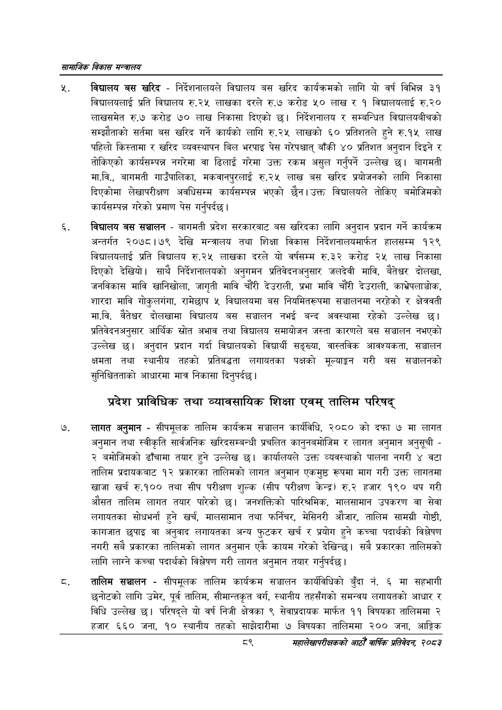

# Page 111 QA

## Rendered page


## Extracted text

```text
सायाजिक विकास
र. विद्यालय बस खरिद -निर्देशनालयले विद्यालय बस खरिद कार्यक्रमको लागि यो वर्ष विभिन्न ३१ विद्यालयलाई प्रति विद्यालय रु.२५ लाखका दरले रु.७ करोड ५० लाख र १ विद्यालयलाई रु.२० लाखसमेत रु.७ करोड ७० लाख निकासा दिएको छ। निर्देशनालय र सम्बन्धित विद्यालयबीचको सम्झौताको सर्तमा बस खरिद गर्ने कार्यको लागि रु.२५ लाखको ६० प्रतिशतले हुने रु.१५ लाख पहिलो किस्तामा र खरिद व्यवस्थापन बिल भरपाइ पेस गरेपश्चात्‌ बाँकी ४० प्रतिशत अनुदान दिइने र तोकिएको कार्यसम्पन्न नगरेमा वा ढिलाई गरेमा उक्त रकम असुल गर्नुपर्ने उल्लेख छ। बागमती मा.वि., बागमती गाउँपालिका, मकवानपुरलाई रु.२५ लाख बस खरिद प्रयोजनको लागि निकासा दिएकोमा लेखापरीक्षण अवधिसम्म कार्यसम्पन्न भएको छैन। उक्त विद्यालयले तोकिए बमोजिमको कार्यसम्पन्न गरेको प्रमाण पेस गर्नुपर्दछ |
विद्यालय बस सञ्चालन -बागमती प्रदेश सरकारबाट बस खरिदका लागि अनुदान प्रदान गर्ने कार्यक्रम अन्तर्गत २०७८।७९ देखि मन्त्रालय तथा शिक्षा विकास निर्देशनालयमार्फत हालसम्म १२९ विद्यालयलाई प्रति विद्यालय रु.२५ लाखका दरले यो वर्षसम्म रु.३२ करोड २५ लाख निकासा दिएको देखियो। साथै निर्देशनालयको अनुगमन प्रतिवेदनअनुसार जलदेवी मावि, बैतेध्वर दोलखा, जनविकास मावि खानिखोला, जागृती मावि चौंरी देउराली, प्रभा मावि चौंरी देउराली, काभ्रेपलाञ्चोक, शारदा मावि गोकुलगंगा, रामेछाप ५ विद्यालयमा बस नियमितरूपमा सञ्चालनमा नरहेको र क्षेत्रवती मा.वि. दोलखामा विद्यालय बस सञ्चालन नभई बन्द अवस्थामा रहेको उल्लेख छ। प्रतिवेदनअनुसार आर्थिक स्रोत अभाव तथा विद्यालय समायोजन जस्ता कारणले बस सञ्चालन नभएको उल्लेख छ। अनुदान प्रदान गर्दा विद्यालयको विद्यार्थी सङ्ख्या, वास्तविक आवश्यकता, सञ्चालन क्षमता तथा स्थानीय तहको प्रतिबद्धता लगायतका पक्षको मूल्याङ्कन गरी बस सञ्चालनको सुनिश्चितताको आधारमा मात्र निकासा दिनुपर्दछ |
प्रदेश प्राविधिक तथा व्यावसायिक शिक्षा एवम्‌ तालिम परिषद्‌
लागत अनुमान -सीपमूलक तालिम कार्यक्रम सञ्चालन कार्यविधि, २०८० को दफा ७ मा लागत अनुमान तथा स्वीकृति सार्वजनिक खरिदसम्बन्धी प्रचलित कानुनबमोजिम र लागत अनुमान अनुसूची -२ बमोजिमको ढाँचामा तयार हुने उल्लेख छ। कार्यालयले उक्त व्यवस्थाको पालना नगरी ४ वटा तालिम प्रदायकबाट १२ प्रकारका तालिमको लागत अनुमान एकमुष्ठ रूपमा माग गरी उक्त लागतमा खाजा खर्च रु.१०० तथा सीप परीक्षण शुल्क (सीप परीक्षण केन्द्र) रु.२ हजार १९० थप गरी औसत तालिम लागत तयार पारेको छ। जनशक्तिको पारिश्रमिक, मालसामान उपकरण वा सेवा लगायतका सोधभर्ना हुने खर्च, मालसामान तथा फर्निचर, मेसिनरी औजार, तालिम सामग्री गोष्ठी, कागजात छपाइ वा अनुवाद लगायतका अन्य फुटकर खर्च र प्रयोग हुने कच्चा पदार्थको विश्लेषण नगरी सबै प्रकारका तालिमको लागत अनुमान एकै कायम गरेको देखिन्छ। सबै प्रकारका तालिमको लागि लाग्ने कच्चा पदार्थको विश्लेषण गरी लागत अनुमान तयार गर्नुपर्दछ |
तालिम सञ्चालन -सीपमूलक तालिम कार्यक्रम सञ्चालन कार्यविधिको बुँदा न. ६ मा सहभागी छनोटको लागि उमेर, पूर्व तालिम, सीमान्तकृत वर्ग, स्थानीय तहसँगको समन्वय लगायतको आधार र विधि उल्लेख छ। परिषद्ले यो वर्ष निजी क्षेत्रका ९ सेवाप्रदायक मार्फत ११ विषयका तालिममा २ हजार ६६० जना, ९० स्थानीय तहको साझेदारीमा ७ विषयका तालिममा २०० जना, आङ्गिक
महालेखापरीक्षकको आठौँ वाषिकि प्रतिवेदन २०८२
```

## Flags
- None
