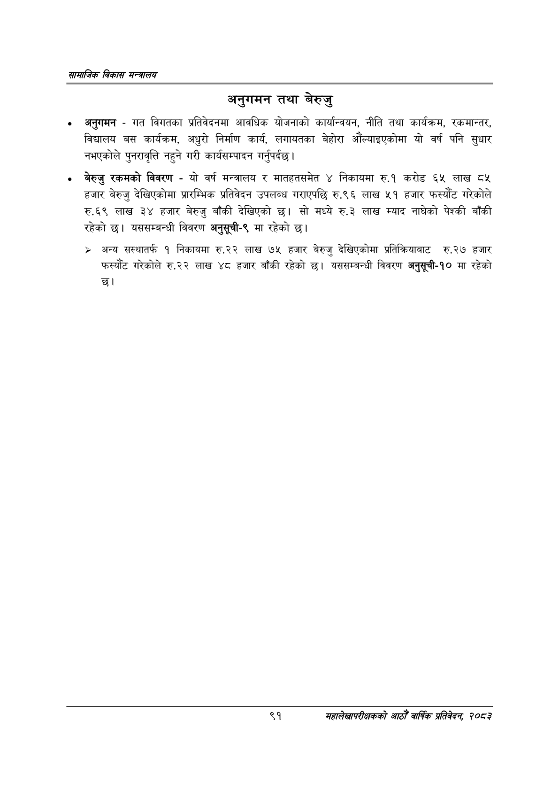

# Page 113 QA

## Rendered page


## Extracted text

```text
सायाजिक विकास
अनुगमन तथा बेरुजु
अनुगमन -गत विगतका प्रतिवेदनमा आवधिक योजनाको कार्यान्वयन, नीति तथा कार्यक्रम, रकमान्तर, विद्यालय बस कार्यक्रम, अधुरो निर्माण कार्य, लगायतका बेहोरा औंल्याइएकोमा यो वर्ष पनि सुधार नभएकोले पुनरावृत्ति नहुने गरी कार्यसम्पादन गर्नुपर्दछ |
बेरुजु रकमको विवरण -यो वर्ष मन्त्रालय र मातहतसमेत ४ निकायमा रु.१ करोड ६५ लाख हजार बेरुजु देखिएकोमा प्रारम्भिक प्रतिवेदन उपलब्ध गराएपछि रु.९६ लाख ५१ हजार फस्यौट गरेकोले रु.६९ लाख ३४ हजार बेरुजु बाँकी देखिएको छ। सो मध्ये रु.३ लाख म्याद नाघेको पेश्की बाँकी रहेको | यससम्बन्धी विवरण अनुसूची-९ मा रहेको छ।
» अन्य सस्थातर्फ १ निकायमा रु.२२ लाख ७५ हजार बेरुजु देखिएकोमा प्रतिक्रियाबाट रु.२७ हजार फस्यौट गरेकोले रु.२२ लाख ४८ हजार बाँकी रहेको छ। यससम्बन्धी विवरण अनुसूची-१० मा रहेको छ।
९१
महालेखापरीक्षकको आठौँ वाषिकि प्रतिवेदन २०८२
```

## Flags
- None
