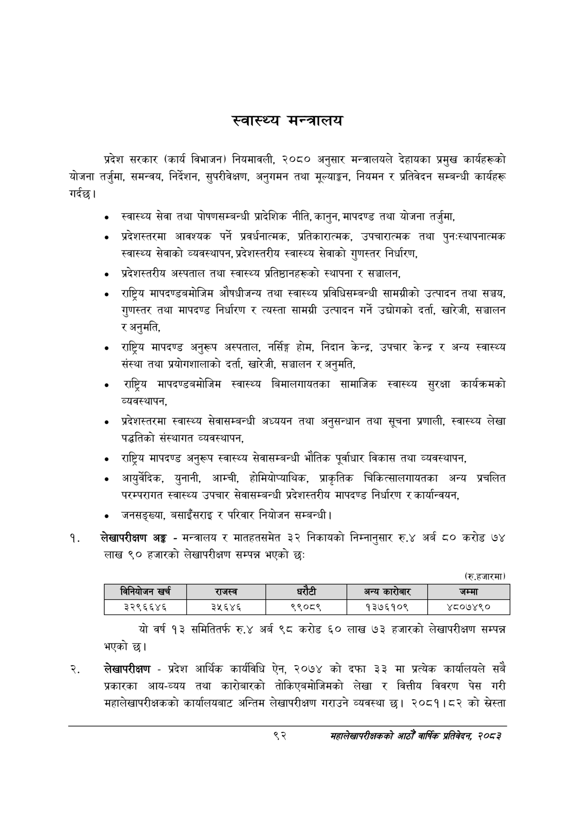

# Page 114 QA

## Rendered page


## Extracted text

```text
स्वास्थ्य मन्त्रालय
प्रदेश सरकार (कार्य विभाजन) नियमावली, २०८० अनुसार मन्त्रालयले देहायका प्रमुख कार्यहरूको योजना तर्जुमा, समन्वय, निर्देशन, सुपरीवेक्षण, अनुगमन तथा मूल्याङ्कन, नियमन र प्रतिवेदन सम्बन्धी कार्यहरू गर्दछ।
स्वास्थ्य सेवा तथा पोषणसम्बन्धी प्रादेशिक नीति, कानुन, मापदण्ड तथा योजना तर्जुमा,
प्रदेशस्तरमा आवश्यक पर्ने प्रवर्धनात्मक, प्रतिकारात्मक, उपचारात्मक तथा पुनःस्थापनात्मक स्वास्थ्य सेवाको व्यवस्थापन, प्रदेशस्तरीय स्वास्थ्य सेवाको गुणस्तर निर्धारण,
प्रदेशस्तरीय अस्पताल तथा स्वास्थ्य प्रतिष्ठानहरूको स्थापना र सञ्चालन,
राष्ट्रिय मापदण्डबमोजिम औषधीजन्य तथा स्वास्थ्य प्रविधिसम्बन्धी सामग्रीको उत्पादन तथा सञ्चय, गुणस्तर तथा मापदण्ड निर्धारण र त्यस्ता सामग्री उत्पादन गर्ने उद्योगको दर्ता, खारेजी, सञ्चालन र अनुमति,
राष्ट्रिय मापदण्ड अनुरूप अस्पताल, नर्सिङ्ग होम, निदान केन्द्र, उपचार केन्द्र र अन्य स्वास्थ्य संस्था तथा प्रयोगशालाको दर्ता, खारेजी, सञ्चालन र अनुमति,
राष्ट्रिय मापदण्डबमोजिम स्वास्थ्य बिमालगायतका सामाजिक स्वास्थ्य सुरक्षा कार्यक्रमको व्यवस्थापन,
प्रदेशस्तरमा स्वास्थ्य सेवासम्बन्धी अध्ययन तथा अनुसन्धान तथा सूचना प्रणाली, स्वास्थ्य लेखा पद्धतिको संस्थागत व्यवस्थापन,
राष्ट्रिय मापदण्ड अनुरूप स्वास्थ्य सेवासम्बन्धी भौतिक पूर्वाधार विकास तथा व्यवस्थापन,
आयुर्वेदिक, युनानी, आम्ची, होमियोप्याथिक, प्राकृतिक चिकित्सालगायतका अन्य प्रचलित परम्परागत स्वास्थ्य उपचार सेवासम्बन्धी प्रदेशस्तरीय मापदण्ड निर्धारण र कार्यान्वयन,
जनसङ्ख्या, बसाइँसराइ र परिवार नियोजन सम्बन्धी |
लेखापरीक्षण अङ्ग -मन्त्रालय र मातहतसमेत ३२ निकायको निम्नानुसार रु.४ अर्ब ८० करोड लाख ९० हजारको लेखापरीक्षण सम्पन्न भएको छः
(रु.हजारमा)
यो वर्ष १३ समितितर्फ रु.४ अर्ब ९८ करोड ६० लाख ७३ हजारको लेखापरीक्षण सम्पन्न भएको छ।
लेखापरीक्षण -प्रदेश आर्थिक कार्यविधि ऐन, २०७४ को दफा ३३ मा प्रत्येक कार्यालयले सबै प्रकारका आय-व्यय तथा कारोबारको तोकिएबमोजिमको लेखा र वित्तीय विवरण पेस गरी महालेखापरीक्षकको कार्यालयबाट अन्तिम लेखापरीक्षण गराउने व्यवस्था छ। २०८१।८२ को सस्ता
९२
महालेखापरीक्षकको आठौँ वाषिकि प्रतिवेदन २०८२

| बानवोजन खर्च | राजस्व | धरेटी |  | अन्य कारोबार |
| --- | --- | --- | --- | --- |
| ३२९६६४६ | ३५६४६ | ९९०८९ |  | १३७६१०९ |
```

## Flags
- table_page
- medium_quality_table
