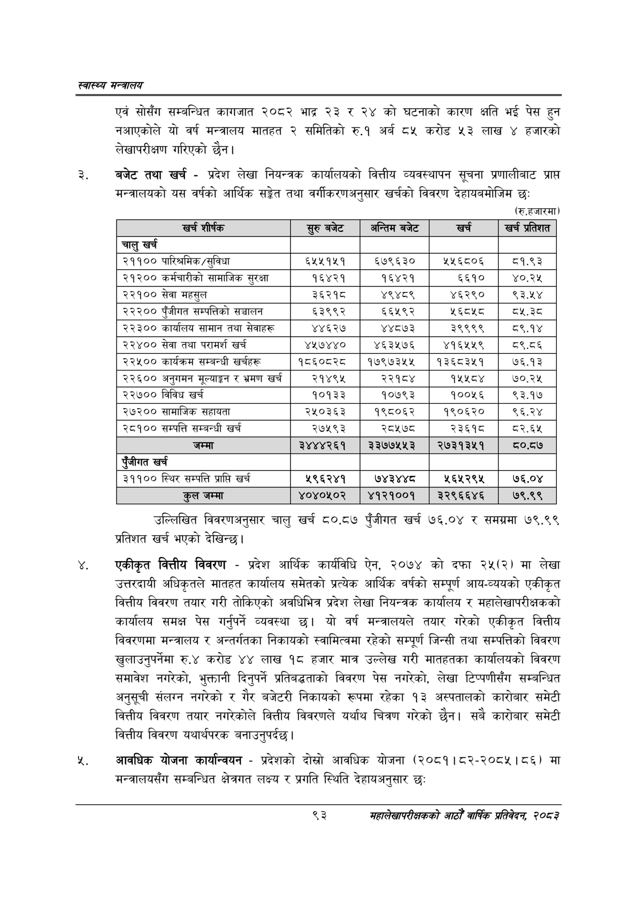

# Page 115 QA

## Rendered page


## Extracted text

```text
स्वास्थ्य मन्त्रालय
एवं सोसँग सम्बन्धित कागजात २०८२ भाद्र २३ र २४ को घटनाको कारण क्षति भई पेस हुन नआएकोले यो वर्ष मन्त्रालय मातहत २ समितिको रु.१ अर्ब ८५ करोड ५३ लाख ४ हजारको लेखापरीक्षण गरिएको छैन।
बजेट तथा खर्च -प्रदेश लेखा नियन्त्रक कार्यालयको वित्तीय व्यवस्थापन सूचना प्रणालीबाट प्राप्त मन्त्रालयको यस वर्षको आर्थिक सङ्ेत तथा वर्गीकरणअनुसार खर्चको विवरण देहायबमोजिम छः
(रु.हजारमा)
उल्लिखित विवरणअनुसार चालु खर्च ८०.८७ पुँजीगत खर्च ७६.०४ र समग्रमा ७९.९९ प्रतिशत खर्च भएको देखिन्छ।
एकीकृत वित्तीय विवरण -प्रदेश आर्थिक कार्यविधि ऐन, २०७४ को दफा २५(२) मा लेखा उत्तरदायी अधिकृतले मातहत कार्यालय समेतको प्रत्येक आर्थिक वर्षको सम्पूर्ण आय-व्ययको एकीकृत वित्तीय विवरण तयार गरी तोकिएको अवधिभित्र प्रदेश लेखा नियन्त्रक कार्यालय र महालेखापरीक्षकको कार्यालय समक्ष पेस गर्नुपर्ने व्यवस्था यो वर्ष मन्त्रालयले तयार गरेको एकीकृत वित्तीय विवरणमा मन्त्रालय र अन्तर्गतका निकायको स्वामित्वमा रहेको सम्पूर्ण जिन्सी तथा सम्पत्तिको विवरण खुलाउनुपर्नेमा रु.४ करोड ४४ लाख १८ हजार मात्र उल्लेख गरी मातहतका कार्यालयको विवरण समावेश नगरेको, भुक्तानी दिनुपर्ने प्रतिबद्धताको विवरण पेस नगरेको, लेखा टिप्पणीसँग सम्बन्धित अनुसूची संलग्न नगरेको र गैर बजेटरी निकायको रूपमा रहेका १३ अस्पतालको कारोबार समेटी वित्तीय विवरण तयार नगरेकोले वित्तीय विवरणले यर्थाथ चित्रण गरेको छैन। सबै कारोबार समेटी वित्तीय विवरण यथार्थपरक बनाउनुपर्दछ।
आवधिक योजना कार्यान्वयन -प्रदेशको दोस्रो आवधिक योजना (२०८१।८२-२०८५।८६) मा मन्त्रालयसँग सम्बन्धित क्षेत्रगत लक्ष्य र प्रगति स्थिति देहायअनुसार छः
९३
सहालेखापरीक्षकको आठौँ वाषिकि प्रतिवेदन २०८२

| खर्च शीर्षक | सुरुबबेट | अन्तिम बजेट | खर्च | खर्च प्रतिशत |
| --- | --- | --- | --- | --- |
| चालु खर्च |  |  |  |  |
| २११०० पारिश्रमिक/सुविधा | ६५५१५१ | ६७९६३० | ५५६८०६ | ८१.९३ |
| २१२०० कर्मचारीको सामाजिक सुरक्षा | १६४२१ | १६४२१ | ६६१० | ४०.२५ |
| २२१०० सेवा महसुल | ३६२१८ | ४९४८९ | ४६२९० | ९३.१४ |
| २२२०० पुँजीगत सम्पत्तिको सञ्चालन | ६३९९२ | ६५६५९२ | ५६८५८ | ८५.३ठ |
| २२३०० कार्यालय सामान तथा सेवाहरू | ४४६२७ | ४४८७३ | ३९९९९ | ८९.१४ |
| २२४०० सेवा तथा परामर्श खर्च | ४५७४४० | ४६३५७६ | ४१६५४५९ | ८९.८६ |
| २२५०० कार्थक्रल सम्बन्धी खर्चहरू | १८६०८२८ | १७९७३५५ | १३६८३५१ | ७६.१३ |
| २२६०० अनुनमन २ूल्याङ्गन र भ्रमण खर्च | २१४९५ | २२१४ | १५४८४ | ७०.२५ |
| २२७०० विविध खर्च | १०१३३ | १०७९३ | १००५६ | ९३.१७ |
| २७२०० सामाजिक सहायता | २५०३६३ | १९८०६२ | १९०६२० | ९६.२४ |
| २८१०० सम्पत्ति सम्बन्धी खर्च | २७५९३ | २८५७८ | २३६१८ | ८२.६४५ |
| जम्मा | २४४४२६१ | ३३७७५५३ | २७३१३४५१ | ८०.८७ |
| एंजीगत खर्च |  |  |  |  |
| ३११०० स्थिर सम्पत्ति प्राप्ति खर्च | ५९६२४१ | ७४३४४८ | ५६५२९५ | ७६.०४ |
| तल जम्मा | ४०४०५०२ | ४१२१००१ | ३२९६६४६ | ७९.९९ |
```

## Flags
- table_page
- medium_quality_table
