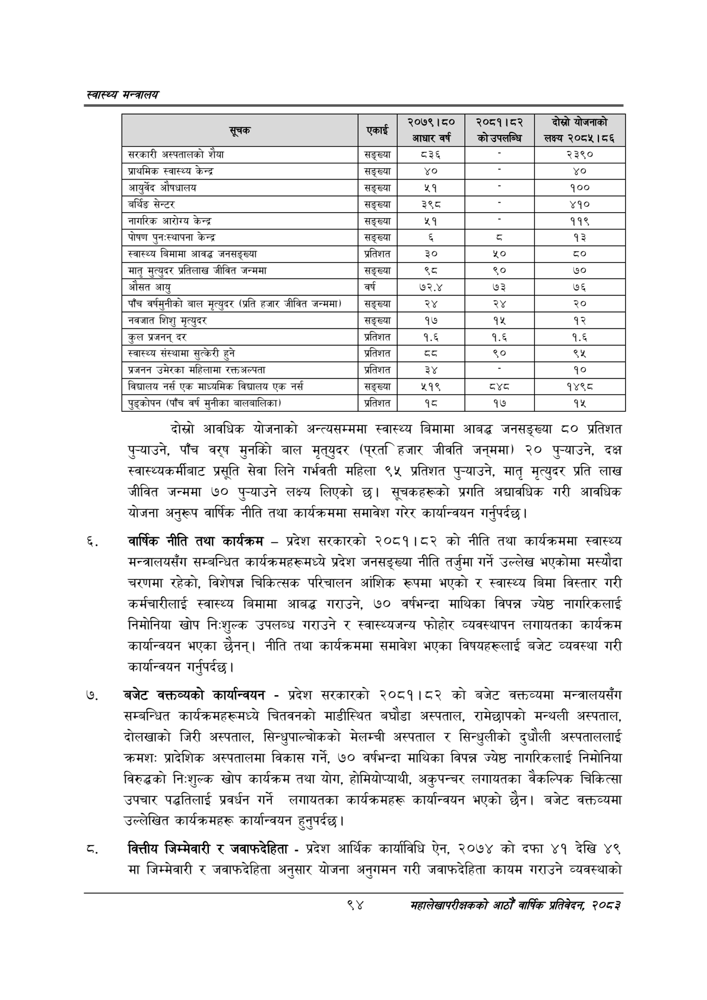

# Page 116 QA

## Rendered page


## Extracted text

```text
स्वास्थ्य मन्त्रालय
दोस्रो आवधिक योजनाको अन्त्यसम्ममा स्वास्थ्य बिमामा आबद्ध जनसङ्ख्या ८० प्रतिशत पुन्याउने, पाँच वरष मुनको बाल मृत्‌युदर ( हजार जीवति जन्‌ममा) २० पुन्याउने, दक्ष स्वास्थ्यकर्मीबाट प्रसूति सेवा लिने गर्भवती महिला ९४५ प्रतिशत पुन्याउने, मातृ मृत्युदर प्रति लाख जीवित जन्ममा ७० पुन्याउने लक्ष्य लिएको छ। सूचकहरूको प्रगति अद्यावधिक गरी आवधिक योजना अनुरूप वार्षिक नीति तथा कार्यक्रममा समावेश गरेर कार्यान्वयन गर्नुपर्दछ |
वार्षिक नीति तथा कार्यक्रम -प्रदेश सरकारको २०८१।८२ को नीति तथा कार्यक्रममा स्वास्थ्य मन्त्रालयसँग सम्बन्धित कार्यक्रमहरूमध्ये प्रदेश जनसङ्ख्या नीति तर्जुमा गर्ने उल्लेख भएकोमा मस्यौदा चरणमा रहेको, विशेषज्ञ चिकित्सक परिचालन आंशिक रूपमा भएको र स्वास्थ्य बिमा विस्तार गरी कर्मचारीलाई स्वास्थ्य बिमामा आबद्ध गराउने, ७० वर्षभन्दा माथिका विपन्न ज्येष्ठ नागरिकलाई निमोनिया खोप निःशुल्क उपलब्ध गराउने र स्वास्थ्यजन्य फोहोर व्यवस्थापन लगायतका कार्यक्रम कार्यान्वयन भएका छैनन्‌। नीति तथा कार्यक्रममा समावेश भएका विषयहरूलाई बजेट व्यवस्था गरी कार्यान्वयन गर्नुपर्दछ |
बजेट कक्तव्यको कार्यान्वयन -प्रदेश सरकारको २०८१।८२ को बजेट वक्तव्यमा मन्त्रालयसँग सम्बन्धित कार्यक्रमहरूमध्ये चितवनको माडीस्थित बघौडा अस्पताल, रामेछापको मन्थली अस्पताल, दोलखाको जिरी अस्पताल, सिन्धुपाल्चोकको मेलम्ची अस्पताल र सिन्धुलीको दुधौली अस्पताललाई क्रमश: प्रादेशिक अस्पतालमा विकास गर्ने, ७० वर्षभन्दा माथिका विपन्न ज्येष्ठ नागरिकलाई निमोनिया विरुद्धको निःशुल्क खोप कार्यक्रम तथा योग, होमियोप्याथी, अकुपन्चर लगायतका वैकल्पिक चिकित्सा उपचार पद्धतिलाई प्रवर्धन गर्ने लगायतका कार्यक्रमहरू कार्यान्वयन भएको छैन। बजेट वक्तव्यमा उल्लेखित कार्यक्रमहरू कार्यान्वयन हुनुपर्दछ |
वित्तीय जिम्मेवारी र जवाफदेहिता -प्रदेश आर्थिक कार्याविधि ऐन, २०७४ को दफा ४१ देखि ४९ मा जिम्मेवारी र जवाफदेहिता अनुसार योजना अनुगमन गरी जवाफदेहिता कायम गराउने व्यवस्थाको
९४
सहालेखापरीक्षकको आठौँ वाषिकि प्रतिवेदन २०८२

|  |  | ब्ब्त्य५५०१५५८८५५०५५ आधार वर्ष | कोउपलण्न |
| --- | --- | --- | --- |
| सरकारी अस्पतालको शैया | सङ्ख्या | ८३६ |  |
| प्राथमिक स्वास्थ्य केन्द्र | सङ्ख्या | ४० |  |
| आयुर्वेद औषधालय | सङ्ख्या | २१ |  |
| वर्थिङ सेन्टर | सङ्ख्या | ३९८ |  |
| नागरिक आरोग्य केन्द्र | सङ्ख्या | ५१ |  |
| पोषण पुनःस्थापना केन्द्र | सङ्ख्या |  | व्‌ |
| स्वास्थ्य बिमामा आवद्ध जनसङ्ख्या | प्रतिशत | ३० |  |
| मातृ मुत्युदर प्रतिलाख जीवित जन्ममा | सङ्ख्या | १ | ९० |
| औसत आयु | वर्ष | ७२.४ | ७३ |
| पाँच वर्षभुनीको बाल मृत्युदर (प्रति हजार जीवित जन्ममा | सङ्ख्या | २४ | २४ |
| नवजात शिशु मृत्युदर | सङ्ख्या | १७ | १५ |
| कुल प्रजनन्‌ दर | प्रतिशत | १.६ | १.६ |
| स्वास्थ्य संस्थामा सुत्केरी हुने | प्रतिशत | (५३ | ९० |
| प्रजनन उमेरका महिलामा रक्तअल्पता | प्रतिशत | ३४ |  |
| विद्यालय नर्स एक भाध्यमिक विद्यालय एक नर्स | सङ्ख्या | ५१९ | (३% |
| चुड्कोषन (पाँच वर्ष मुनीका बालबालिका) | प्रतिशत | १८ | १७ |
```

## Flags
- table_page
- medium_quality_table
