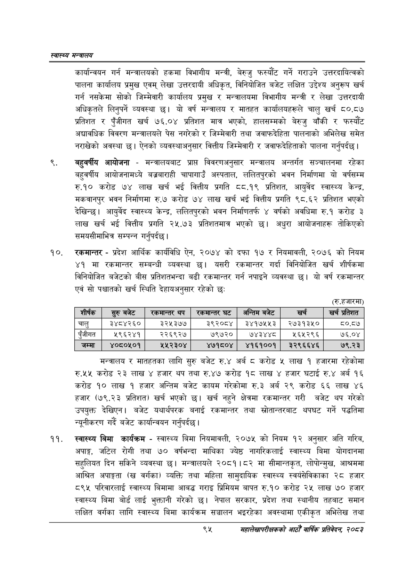

# Page 117 QA

## Rendered page


## Extracted text

```text
स्वास्थ्य मन्त्रालय
कार्यान्वयन गर्न मन्त्रालयको हकमा विभागीय मन्त्री, बेरुजु फस्यौट गर्ने गराउने उत्तरदायित्वको पालना कार्यालय प्रमुख एवम्‌ लेखा उत्तरदायी अधिकृत, विनियोजित बजेट लक्षित उद्देश्य अनुरूप खर्च गर्न नसकेमा सोको जिम्मेवारी कार्यालय प्रमुख र मन्त्रालयमा विभागीय मन्त्री र लेखा उत्तरदायी अधिकृतले लिनुपर्ने व्यवस्था यो वर्ष मन्त्रालय र मातहत कार्यालयहरूले चालु खर्च ८०.८७ प्रतिशत र पुँजीगत खर्च ७६.०४ प्रतिशत मात्र भएको, हालसम्मको बेरुजु बाँकी र फस्यौट अद्यावधिक विवरण मन्त्रालयले पेस नगरेको र जिम्मेवारी तथा जवाफदेहिता पालनाको अभिलेख समेत नराखेको अवस्था | ऐनको व्यवस्थाअनुसार वित्तीय जिम्मेवारी र जवाफदेहिताको पालना गर्नुपर्दछ।
बहुवर्षीय आयोजना -मन्त्रालयबाट प्राप्त विवरणअनुसार मन्त्रालय अन्तर्गत सञ्चालनमा रहेका बहुवर्षीय आयोजनामध्ये बज्रबाराही चापागाउँ अस्पताल, ललितपुरको भवन निर्माणमा यो वर्षसम्म रु.१० करोड ७४ लाख खर्च भई वित्तीय प्रगति ८८.१९ प्रतिशत, आयुर्वेद स्वास्थ्य केन्द्र, मकवानपुर भवन निर्माणमा रु.७ करोड ७४ लाख खर्च भई वित्तीय प्रगति ९८.६२ प्रतिशत भएको देखिन्छ। आयुर्वेद स्वास्थ्य केन्द्र, ललितपुरको भवन निर्माणतर्फ ४ वर्षको अवधिमा रु.१ करोड ३ लाख खर्च भई वित्तीय प्रगति २५.७३ प्रतिशतमात्र भएको छ। अधुरा आयोजनाहरू तोकिएको समयसीमाभित्र सम्पन्न गर्नुपर्दछ |
रकमान्तर -प्रदेश आर्थिक कार्यविधि ऐन, २०७४ को दफा १७ र नियमावली, २०७६ को नियम ४१ मा रकमान्तर सम्बन्धी व्यवस्था छु। यसरी रकमान्तर गर्दा विनियोजित खर्च शीर्षकमा विनियोजित बजेटको बीस प्रतिशतभन्दा बढी रकमान्तर गर्न नपाइने व्यवस्था | यो वर्ष रकमान्तर एवं सो पश्चातको खर्च स्थिति देहायअनुसार रहेको छः
(रु.हजारमा)
मन्त्रालय र मातहतका लागि सुरु बजेट रु.४ अर्ब ८ करोड ५ लाख १ हजारमा रहेकोमा रु.५५ करोड २३ लाख ४ हजार थप तथा रु.४७ करोड १८ लाख ४ हजार घटाई रु.४ अर्ब १६ करोड १० लाख १ हजार अन्तिम बजेट कायम गरेकोमा रु.३ अर्ब २९ करोड ६६ लाख ४६ हजार (७९.२३ प्रतिशत) खर्च भएको छ। खर्च नहुने क्षेत्रमा रकमान्तर गरी बजेट थप गरेको उपयुक्त देखिएन। बजेट यथार्थपरक बनाई रकमान्तर तथा स्रोतान्तरबाट थपघट गर्ने पद्धतिमा न्यूनीकरण गर्दै बजेट कार्यान्वयन गर्नुपर्दछ |
स्वास्थ्य बिमा कार्यक्रम -स्वास्थ्य बिमा नियमावली, २०७५ को नियम १२ अनुसार अति गरिब, अपाङ्ग, जटिल रोगी तथा ७० वर्षभन्दा माथिका ज्येष्ठ नागरिकलाई स्वास्थ्य बिमा योगदानमा सहुलियत दिन सकिने व्यवस्था छ। मन्त्रालयले २०८१।८२ मा सीमान्तकृत, लोपोन्मुख, आश्रममा आश्रित अपाङ्गता ( वर्गका) व्यक्ति तथा महिला सामुदायिक स्वास्थ्य स्वयंसेविकाका २८ हजार ८९५ परिवारलाई स्वास्थ्य बिमामा आबद्ध गराइ प्रिमियम बापत रु.१० करोड २५ लाख ७० हजार स्वास्थ्य बिमा बोर्ड लाई भुक्तानी गरेको छ। नेपाल सरकार, प्रदेश तथा स्थानीय तहबाट समान लक्षित वर्गका लागि स्वास्थ्य बिमा कार्यक्रम सञ्चालन भइरहेका अवस्थामा एकीकृत अभिलेख तथा
९५
सहालेखापरीक्षकको आठौँ वाषिकि प्रतिवेदन २०८२

| शीर्षक | रहुरुबजेट | थप | स्कान्तर घट | अन्तिम बजेट | खर्च | खर्च प्रतिशत |
| --- | --- | --- | --- | --- | --- | --- |
| चालु | ३४८४२६० | ३२५३७७ | ३९२०८४ | ३४१७५५३ | २७३१३५० | ८०.८७ |
|  | ५९६२४१ | २२६९२७ | ७९७२० | ७४३४४८ | ५६५२९६ | ७६.०४ |
| जम्मा | ४०८०५०१ | २५२३०४ | ४७१८०४ | ४१६१००१ | ३२९६६४६ | ७९.२३ |
```

## Flags
- table_page
- medium_quality_table
