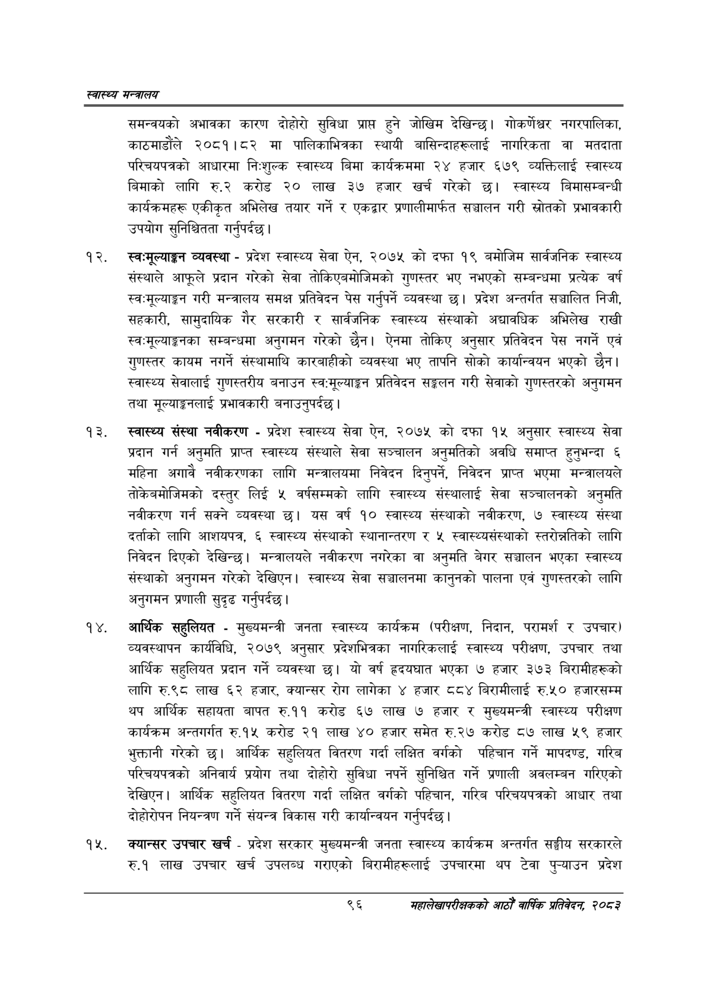

# Page 118 QA

## Rendered page


## Extracted text

```text
स्वास्थ्य मन्त्रालय
समन्वयको अभावका कारण दोहोरो सुविधा प्राप्त हुने जोखिम देखिन्छ। गोकर्णेघर नगरपालिका, काठमाडौले २०८१।८२ मा पालिकाभित्रका स्थायी बासिन्दाहरूलाई नागरिकता वा मतदाता परिचयपत्रको आधारमा निःशुल्क स्वास्थ्य बिमा कार्यक्रममा २४ हजार ६७९ व्यक्तिलाई स्वास्थ्य बिमाको लागि रु.२ करोड २० लाख ३७ हजार खर्च गरेको छ। स्वास्थ्य बिमासम्बन्धी कार्यक्रमहरू एकीकृत अभिलेख तयार गर्ने र एकद्वार प्रणालीमार्फत सञ्चालन गरी स्रोतको प्रभावकारी उपयोग सुनिश्चितता गर्नुपर्दछ |
स्वःमूल्याङ्गन व्यवस्था -प्रदेश स्वास्थ्य सेवा ऐन, २०७५ को दफा १९ बमोजिम सार्वजनिक स्वास्थ्य संस्थाले आफूले प्रदान गरेको सेवा तोकिएबमोजिमको गुणस्तर भए नभएको सम्बन्धमा प्रत्येक वर्ष स्व-मूल्याङ्गन गरी मन्त्रालय समक्ष प्रतिवेदन पेस गर्नुपर्ने व्यवस्था छ। प्रदेश अन्तर्गत सञ्चालित निजी, सहकारी, सामुदायिक गैर सरकारी र सार्वजनिक स्वास्थ्य संस्थाको अद्यावधिक अभिलेख राखी स्वःमूल्याङ्गका सम्बन्धमा अनुगमन गरेको छैन। ऐनमा तोकिए अनुसार प्रतिवेदन पेस नगर्ने एवं गुणस्तर कायम नगर्ने संस्थामाथि कारबाहीको व्यवस्था भए तापनि सोको कार्यान्वयन भएको छैन। स्वास्थ्य सेवालाई गुणस्तरीय बनाउन स्व:मूल्याङ्कन प्रतिवेदन सङ्कलन गरी सेवाको गुणस्तरको अनुगमन तथा प्रभावकारी |
मूल्याङ्गनलाई बनाउनुपर्दछ
स्वास्थ्य संस्था नवीकरण -प्रदेश स्वास्थ्य सेवा ऐन, २०७५ को दफा १५ अनुसार स्वास्थ्य सेवा प्रदान गर्न अनुमति प्राप्त स्वास्थ्य संस्थाले सेवा सञ्चालन अनुमतिको अवधि समाप्त हुनुभन्दा ६ महिना अगावै नवीकरणका लागि मन्त्रालयमा निवेदन दिनुपर्ने, निवेदन प्राप्त भएमा मन्त्रालयले तोकेबमोजिमको दस्तुर लिई ५ वर्षसम्मको लागि स्वास्थ्य संस्थालाई सेवा सञ्चालनको अनुमति नवीकरण गर्न सक्ने व्यवस्था छ। यस वर्ष १० स्वास्थ्य संस्थाको नवीकरण, ७ स्वास्थ्य संस्था दर्ताको लागि आशयपत्र, ६ स्वास्थ्य संस्थाको स्थानान्तरण र ५ स्वास्थ्यसंस्थाको स्तरोन्नतिको लागि निवेदन दिएको देखिन्छ। मन्त्रालयले नवीकरण नगरेका वा अनुमति बेगर सञ्चालन भएका स्वास्थ्य संस्थाको अनुगमन गरेको देखिएन। स्वास्थ्य सेवा सञ्चालनमा कानुनको पालना एवं गुणस्तरको लागि अनुगमन प्रणाली सुदृढ गर्नुपर्दछ।
आर्थिक सहुलियत -मुख्यमन्त्री जनता स्वास्थ्य कार्यक्रम (परीक्षण, निदान, परामर्श र उपचार) व्यवस्थापन कार्यविधि, २०७९ अनुसार प्रदेशभित्रका नागरिकलाई स्वास्थ्य परीक्षण, उपचार तथा आर्थिक सहुलियत प्रदान गर्ने व्यवस्था छ। यो वर्ष हृदयघात भएका ७ हजार ३७३ बिरामीहरूको लागि रु.९८ लाख ६२ हजार, क्यान्सर रोग लागेका हजार ८८४ बिरामीलाई रु.५० हजारसम्म थप आर्थिक सहायता बापत रु.११ करोड ६७ लाख ७ हजार र मुख्यमन्त्री स्वास्थ्य परीक्षण कार्यक्रम अन्तगर्गत रु.१५ करोड २१ लाख ४० हजार समेत रु.२७ करोड ८७ लाख ५९ हजार भुक्तानी गरेको छ। आर्थिक सहुलियत वितरण गर्दा लक्षित वर्गको पहिचान गर्ने मापदण्ड, गरिव परिचयपत्रको अनिवार्य प्रयोग तथा दोहोरो सुविधा नपर्ने सुनिश्चित गर्ने प्रणाली अवलम्बन गरिएको देखिएन। आर्थिक सहुलियत वितरण गर्दा लक्षित वर्गको पहिचान, गरिब परिचयपत्रको आधार तथा दोहोरोपन नियन्त्रण गर्ने संयन्त्र विकास गरी कार्यान्वयन गर्नुपर्दछ |
क्यान्सर उपचार खर्च -प्रदेश सरकार मुख्यमन्त्री जनता स्वास्थ्य कार्यक्रम अन्तर्गत सङ्घीय सरकारले रु.१ लाख उपचार खर्च उपलब्ध गराएको बिरामीहरूलाई उपचारमा थप टेवा पुन्याउन प्रदेश
९६
सहालेखापरीक्षकको आठौँ वाषिकि प्रतिवेदन २०८२
```

## Flags
- None
