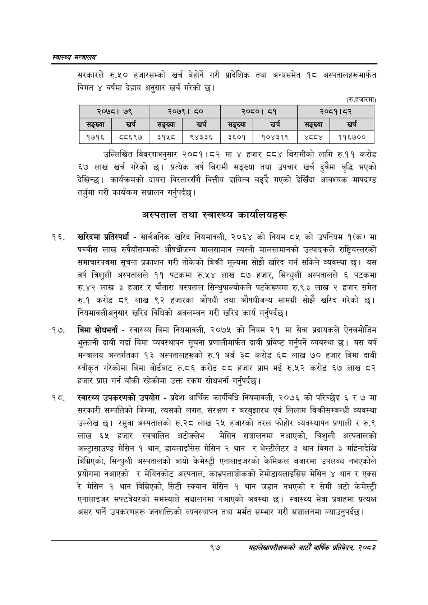

# Page 119 QA

## Rendered page


## Extracted text

```text
स्वास्थ्य मन्त्रालय
सरकारले रु.५० हजारसम्को खर्च बेहोर्ने गरी प्रादेशिक तथा अन्यसमेत १८ अस्पतालहरूमार्फत विगत ४ वर्षमा देहाय अनुसार खर्च गरेको छ।
(रू. हजारमा)
उल्लिखित विवरणअनुसार २०८१।८२ मा हजार ८८४ बिरामीको लागि रु.११ करोड ६७ लाख खर्च गरेको छ। प्रत्येक वर्ष बिरामी सङ्ख्या तथा उपचार खर्च दुवैमा वृद्धि भएको देखिन्छ। कार्यक्रमको दायरा विस्तारसँगै वित्तीय दायित्व बढ्दै गएको देखिँदा आवश्यक मापदण्ड तर्जुमा गरी कार्यक्रम सञ्चालन गर्नुपर्दछ |
अस्पताल तथा स्वास्थ्य कार्यालयहरू
खरिदमा प्रतिस्पर्धा -सार्वजनिक खरिद नियमावली, २०६४ को नियम ८५ को उपनियम १(क) मा पच्चीस लाख रुपैयाँसम्मको औषधीजन्य मालसामान त्यस्तो मालसामानको उत्पादकले राष्ट्रियस्तरको समाचारपत्रमा सूचना प्रकाशन गरी तोकेको बिक्री मूल्यमा सोझै खरिद गर्न सकिने व्यवस्था छ। यस वर्ष त्रिशुली अस्पतालले ११ पटकमा रु.५४ लाख ८७ हजार, सिन्धुली अस्पतालले ६ पटकमा रु.४२ लाख ३ हजार र चौतारा अस्पताल सिन्धुपाल्चोकले पटकेरूपमा रु.९३ लाख २ हजार समेत रु.१ करोड ८९ लाख ९२ हजारका औषधी तथा औषधीजन्य सामग्री सोझै खरिद गरेको छ। नियमावलीअनुसार खरिद विधिको अवलम्बन गरी खरिद कार्य गर्नुपर्दछ |
बिमा सोधभर्ना -स्वास्थ्य बिमा नियमावली, २०७५ को नियम २१ मा सेवा प्रदायकले ऐनबमोजिम भुक्तानी दाबी गर्दा बिमा व्यवस्थापन सूचना प्रणालीमार्फत दाबी प्रविष्ट गर्नुपर्ने व्यवस्था छु। यस वर्ष मन्त्रालय अन्तर्गतका १३ अस्पतालहरूको रु.१ अर्ब ३८ करोड ६८ लाख ७० हजार बिमा दाबी स्वीकृत गरेकोमा बिमा बोर्डबाट रु.८६ करोड ठव हजार प्राप्त भई रु.५२ करोड ६७ लाख हजार प्राप्त गर्न बाँकी रहेकोमा उक्त रकम सोधभर्ना गर्नुपर्दछ।
स्वास्थ्य उपकरणको उपयोग -प्रदेश आर्थिक कार्यविधि नियमावली, २०७६ को परिच्छेद ६ र ७ मा सरकारी सम्पत्तिको जिम्मा, त्यसको लगत, संरक्षण र बरबुझारथ एवं लिलाम बिक्रीसम्बन्धी व्यवस्था उल्लेख छ। रसुवा अस्पतालको रु.२८ लाख २५ हजारको तरल फोहोर व्यवस्थापन प्रणाली र रु.९ लाख ६५ हजार स्वचालित अटोक्लनेभ मेसिन सञ्चालनमा नआएको, त्रिशुली अस्पतालको अल्ट्रासाउण्ड मेसिन १ थान, डायलाइसिस मेसिन २ थान र भेन्टीलेटर ३ थान विगत ३ महिनादेखि बिग्रिएको, सिन्धुली अस्पतालको बायो केमेस्ट्री एनालाइजरको केमिकल बजारमा उपलब्ध नभएकोले प्रयोगमा नआएको र मेथिनकोट अस्पताल, काभ्रपलाञ्चोकको हेमोडायलाइसिस मेसिन थान र एक्स रे मेसिन १ थान बिग्रिएको, सिटी स्क्यान मेसिन १ थान जडान नभएको र सेमी अटो केमेस्ट्री एनालाइजर सफ्टवेयरको समस्याले सञ्चालनमा नआएको अवस्था छ। स्वास्थ्य सेवा प्रवाहमा प्रत्यक्ष असर पार्ने उपकरणहरू जनशक्तिको व्यवस्थापन तथा मर्मत सम्भार गरी सञ्चालनमा ल्याउनुपर्दछ।
९७
सहालेखापरीक्षकको आठौँ वाषिकि प्रतिवेदन २०८२

| २०७८। | ७९ | २०७९। | ८० | २०८०। | ८१ |  | २०८१।८२ |
| --- | --- | --- | --- | --- | --- | --- | --- |
| सङ्ख्या | खर्च | सङ्ख्या | 'खची | सङ्ख्या |  | सङ्ख्या | खर्च |
| १७१६ | ८५८६९७ | ३१५८ | ९४३३६ | ३६०१ | १०४३१९ | ४८८४ | ११६७०० |
```

## Flags
- table_page
- medium_quality_table
