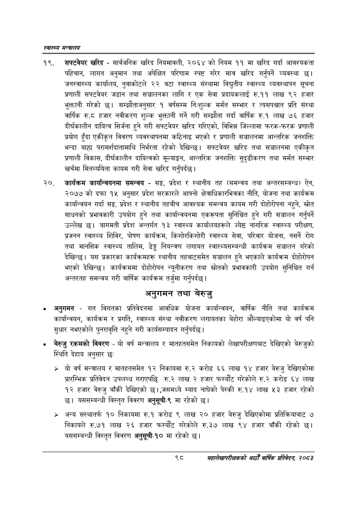

# Page 120 QA

## Rendered page


## Extracted text

```text
स्वास्थ्य मन्त्रालय
सफ्टवेयर खरिद -सार्वजनिक खरिद नियमावली, २०६४ को नियम ११ मा खरिद गर्दा आवश्यकता पहिचान, लागत अनुमान तथा अपेक्षित परिणाम स्पष्ट गरेर मात्र खरिद गर्नुपर्ने व्यवस्था छ। जनस्वास्थ्य कार्यालय, नुवाकोटले २२ वटा स्वास्थ्य संस्थामा विद्युतीय स्वास्थ्य व्यवस्थापन सूचना प्रणाली सफ्टवेयर जडान तथा सञ्चालनका लागि र एक सेवा प्रदायकलाई रु.११ लाख ९२ हजार भुक्तानी गरेको छ। सम्झौताअनुसार १ वर्षसम्म निःशुल्क मर्मत सम्भार र त्यसपश्चात प्रति संस्था वार्षिक रु.८ हजार नवीकरण शुल्क भुक्तानी गर्ने गरी सम्झौता गर्दा वार्षिक रु.१ लाख ७६ हजार दीर्घकालीन दायित्व सिर्जना हुने गरी सफ्टवेयर खरिद गरिएको, विभिन्न जिल्लामा फरक-फरक प्रणाली प्रयोग हुँदा एकीकृत विवरण व्यवस्थापनमा कठिनाइ भएको र प्रणाली सञ्चालनमा आन्तरिक जनशक्ति भन्दा बाहा परामर्शदातामाथि निर्भरता रहेको देखिन्छ। सफ्टवेयर खरिद तथा सञ्चालनमा एकीकृत प्रणाली विकास, दीर्घकालीन दायित्वको मूल्याङ्कन, आन्तरिक जनशक्ति सुदृढीकरण तथा मर्मत सम्भार खर्चमा मितव्ययिता कायम गरी सेवा खरिद गर्नुपर्दछ |
कार्यक्रम कार्यान्वयनमा समन्वय -सङ्ग, प्रदेश र स्थानीय तह (समन्वय तथा अन्तरसम्बन्ध) ऐन, २०७७ को दफा १५ अनुसार प्रदेश सरकारले आफ्नो क्षेत्राधिकारभित्रका नीति, योजना तथा कार्यक्रम कार्यान्वयन गर्दा सङ्घ, प्रदेश र स्थानीय तहबीच आवश्यक समन्वय कायम गरी दोहोरोपना नहुने, स्रोत साधनको प्रभावकारी उपयोग हुने तथा कार्यान्वयनमा एकरूपता सुनिश्चित हुने गरी सञ्चालन गर्नुपर्ने उल्लेख छ। बागमती प्रदेश अन्तर्गत १३ स्वास्थ्य कार्यालयहरूले ज्येष्ठ नागरिक स्वास्थ्य परीक्षण, प्रजनन स्वास्थ्य शिविर, पोषण कार्यक्रम, किशोरकिशोरी स्वास्थ्य सेवा, परिवार योजना, नसर्ने रोग तथा मानसिक स्वास्थ्य तालिम, डेङ्ग नियन्त्रण लगायत स्वास्थ्यसम्बन्धी कार्यक्रम सञ्चालन गरेको देखिन्छ। यस प्रकारका कार्यक्रमहरू स्थानीय तहबाटसमेत सञ्चालन हुने भएकाले कार्यक्रम दोहोरोपन भएको देखिन्छ। कार्यक्रममा दोहोरोपन न्यूनीकरण तथा स्रोतको प्रभावकारी उपयोग सुनिश्चित गर्न अन्तरतह समन्वय गरी वार्षिक कार्यक्रम तर्जुमा गर्नुपर्दछ |
अनुगमन तथा बेरुजु
अनुगमन -गत विगतका प्रतिवेदनमा आवधिक योजना कार्यान्वयन, वार्षिक नीति तथा कार्यक्रम कार्यान्वयन, कार्यक्रम र प्रगति, स्वास्थ्य संस्था नवीकरण लगायतका बेहोरा औंल्याइएकोमा यो वर्ष पनि सुधार नभएकोले पुनरावृत्ति नहुने गरी कार्यसम्पादन गर्नुपर्दछ |
० बेरुजु रकमको विवरण -यो वर्ष मन्त्रालय र मातहतसमेत निकायको लेखापरीक्षणबाट देखिएको बेरुजुको स्थिति देहाय अनुसार छः
> यो वर्ष मन्त्रालय र मातहतसमेत १२ निकायमा रु.२ करोड ६६ लाख १४ हजार बेरुजु देखिएकोमा प्रारम्भिक प्रतिवेदन उपलब्ध गराएपछि रु.२ लाख २ हजार फस्यौट गरेकोले रु.२ करोड ६४ लाख १२ हजार बेरुजु बाँकी देखिएको छ।,जसमध्ये म्याद नाघेको पेस्की रु.१४ लाख ५३ हजार रहेको छ। यससम्बन्धी विस्तृत विवरण अनुसूची-९ मा रहेको
> अन्य सस्थातर्फ १० निकायमा रु.१ करोड ९ लाख ० हजार बेरुजु देखिएकोमा प्रतिक्रियाबाट ७ निकायले रु.७१ लाख २६ हजार फस्यौट गरेकोले रु.३७ लाख ९४ हजार बाँकी रहेको छ। यससम्बन्धी विस्तृत विवरण अनुसूची-१० मा रहेको छ।
९्ठ
सहालेखापरीक्षकको आठौँ वाषिकि प्रतिवेदन २०८२
```

## Flags
- None
