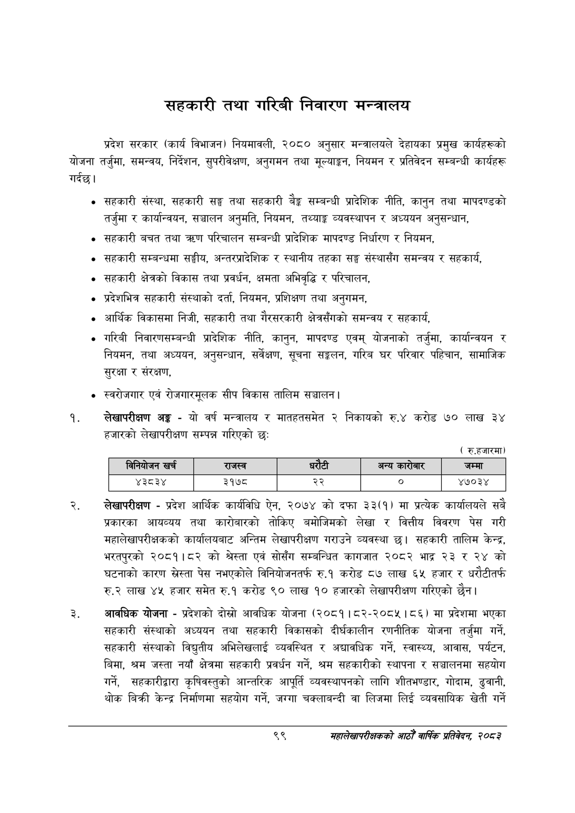

# Page 121 QA

## Rendered page


## Extracted text

```text
सहकारी तथा गरिबी निवारण मन्त्रालय
प्रदेश सरकार (कार्य विभाजन) नियमावली, २०८० अनुसार मन्त्रालयले देहायका प्रमुख कार्यहरूको योजना तर्जुमा, समन्वय, निर्देशन, सुपरीवेक्षण, अनुगमन तथा मूल्याङ्कन, नियमन र प्रतिवेदन सम्बन्धी कार्यहरू गर्दछु।
सहकारी संस्था, सहकारी सङ्घ तथा सहकारी बैङ्क सम्बन्धी प्रादेशिक नीति, कानुन तथा मापदण्डको तर्जुमा र कार्यान्वयन, सञ्चालन अनुमति, नियमन, तथ्याङ्क व्यवस्थापन र अध्ययन अनुसन्धान,
सहकारी बचत तथा त्रधण परिचालन सम्बन्धी प्रादेशिक मापदण्ड निर्धारण र नियमन,
सहकारी सम्बन्धमा सङ्घीय, अन्तरप्रादेशिक र स्थानीय तहका सङ्घ संस्थासँग समन्वय र सहकार्य,
सहकारी क्षेत्रको विकास तथा प्रवर्धन, क्षमता अभिवृद्धि र परिचालन,
प्रदेशभित्र सहकारी संस्थाको दर्ता, नियमन, प्रशिक्षण तथा अनुगमन,
आर्थिक विकासमा निजी, सहकारी तथा गैरसरकारी क्षेत्रसँगको समन्वय र सहकार्य,
गरिबी निवारणसम्बन्धी प्रादेशिक नीति, कानुन, मापदण्ड एवम्‌ योजनाको तर्जुमा, कार्यान्वयन र नियमन, तथा अध्ययन, अनुसन्धान, सर्वेक्षण, सूचना सङ्लन, गरिब घर परिवार पहिचान, सामाजिक सुरक्षा र संरक्षण,
स्वरोजगार एवं रोजगारमूलक सीप विकास तालिम सञ्चालन |
लेखापरीक्षण अङ्ग -यो वर्ष मन्त्रालय र मातहतसमेत २ निकायको रु.४ करोड ७० लाख ३४ हजारको लेखापरीक्षण सम्पन्न गरिएको छः
( रु.हजारमा)
लेखापरीक्षण -प्रदेश आर्थिक कार्यविधि ऐन, २०७४ को दफा ३३(१) मा प्रत्येक कार्यालयले सबै प्रकारका आयव्यय तथा कारोबारको तोकिए बमोजिमको लेखा र वित्तीय विवरण पेस गरी महालेखापरीक्षकको कार्यालयबाट अन्तिम लेखापरीक्षण गराउने व्यवस्था छ। सहकारी तालिम केन्द्र, भरतपुरको २०८१।८२ को श्रेस्ता एवं सोसँग सम्बन्धित कागजात २०८२ भाद्र ३ र २४ को घटनाको कारण पेस नभएकोले विनियोजनतर्फ रु.१ करोड ८७ लाख ६५ हजार र धरौटीतर्फ रु.२ लाख ४५ हजार समेत रु.१ करोड ९० लाख १० हजारको लेखापरीक्षण गरिएको छैन।
आवधिक योजना -प्रदेशको दोस्रो आवधिक योजना (२०८१। ८२-२०८५।८६) मा प्रदेशमा भएका सहकारी संस्थाको अध्ययन तथा सहकारी विकासको दीर्घकालीन रणनीतिक योजना तर्जुमा गर्ने, सहकारी संस्थाको विद्युतीय अभिलेखलाई व्यवस्थित र अद्यावधिक गर्ने, स्वास्थ्य, आवास, पर्यटन, बिमा, श्रम जस्ता नयाँ क्षेत्रमा सहकारी प्रवर्धन गर्ने, श्रम सहकारीको स्थापना र सञ्चालनमा सहयोग गर्ने, सहकारीद्वारा कृषिवस्तुको आन्तरिक आपूर्ति व्यवस्थापनको लागि शीतभण्डार, गोदाम, ढुवानी, थोक बिक्री केन्द्र निर्माणमा सहयोग गर्ने, जग्गा चक्लाबन्दी वा लिजमा लिई व्यवसायिक खेती गर्ने
९९
महालेखापरीक्षकको आठौँ वाषिकि प्रतिवेदन २०८२

|  |  | बिनेचोणन खर्च | राजस्व | धरेटी |  | अन्य | जम्मा |
| --- | --- | --- | --- | --- | --- | --- | --- |
|  |  | ४३८३४ | ३१७८ | २२ |  | ० | ४७०३४ |
```

## Flags
- table_page
- medium_quality_table
