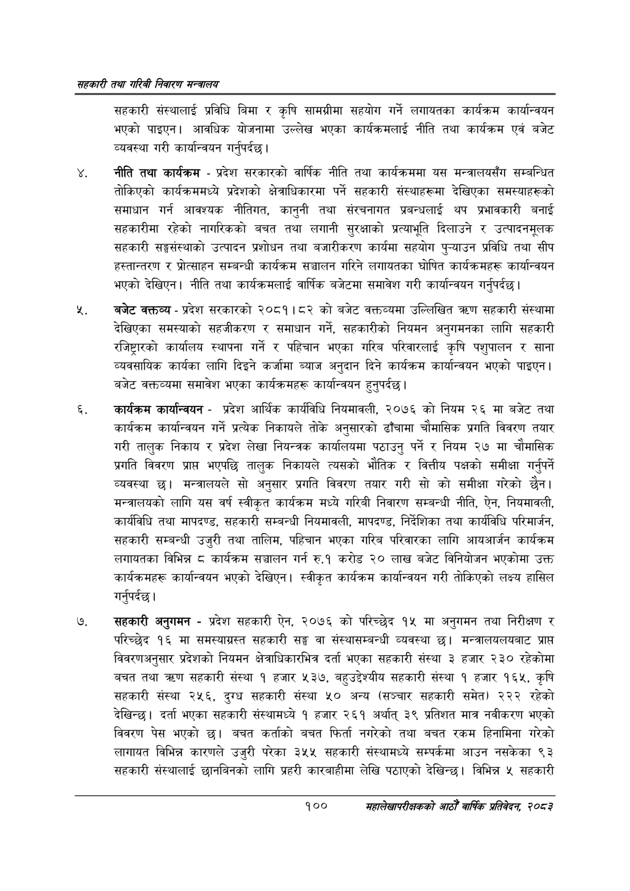

# Page 122 QA

## Rendered page


## Extracted text

```text
सहकारी तथा गरिबी निवारण सन्बालय
सहकारी संस्थालाई प्रविधि बिमा र कृषि सामग्रीमा सहयोग गर्ने लगायतका कार्यक्रम कार्यान्वयन भएको पाइएन। आवधिक योजनामा उल्लेख भएका कार्यक्रमलाई नीति तथा कार्यक्रम एवं बजेट व्यवस्था गरी कार्यान्वयन गर्नुपर्दछ |
नीति तथा कार्यक्रम -प्रदेश सरकारको वार्षिक नीति तथा कार्यक्रममा यस मन्त्रालयसँग सम्बन्धित तोकिएको कार्यक्रममध्ये प्रदेशको क्षेत्राधिकारमा पर्ने सहकारी संस्थाहरूमा देखिएका समस्याहरूको समाधान गर्न आवश्यक नीतिगत, कानुनी तथा संरचनागत प्रबन्धलाई थप प्रभावकारी बनाई सहकारीमा रहेको नागरिकको बचत तथा लगानी सुरक्षाको प्रत्याभूति दिलाउने र उत्पादनमूलक सहकारी सङ्घसंस्थाको उत्पादन प्रशोधन तथा बजारीकरण कार्यमा सहयोग पुन्याउन प्रविधि तथा सीप हस्तान्तरण र प्रोत्साहन सम्बन्धी कार्यक्रम सञ्चालन गरिने लगायतका घोषित कार्यक्रमहरू कार्यान्वयन भएको देखिएन। नीति तथा कार्यक्रमलाई वार्षिक बजेटमा समावेश गरी कार्यान्वयन गर्नुपर्दछ |
बजेट वक्तव्य -प्रदेश सरकारको २०८१।८२ को बजेट वक्तव्यमा उल्लिखित त्रण सहकारी संस्थामा देखिएका समस्याको सहजीकरण र समाधान गर्ने, सहकारीको नियमन अनुगमनका लागि सहकारी रजिष्ट्रारको कार्यालय स्थापना गर्ने र पहिचान भएका गरिब परिवारलाई कृषि पशुपालन र साना व्यवसायिक कार्यका लागि दिइने कर्जामा ब्याज अनुदान दिने कार्यक्रम कार्यान्वयन भएको पाइएन | बजेट वक्तव्यमा समावेश भएका कार्यक्रमहरू कार्यान्वयन हुनुपर्दछ |
कार्यक्रम कार्यान्वयन -प्रदेश आर्थिक कार्यविधि नियमावली, २०७६ को नियम २६ मा बजेट तथा कार्यक्रम कार्यान्वयन गर्ने प्रत्यक निकायले तोके अनुसारको ढाँचामा चौमासिक प्रगति विवरण तयार गरी तालुक निकाय र प्रदेश लेखा नियन्त्रक कार्यालयमा पठाउनु पर्ने र नियम २७ मा चौमासिक प्रगति विवरण प्राप्त भएपछि तालुक निकायले त्यसको भौतिक र वित्तीय पक्षको समीक्षा गर्नुपर्ने व्यवस्था छ। मन्त्रालयले सो अनुसार प्रगति विवरण तयार गरी सो को समीक्षा गरेको छैन। मन्त्रालयको लागि यस वर्ष स्वीकृत कार्यक्रम मध्ये गरिबी निवारण सम्बन्धी नीति, ऐन, नियमावली, कार्यविधि तथा मापदण्ड, सहकारी सम्बन्धी नियमावली, मापदण्ड, निर्देशिका तथा कार्यविधि परिमार्जन, सहकारी सम्बन्धी उजुरी तथा तालिम, पहिचान भएका गरिब परिवारका लागि आयआर्जन कार्यक्रम लगायतका विभिन्न ८ कार्यक्रम सञ्चालन गर्न रु.१ करोड २० लाख बजेट विनियोजन भएकोमा उक्त कार्यक्रमहरू कार्यान्वयन भएको देखिएन। स्वीकृत कार्यक्रम कार्यान्वयन गरी तोकिएको लक्ष्य हासिल गर्नुपर्दछ |
सहकारी अनुगमन -प्रदेश सहकारी ऐन, २०७६ को परिच्छेद १५ मा अनुगमन तथा निरीक्षण र परिच्छेद १६ मा समस्याग्रस्त सहकारी सङ्घ वा संस्थासम्बन्धी व्यवस्था छ। मन्त्रालयलयबाट प्राप्त विवरणअनुसार प्रदेशको नियमन क्षेत्राधिकारभित्र दर्ता भएका सहकारी संस्था ३ हजार २३० रहेकोमा बचत तथा त्रदण सहकारी संस्था १ हजार ५३७, बहुउद्देश्यीय सहकारी संस्था १ हजार १६५, कृषि सहकारी संस्था २५६, दुग्ध सहकारी संस्था ५० अन्य (सञ्चार सहकारी समेत) २२२ रहेको देखिन्छ। दर्ता भएका सहकारी संस्थामध्य १ हजार २६१ अर्थात्‌ ३९ प्रतिशत मात्र नवीकरण भएको विवरण पेस भएको छ। बचत कर्ताको बचत फिर्ता नगरेको तथा बचत रकम हिनामिना गरेको लागायत विभिन्न कारणले उजुरी परेका ३५५ सहकारी संस्थामध्ये सम्पर्कमा आउन नसकेका ९३ सहकारी संस्थालाई छानबिनको लागि प्रहरी कारबाहीमा लेखि पठाएको देखिन्छ। विभिन्न ५ सहकारी
१००
सहालेखापरीक्षकको आठौँ वाषिकि प्रतिवेदन २०८२
```

## Flags
- None
