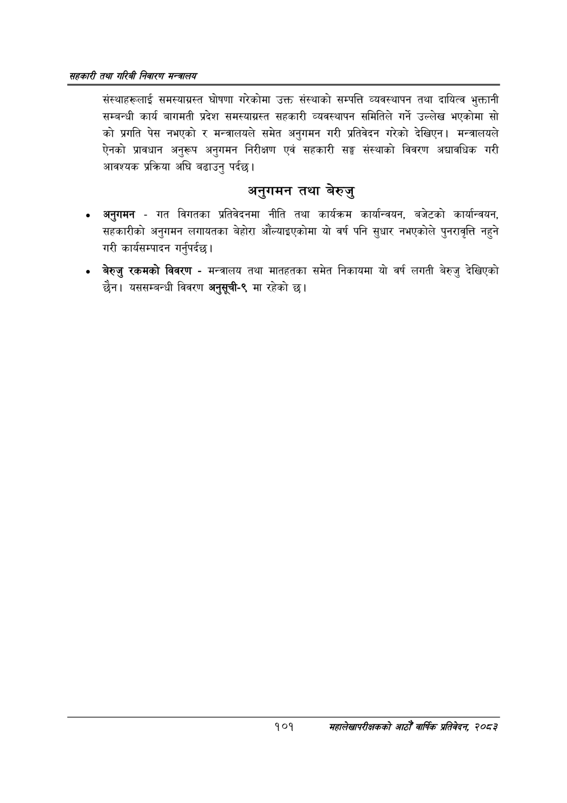

# Page 123 QA

## Rendered page


## Extracted text

```text
सहकारी तथा गरिबी निवारण सन्बालय
संस्थाहरूलाई समस्याग्रस्त घोषणा गरेकोमा उक्त संस्थाको सम्पत्ति व्यवस्थापन तथा दायित्व भुक्तानी सम्बन्धी कार्य बागमती प्रदेश समस्याग्रस्त सहकारी व्यवस्थापन समितिले गर्ने उल्लेख भएकोमा सो को प्रगति पेस नभएको र मन्त्रालयले समेत अनुगमन गरी प्रतिवेदन गरेको देखिएन। मन्त्रालयले ऐनको प्रावधान अनुरूप अनुगमन निरीक्षण एवं सहकारी सङ्घ संस्थाको विवरण अद्यावधिक गरी आवश्यक प्रक्रिया अघि बढाउनु पर्दछ।
अनुगमन तथा बेरुजु
अनुगमन -गत विगतका प्रतिवेदनमा नीति तथा कार्यक्रम कार्यान्वयन, बजेटको कार्यान्वयन, सहकारीको अनुगमन लगायतका बेहोरा औंल्याइएकोमा यो वर्ष पनि सुधार नभएकोले पुनरावृत्ति नहुने गरी कार्यसम्पादन गर्नुपर्दछ |
बेरुजु रकमको विवरण -मन्त्रालय तथा मातहतका समेत निकायमा यो वर्ष लगती बेरुजु देखिएको छैन। यससम्बन्धी विवरण अनुसूची-९ मा रहेको छ।
१०१
सहालेखापरीक्षकको आठौँ वाषिकि प्रतिवेदन २०८२
```

## Flags
- None
