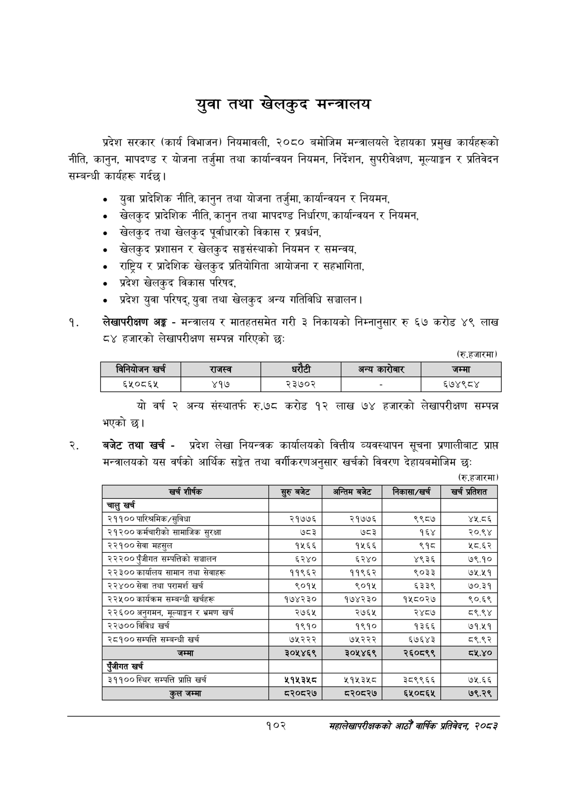

# Page 124 QA

## Rendered page


## Extracted text

```text
युवा तथा खेलकुद मन्त्रालय
प्रदेश सरकार (कार्य विभाजन) नियमावली, २०८० बमोजिम मन्त्रालयले देहायका प्रमुख कार्यहरूको नीति, कानुन, मापदण्ड र योजना तर्जुमा तथा कार्यान्वयन नियमन, निर्देशन, सुपरीवेक्षण, मूल्याङ्कन र प्रतिवेदन सम्बन्धी कार्यहरू गर्दछ।
युवा प्रादेशिक नीति, कानुन तथा योजना तर्जुमा, कार्यान्वयन र नियमन,
१ खेलकुद प्रादेशिक नीति, कानुन तथा मापदण्ड निर्धारण, कार्यान्वयन र नियमन,
खेलकुद तथा खेलकुद पूर्वाधारको विकास र प्रवर्धन,
खेलकुद प्रशासन र खेलकुद सङ्घसंस्थाको नियमन र समन्वय,
राष्ट्रिय र प्रादेशिक खेलकुद प्रतियोगिता आयोजना र सहभागिता,
० प्रदेश खेलकुद विकास परिषद,
प्रदेश युवा परिषद्‌, युवा तथा खेलकुद अन्य गतिविधि सञ्चालन |
लेखापरीक्षण अङ्ग -मन्त्रालय र मातहतसमेत गरी ३ निकायको निम्नानुसार रु ६७ करोड ४९ लाख ८४ हजारको लेखापरीक्षण सम्पन्न गरिएको छः
(रु.हजारमा)
यो वर्ष २ अन्य संस्थातर्फ रु.७८ करोड १२ लाख ७४ हजारको लेखापरीक्षण सम्पन्न भएको छ।
बजेट तथा खर्च -प्रदेश लेखा नियन्त्रक कार्यालयको वित्तीय व्यवस्थापन सूचना प्रणालीबाट प्राप्त मन्त्रालयको यस वर्षको आर्थिक सङ्ेत तथा वर्गीकरणअनुसार खर्चको विवरण देहायबमोजिम छः
(रु.हजारमा)
१०२
सहालेखापरीक्षकको आठो वाषिकि प्रतिवेदन २०८२

|  |  | (ननवाजन खरी |  | राजस्व |  | ५ १ १ १ १ ५ ५४४ १२ ३२ १४ ९६.३७८८९१ अन्य ५ १ १ १ १ ६ ५८४ ६ ५७ २० १२.१४४६४२ ५ १ १ १ १ ७ ७४० १२ ४० १४ ९५.४१४२१५ जम्मा ४ १ १ १ २ ० ५० ४२ ७४८ १६ -१ ५ १ १ १ २ १ ५० ४३ ७३ १५ ७८.२१३७१५ ६५०८६५ ५ १ १ १ २ २ २३६ ४२ ३७ १६ ९६.५११२६९ ४१७ ५ १ १ १ २ ३ ३९२ ४३ ६० १४ ९२.२०५६५० २३७०२ ५ १ १ १ २ ४ ५८९ ५० ५ २ ९४.२९२४३५ - ५ १ १ १ २ ५ ७२३ ४३ ७५ १५ ९०.३६०६४१ ६७४९८४ |  |  |
| --- | --- | --- | --- | --- | --- | --- | --- | --- |
|  |  |  |  |  |  |  |  |  |

| खर्च शीर्षक | सुरु बजेट | अन्तिम बेट | निकासा/खर्च | खर्च प्रतिशत |
| --- | --- | --- | --- | --- |
| चालु खर्च |  |  |  |  |
| २११०० पारिश्रमिक/सुविधा | २१७७६ | २१७७६ | ९९८७ | ४५.८६ |
| २१२०० कर्मचारीको सामाजिक सुरक्षा | ७८३ | ७८३ | १६४ | २०.९४ |
| २२१०० सेवा महसुल | १५६६ | १५६६ | ९१८ | ५८.६२ |
| २२२०० पुँजीगत क्ष्पततिको सञ्चालन | ६२४० | ६२४० | ४९३६ | ७९.१० |
| २२३०० कार्यालष सामान तथा सेवाहरू | ११९६२ | ११९६२ | ९०३३ | ७५.५१ |
| २२४०० सेवा तथा परामर्श खर्च | ९०१५ | ९०१५ | ६३३९ | ७०.३१ |
| २२५०० कार्यक्रम सम्बन्धी खर्चहरू | १७४२३० | १७४२३० | १५८०२७ | ९०.६९ |
| २२६०० अनुगमन, मूल्याङ्कन र भ्रमण खर्च | २७६५ | २७६५ | २४८७ | ८९.९४ |
| २२७०० विविध खर्च | १९१० | १९१० | १३६६ | ७१.२५१ |
| २८१०० सम्पत्ति सम्बन्धी खर्च | ७५२२२ | ७५२२२ | ६७६४३ | ८९.९२ |
| जम्मा | ३०५४६९ | ३०५४६९ | २६०८९९ | ८.४० |
| पुँजीगत खर्च |  |  |  |  |
| २९९०० स्थिर सम्पत्ति प्राप्ति खर्च | ५१४५३४५८ | ५१५३५८ | ३८९९६६ | ७५.६६ |
| कुल जम्मा | ८२०८२७ | ८२०८२७ | ६५०८६५ | ७९.२९ |
```

## Flags
- table_page
- low_quality_table
