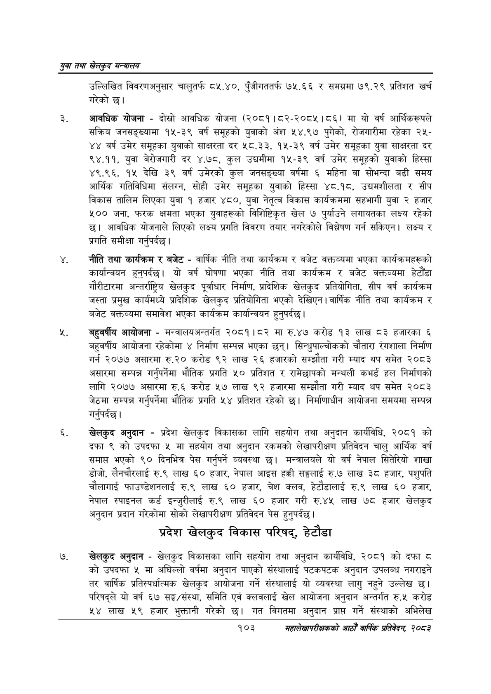

# Page 125 QA

## Rendered page


## Extracted text

```text
युवा तथा खेलकुद सन्वालय
उल्लिखित विवरणअनुसार चालुतर्फ ८५.४०, पुँजीगततर्फ ७५.६६ र समग्रमा ७९.२९ प्रतिशत खर्च गरेको छ।
आवधिक योजना -दोस्रो आवधिक योजना (२०८१।८२-२०८५।८६) मा यो वर्ष आर्थिकरूपले सक्रिय जनसङ्ख्यामा १५-३९ वर्ष समूहको युवाको अंश ५४.९७ पुगेको, रोजगारीमा रहेका २५४४ वर्ष उमेर समूहका युवाको साक्षरता दर ५८.३३, १५-३९ वर्ष उमेर समूहका युवा साक्षरता दर ९४.११, युवा बेरोजगारी दर ४.७८, कुल उच्चमीमा १५-३९ वर्ष उमेर समूहको युवाको हिस्सा ४९.९६, १५ देखि ३९ वर्ष उमेरको कुल जनसङ्ख्या वर्षमा ६ महिना वा सोभन्दा बढी समय आर्थिक गतिविधिमा संलग्न, सोही उमेर समूहका युवाको हिस्सा ४८.१८, उद्यमशीलता र सीप विकास तालिम लिएका युवा १ हजार ४८०, युवा नेतृत्व विकास कार्यक्रममा सहभागी युवा २ हजार ५०० जना, फरक क्षमता भएका युवाहरूको विशिष्टिकृत खेल ७ पुर्याउने लगायतका लक्ष्य रहेको छ। आवधिक योजनाले लिएको लक्ष्य प्रगति विवरण तयार नगरेकोले विश्लेषण गर्न सकिएन। लक्ष्य र प्रगति समीक्षा गर्नुपर्दछ |
नीति तथा कार्यक्रम र बजेट -वार्षिक नीति तथा कार्यक्रम र बजेट वक्तव्यमा भएका कार्यक्रमहरूको कार्यान्वयन हुनुपर्दछ। यो वर्ष घोषणा भएका नीति तथा कार्यक्रम र बजेट वक्तव्यमा हेटौंडा गौरीटारमा अन्तर्राष्ट्रिय खेलकुद पूर्वाधार निर्माण, प्रादेशिक खेलकुद प्रतियोगिता, सीप वर्ष कार्यक्रम जस्ता प्रमुख कार्यमध्ये प्रादेशिक खेलकुद प्रतियोगिता भएको देखिएन। वार्षिक नीति तथा कार्यक्रम र बजेट वक्तव्यमा समावेश भएका कार्यक्रम कार्यान्वयन हुनुपर्दछ |
बहुवर्षीय आयोजना -मन्त्रालयअन्तर्गत २०८१।८२ मा रु.४७ करोड १३ लाख ८३ हजारका ६ बहुवर्षीय आयोजना रहेकोमा ४ निर्माण सम्पन्न भएका छन्‌। सिन्धुपाल्चोकको चौतारा रंगशाला निर्माण गर्न २०७७ असारमा रु.२० करोड ९२ लाख २६ हजारको सम्झौता गरी म्याद थप समेत २०८३ असारमा सम्पन्न गर्नुपर्नेमा भौतिक प्रगति ५० प्रतिशत र रामेछापको मन्थली कभर्ड हल निर्माणको लागि २०७७ असारमा रु.६ करोड ५७ लाख ९२ हजारमा सम्झौता गरी म्याद थप समेत २०८३ जेठमा सम्पन्न गर्नुपर्नेमा भौतिक प्रगति ५४ प्रतिशत रहेको छ। निर्माणाधीन आयोजना समयमा सम्पन्न गर्नुपर्दछ |
खेलकुद अनुदान -प्रदेश खेलकुद विकासका लागि सहयोग तथा अनुदान कार्यविधि, २०८१ को दफा ९ को उपदफा ५ मा सहयोग तथा अनुदान रकमको लेखापरीक्षण प्रतिवेदन चालु आर्थिक वर्ष समाप्त भएको ९० दिनभित्र पेस गर्नुपर्ने व्यवस्था छ। मन्त्रालयले यो वर्ष नेपाल सितेरियो शाखा डोजो, लैनचौरलाई रु.९ लाख ६० हजार, नेपाल आइस हक्की सङ्घलाई रु.७ लाख ३८ हजार, पशुपति चौलागाई फाउण्डेशनलाई रु.९ लाख ६० हजार, चेश क्लव, हेटौडालाई रु.९ लाख ६० हजार, नेपाल स्पाइनल कर्ड इन्जुरीलाई रु.९ लाख ६० हजार गरी रु.४५ लाख ७८ हजार खेलकुद अनुदान प्रदान गरेकोमा सोको लेखापरीक्षण प्रतिवेदन पेस हुनुपर्दछ |
प्रदेश खेलकुद विकास परिषद्‌, हेटौडा
खेलकुद अनुदान -खेलकुद विकासका लागि सहयोग तथा अनुदान कार्यविधि, २०८१ को दफा ८ को उपदफा ५ मा अघिल्लो वर्षमा अनुदान पाएको संस्थालाई पटकपटक अनुदान उपलब्ध नगराइने तर वार्षिक प्रतिस्पर्धात्मक खेलकुद आयोजना गर्ने संस्थालाई यो व्यवस्था लागु नहुने उल्लेख छ। परिषद्ले यो वर्ष ६७ सङ्घ/संस्था, समिति एवं क्लवलाई खेल आयोजना अनुदान अन्तर्गत रु.५ करोड ५४ लाख ५९ हजार भुक्तानी गरेको गत विगतमा अनुदान प्राप्त गर्ने संस्थाको अभिलेख
१०३
सहालेखापरीक्षकको आठौँ वाषिकि प्रतिवेदन २०८२
```

## Flags
- None
