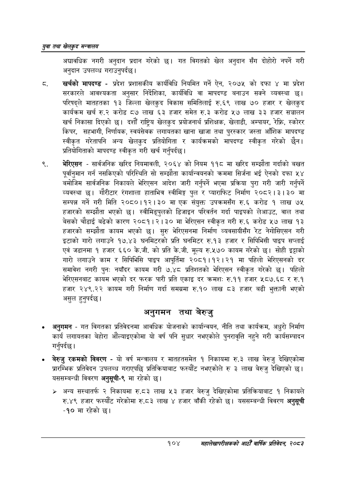

# Page 126 QA

## Rendered page


## Extracted text

```text
युवा तथा खेलकुद सन्वालय
अद्यावधिक नगरी अनुदान प्रदान गरेको छ। गत विगतको खेल अनुदान सँग दोहोरी नपर्ने गरी अनुदान उपलव्ध गराउनुपर्दछ।
खर्चको मापदण्ड -प्रदेश प्रशासकीय कार्यविधि नियमित गर्ने ऐन, २०७५ को दफा ४ मा प्रदेश सरकारले आवश्यकता अनुसार निर्देशिका, कार्यविधि वा मापदण्ड बनाउन सक्ने व्यवस्था छ। परिषद्ले मातहतका १३ जिल्ला खेलकुद विकास समितिलाई रु.६९ लाख ७० हजार र खेलकुद कार्यक्रम खर्च रु.२ करोड ८७ लाख ६३ हजार समेत रु.३ करोड ५७ लाख ३३ हजार सञ्चालन खर्च निकासा दिएको छ। दशौं राष्ट्रिय खेलकुद प्रयोजनार्थ प्रशिक्षक, खेलाडी, अम्पायर, रेफ्रि, स्कोरर किपर, सहभागी, निर्णायक, स्वयंसेवक लगायतका खाना खाजा तथा पुरस्कार जस्ता आँशिक मापदण्ड स्वीकृत गरेतापनि अन्य खेलकुद प्रतियोगिता र कार्यक्रमको मापदण्ड स्वीकृत गरेको छैन। प्रतियोगिताको मापदण्ड स्वीकृत गरी खर्च गर्नुपर्दछ |
भेरिएसन -सार्वजनिक खरिद नियमावली, २०६४ को नियम ११८ मा खरिद सम्झौता गर्दाको बखत पूर्वानुमान गर्न नसकिएको परिस्थिति सो सम्झौता कार्यान्वयनको क्रममा सिर्जना भई ऐनको दफा ५४ बमोजिम सार्वजनिक निकायले भेरिएसन आदेश जारी गर्नुपर्ने भएमा प्रक्रिया पुरा गरी जारी गर्नुपर्ने व्यवस्था छ। गौरीटार रंगशाला हाताभित्र स्वीमिङ्ग पुल र प्याराफिट निर्माण २०८२।३।३० मा सम्पन्न गर्ने गरी मिति २०८०।१२।३० मा एक संयुक्त उपक्रमसँग रु.६ करोड १ लाख ७५ हजारको सम्झौता भएको छ। स्वीमिङ्पुलको डिजाइन परिवर्तन गर्दा पाइपको लेआउट, वाल तथा बेसको चौडाई बढेको कारण २०८१।२। ३० मा भेरिएसन स्वीकृत गरी रु.६ करोड ५७ लाख ९३ हजारको सम्झौता कायम भएको छ। सुरु भेरिएसनमा निर्माण व्यवसायीसँग रेट नेगोसिएसन गरी इटाको गारो लगाउने १७.४३ घनमिटरको प्रति घनमिटर रु.१३ हजार र सिपिभिसी पाइप सप्लाई एवं जडानमा १ हजार ६६० के.जी. को प्रति के.जी. मूल्य रु.५७० कायम गरेको छ। सोही इट्टाको गारो लगाउने काम र सिपिभिसि पाइप आपूर्तिमा २०८१।१२।२१ मा पहिलो भेरिएसनको दर समावेश नगरी पुनः नयाँदर कायम गरी ७.४८ प्रतिशतको भेरिएसन स्वीकृत गरेको छ। पहिलो भेरिएसनबाट कायम भएको दर फरक पारी प्रति एकाइ दर क्रमश: रु.११ हजार ५८७.६८ र रु.१ हजार २४९.२२ कायम गरी निर्माण गर्दा समग्रमा रु.१० लाख ८३ हजार बढी भुक्तानी भएको असुल हुनुपर्दछ |
अनुगमन तथा बेरुजु
अनुगमन -गत विगतका प्रतिवेदनमा आवधिक योजनाको कार्यान्वयन, नीति तथा कार्यक्रम, अधुरो निर्माण कार्य लगायतका बेहोरा औंल्याइएकोमा यो वर्ष पनि सुधार नभएकोले पुनरावृत्ति नहुने गरी कार्यसम्पादन गर्नुपर्दछ |
बेरुजु रकमको विवरण -यो वर्ष मन्त्रालय र मातहतसमेत १ निकायमा रु.३ लाख बेरुजु देखिएकोमा प्रारम्भिक प्रतिवेदन उपलब्ध गराएपछि प्रतिक्रियाबाट फस्यौट नभएकोले रु ३ लाख बेरुजु देखिएको छ। यससम्बन्धी विवरण अनुसूची-९ मा रहेको
> अन्य सस्थातर्फ २ निकायमा रु.८३ लाख ५३ हजार बेरुजु देखिएकोमा प्रतिक्रियाबाट १ निकायले रु.४९ हजार फस्यौट गरेकोमा रु.८३ लाख ४ हजार बाँकी रहेको छ। यससम्बन्धी विवरण अनुसूची -१० मा रहेको छ।
१०४
सहालेखापरीक्षकको आठौँ वाषिकि प्रतिवेदन २०८२
```

## Flags
- None
