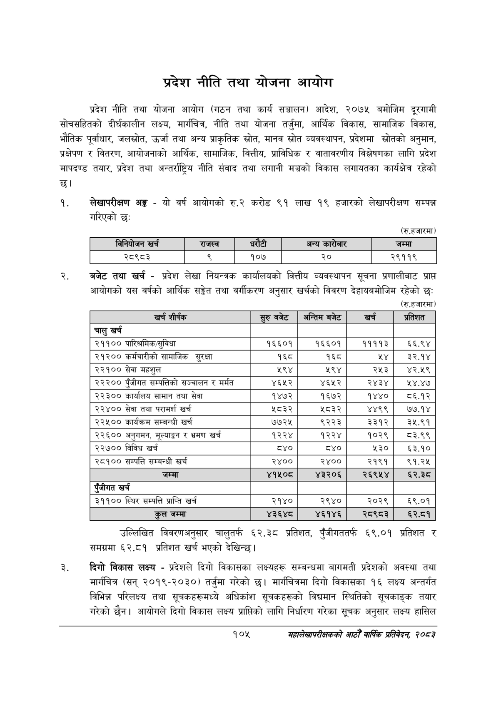

# Page 127 QA

## Rendered page


## Extracted text

```text
प्रदेश नीति तथा योजना आयोग
प्रदेश नीति तथा योजना आयोग (गठन तथा कार्य सञ्चालन) आदेश, २०७५ बमोजिम दूरगामी सोचसहितको दीर्घकालीन लक्ष्य, मार्गचित्र, नीति तथा योजना तर्जुमा, आर्थिक विकास, सामाजिक विकास, भौतिक पूर्वाधार, जलस्रोत, उर्जा तथा अन्य प्राकृतिक स्रोत, मानव स्रोत व्यवस्थापन, प्रदेशमा स्रोतको अनुमान, प्रक्षेपण र वितरण, आयोजनाको आर्थिक, सामाजिक, वित्तीय, प्राविधिक र वातावरणीय विश्लेषणका लागि प्रदेश मापदण्ड तयार, प्रदेश तथा अन्तर्राष्ट्रिय नीति संवाद तथा लगानी मञ्चको विकास लगायतका कार्यक्षेत्र रहेको छ।
लेखापरीक्षण अङ्ग -यो वर्ष आयोगको रु.२ करोड ९१ लाख १९ हजारको लेखापरीक्षण सम्पन्न गरिएको छ:
(रु.हजारमा)
बजेट तथा खर्च -प्रदेश लेखा नियन्त्रक कार्यालयको वित्तीय व्यवस्थापन सूचना प्रणालीबाट प्राप्त आयोगको यस वर्षको आर्थिक सङ्गेत तथा वर्गीकरण अनुसार खर्चको विवरण देहायबमोजिम रहेको छः
(रु.हजारमा)
उल्लिखित विवरणअनुसार चालुतर्फ ६२.३८ प्रतिशत, पुँजीगततर्फ ६९.०१ प्रतिशत र समग्रमा ६२.८१ प्रतिशत खर्च भएको देखिन्छ।
दिगो विकास लक्ष्य -प्रदेशले दिगो विकासका लक्ष्यहरू सम्बन्धमा बागमती प्रदेशको अवस्था तथा मार्गचित्र (सन्‌ २०१९-२०३०) तर्जुमा गरेको छ। मार्गचित्रमा दिगो विकासका १६ लक्ष्य अन्तर्गत विभिन्न परिलक्ष्य तथा सूचकहरूमध्ये अधिकांश सूचकहरूको विद्यमान स्थितिको सूचकाङ्क तयार गरेको छैन। आयोगले दिगो विकास लक्ष्य प्राप्तिको लागि निर्धारण गरेका सूचक अनुसार लक्ष्य हासिल
१०४५
महालेखापरीक्षकको आठौँ वाषिकि प्रतिवेदन २०८२

|  |  | नानिकोजन खर्च |  | राजस्व | ५ १ १ १ १ ५ ५२३ १३ ३२ १४ ९३.२५९१२५ अन्य ५ १ १ १ १ ६ ५६३ ७ ५६ २० १.६९५०५१ बभरेार ५ १ १ १ १ ७ ७३६ १३ ४० १४ ९५.४०२८५५ जम्मा ४ १ १ १ २ ० ८५ ४४ ७०१ १५ -१ ५ १ १ १ २ १ ८५ ४४ ६० १५ ८८.०७३५७० २८९८३ ५ १ १ १ २ २ २८४ ४४ १० १५ ४६.३६९८२७ < ५ १ १ १ २ ३ ३८९ ४४ ३५ १५ ८०.१८४४७९ १०७ ५ १ १ १ २ ४ ५५९ ४४ २२ १४ ९६.६९४८८५ २० ५ १ १ १ २ ५ ७२५ ४४ ६१ १५ ९३.०४०६७२ २९११९ |  |  |  |
| --- | --- | --- | --- | --- | --- | --- | --- | --- |
|  |  |  |  |  |  |  |  |  |

| खर्च शीर्षक | सुरु बबेट | अन्तिम बजेट | खर्च | प्रतिशत |
| --- | --- | --- | --- | --- |
| चालु खर्च |  |  |  |  |
| २११०० पारिश्रमिक/सुविधा | १६६०१ | १६६०१ | ११११३ | ६६.९४ |
| २१२०० कर्मचारीको सामाजिक सुरक्षा | १६८ | १६८ | श४ | ३े२.१४ |
| २२१०० सेवा महशुल | २९४ | ५९४ | २५३ | ४२.४५९ |
| २२२०० पुँजीगत सम्पत्तिको सञ्चालन र मर्मत | ४६५२ | ४६५२ | २४३४ | ४.४७ |
| २२३०० कार्ालष सामान तथा सेवा | १४७२ | १६७२ | १४४० | बव६.१२ |
| २२४०० सेवा तथा परामर्श खर्च | ५८३२ | ५८३२ | ४४९९ | ७७.१४ |
| २२४५०० कार्यक्रम सम्बन्धी खर्च | ७७२५ | ९२२३ | ३३१२ | ३५.९१ |
| २२६०० अनुगमन, मूल्याङ्कन र भ्रमण खर्च | १२२४ | १२२४ | १०२९ | ८३.९९ |
| २२७०० विविध खर्च | ८४० | ८४० | ५३० | ६३.१० |
| २८१०० सम्पत्ति सम्बन्धी खर्च | २४०० | २४०० | २१९१ | १९१.२५ |
| जम्मा | ४१५०८ | ४३२०६ | २६९५४ | ६२.३८ |
| पूँजीगत खर्च |  |  |  |  |
| ३११०० स्थिर सम्पत्ति प्राप्ति खर्च | २१४० | २९४० | २०२९ | ६९.०१ |
| कुल जम्मा | ४३६४८ | ४६१४६ | २८९८३ | ६२.८१ |
```

## Flags
- table_page
- low_quality_table
