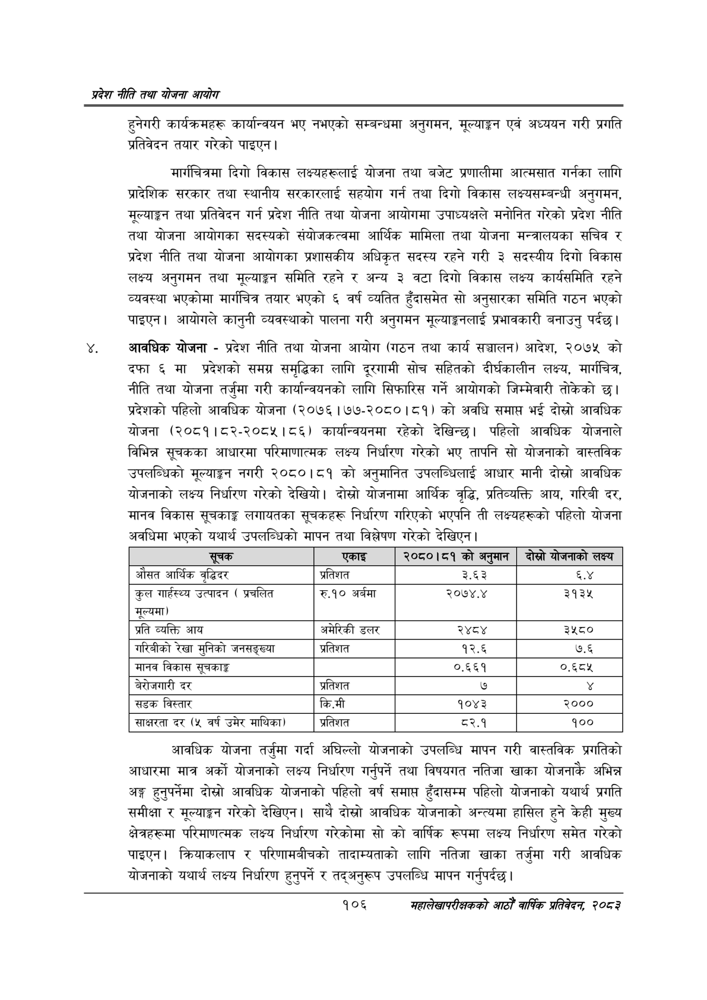

# Page 128 QA

## Rendered page


## Extracted text

```text
प्रदेश नीति तथा योजना आयोग
हुनेगरी कार्यक्रमहरू कार्यान्वयन भए नभएको सम्बन्धमा अनुगमन, मूल्याङ्कन एवं अध्ययन गरी प्रगति प्रतिवेदन तयार गरेको पाइएन |
मार्गचित्रमा दिगो विकास लक्ष्यहरूलाई योजना तथा बजेट प्रणालीमा आत्मसात गर्नका लागि प्रादेशिक सरकार तथा स्थानीय सरकारलाई सहयोग गर्न तथा दिगो विकास लक्ष्यसम्बन्धी अनुगमन, मूल्याङ्कन तथा प्रतिवेदन गर्न प्रदेश नीति तथा योजना आयोगमा उपाध्यक्षले मनोनित गरेको प्रदेश नीति तथा योजना आयोगका सदस्यको संयोजकत्वमा आर्थिक मामिला तथा योजना मन्त्रालयका सचिव र प्रदेश नीति तथा योजना आयोगका प्रशासकीय अधिकृत सदस्य रहने गरी ३ सदस्यीय दिगो विकास लक्ष्य अनुगमन तथा मूल्याङ्कन समिति रहने र अन्य ३ वटा दिगो विकास लक्ष्य कार्यसमिति रहने व्यवस्था भएकोमा मार्गचित्र तयार भएको ६ वर्ष व्यतित हुँदासमेत सो अनुसारका समिति गठन भएको पाइएन। आयोगले कानुनी व्यवस्थाको पालना गरी अनुगमन मूल्याङ्गनलाई प्रभावकारी बनाउनु पर्दछ।
. आवधिक योजना -प्रदेश नीति तथा योजना आयोग (गठन तथा कार्य सञ्चालन) आदेश, २०७५ को दफा ६ मा प्रदेशको समग्र समृद्धिका लागि दूरगामी सोच सहितको दीर्घकालीन लक्ष्य, मार्गचित्र, नीति तथा योजना तर्जुमा गरी कार्यान्वयनको लागि सिफारिस गर्ने आयोगको जिम्मेवारी तोकेको छ। प्रदेशको पहिलो आवधिक योजना (२०७६।७७-२०८०। ८१) को अवधि समाप्त भई दोस्रो आवधिक योजना (२०८१।८२-२०८५।८६) कार्यान्वयनमा रहेको देखिन्छ। पहिलो आवधिक योजनाले विभिन्न सूचकका आधारमा परिमाणात्मक लक्ष्य निर्धारण गरेको भए तापनि सो योजनाको वास्तविक उपलब्धिको मूल्याङ्गन नगरी २०८०।८१ को अनुमानित उपलब्धिलाई आधार मानी दोस्रो आवधिक योजनाको लक्ष्य निर्धारण गरेको देखियो। दोस्रो योजनामा आर्थिक वृद्धि, प्रतिव्यक्ति आय, गरिबी दर, मानव विकास सूचकाङ्क लगायतका सूचकहरू निर्धारण गरिएको भएपनि ती लक्ष्यहरूको पहिलो योजना अवधिमा भएको यथार्थ उपलब्धिको मापन तथा विश्लेषण गरेको देखिएन |
आवधिक योजना तर्जुमा गर्दा अघिल्लो योजनाको उपलब्धि मापन गरी वास्तविक प्रगतिको आधारमा मात्र अर्को योजनाको लक्ष्य निर्धारण गर्नुपर्ने तथा विषयगत नतिजा खाका योजनाकै अभिन्न अङ्ग हुनुपर्नेमा दोस्रो आवधिक योजनाको पहिलो वर्ष समाप्त हुँदासम्म पहिलो योजनाको यथार्थ प्रगति समीक्षा र मूल्याङ्कन गरेको देखिएन। साथै दोस्रो आवधिक योजनाको अन्त्यमा हासिल हुने केही मुख्य क्षेत्रहरूमा परिमाणत्मक लक्ष्य निर्धारण गरेकोमा सो को वार्षिक रूपमा लक्ष्य निर्धारण समेत गरेको पाइएन। क्रियाकलाप र परिणामबीचको तादाम्यताको लागि नतिजा खाका तर्जुमा गरी आवधिक योजनाको यथार्थ लक्ष्य निर्धारण हुनुपर्ने र तद्‌अनुरूप उपलब्धि मापन गर्नुपर्दछ |
१०६
महालेखापरीक्षकको आठौँ वाषिकि प्रतिवेदन २०८२

| स्चक | एकाइ | २०८०।८१ को अनुमान | दोस्रो थोजनाको लक्ष्य |
| --- | --- | --- | --- |
| औसत आर्थिक वृद्धिदर | प्रतिशत | ३.६३ | ६.४ |
| कुल भार्हल्थ्य उत्पादन ( प्रचलित मूल्यमा) | रु.१० अर्बमा | २०७४.४ | ३१३५ |
| प्रति व्यक्ति आय | अमेरिकी डलर | २४८४ | ३५८० |
| भरिबीको रेखा मुनिको जनसङ्ख्या | प्रतिशत | १२.६ | ७.६ |
| मानव विकास |  | ०.६६१ | ०.६८५ |
| बेरोजगारी दर | प्रतिशत | ७ |  |
| 'सडक विस्तार | कि.मी | १०४३ | २००० |
| साक्षरता दर (५ वर्ष उमेर माथिका) | प्रतिशत | ८२.१ | १०० |
```

## Flags
- table_page
- medium_quality_table
