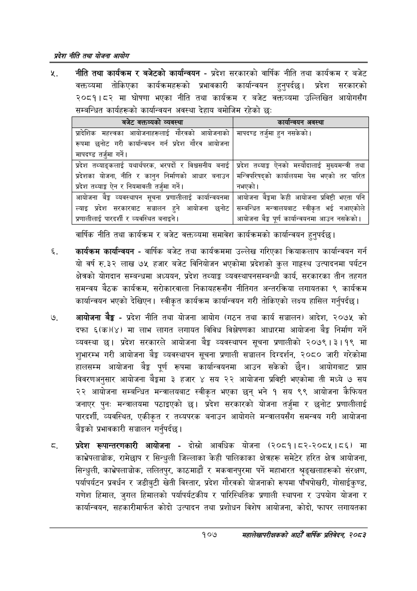

# Page 129 QA

## Rendered page


## Extracted text

```text
प्रदेश नीति तथा योजना आयोग
न्‌. नीति तथा कार्यक्रम र बजेटको कार्यान्वयन -प्रदेश सरकारको वार्षिक नीति तथा कार्यक्रम र बजेट वक्तव्यमा तोकिएका कार्यक्रमहरूको प्रभावकारी कार्यान्वयन हुनुपर्दछ। प्रदेश सरकारको २०८१।८२ मा घोषणा भएका नीति तथा कार्यक्रम र बजेट वक्तव्यमा उल्लिखित आयोगसँग सम्बन्धित कार्यहरूको कार्यान्वयन अवस्था देहाय बमोजिम रहेको छः:
वार्षिक नीति तथा कार्यक्रम र बजेट वक्तव्यमा समावेश कार्यक्रमको कार्यान्वयन हुनुपर्दछ |
कार्यक्रम कार्यान्वयन -वार्षिक बजेट तथा कार्यक्रममा उल्लेख गरिएका क्रियाकलाप कार्यान्वयन गर्न यो वर्ष रु.३२ लाख ७५ हजार बजेट विनियोजन भएकोमा प्रदेशको कुल गाहस्थ उत्पादनमा पर्यटन क्षेत्रको योगदान सम्बन्धमा अध्ययन, प्रदेश तथ्याङ्क व्यवस्थापनसम्बन्धी कार्य, सरकारका तीन तहगत समन्वय बैठक कार्यक्रम, सरोकारवाला निकायहरूसँग नीतिगत अन्तरक्रिया लगायतका ९ कार्यक्रम कार्यान्वयन भएको देखिएन। स्वीकृत कार्यक्रम कार्यान्वयन गरी तोकिएको लक्ष्य हासिल गर्नुपर्दछ |
आयोजना बैङ्क -प्रदेश नीति तथा योजना आयोग (गठन तथा कार्य सञ्चालन) आदेश, २०७५ को दफा ६(क)(४) मा लाभ लागत लगायत विविध विश्लेषणका आधारमा आयोजना बैङ्क निर्माण गर्ने व्यवस्था छ। प्रदेश सरकारले आयोजना बैङ्क व्यवस्थापन सूचना प्रणालीको २०७९।३।१९ मा शुभारम्भ गरी आयोजना बैङ्क व्यवस्थापन सूचना प्रणाली सञ्चालन दिग्दर्शन, २०८० जारी गरेकोमा हालसम्म आयोजना बेङ्ग पूर्ण रूपमा कार्यान्वयनमा आउन सकेको छैन। आयोगबाट प्राप्त विवरणअनुसार आयोजना बैङ्कमा ३ हजार ४ सय २२ आयोजना प्रविष्टी भएकोमा ती मध्ये ७ सय २२ आयोजना सम्बन्धित मन्त्रालयबाट स्वीकृत भएका छन्‌ भने १ सय ९९ आयोजना कैफियत जनाएर पुन: मन्त्रालयमा पठाइएको छ। प्रदेश सरकारको योजना तर्जुमा र छनोट प्रणालीलाई पारदर्शी, व्यवस्थित, एकीकृत र तथ्यपरक बनाउन आयोगले मन्त्रालयसँग समन्वय गरी आयोजना बैङ्कको प्रभावकारी सञ्चालन गर्नुपर्दछ |
प्रदेश रूपान्तरणकारी आयोजना -दोस्रो आवधिक योजना (२०८१।८२-२०८५।८६) मा काभ्रेपलाञ्चोक, रामेछाप र सिन्धुली जिल्लाका केही पालिकाका क्षेत्रहरू समेटेर हरित क्षेत्र आयोजना, सिन्धुली, काभ्रेपलाञ्चोक, ललितपुर, काठमाडौं र मकवानपुरमा पर्ने महाभारत श्रङ्खलाहरूको संरक्षण, पर्यापर्यटन प्रवर्धन र जडीबुटी खेती विस्तार, प्रदेश गौरवको योजनाको रूपमा पाँचपोखरी, गोसाईकुण्ड, गणेश हिमाल, जुगल हिमालको पर्यापर्यटकीय र पारिस्थितिक प्रणाली स्थापना र उपयोग योजना र कार्यान्वयन, सहकारीमार्फत कोदो उत्पादन तथा प्रशोधन विशेष आयोजना, कोदो, फापर लगायतका
१०७
महालेखापरीक्षकको आठौँ वाषिकि प्रतिवेदन २०८२

| बजेट बत?०५को न्यबस्था | कार्यान्वन अवस्था |
| --- | --- |
|  |  |
| आरादेशिक महत्वका आधोजनाहरूलाई गौरबको आयोजनाको रूपमा छनोट गरी कार्यान्वथन गर्न प्रदेश गौरव माषदण्ड तर्जुमा गर्ने। | माषदण्ड तर्जुमा हुन नसकेको \| |
|  |  |
| प्रदेश तथ्याङ्कलाई यथार्थषरक, भरपर्दो र विश्वसनीय वनाई | प्रदेश तथ्याङ्क ऐनको अध्योदालाई नुल्चभन्त्री तथा |
| त्रदेशका योजना, नीति र कानुन निर्माणको आधार बनाउन प्रदेश तथ्याङ्क ऐन र निषमानली तर्जुमा गर्ने। | भन्जिपरिषद्को कार्यालयमा पेस भएको तर पारित नभएको \| |
| आयोजना बैङ्क व्यवस्थापन सूचना श्रणालीलाई कार्यान्वयनमा | आयोजना बैङ्कमा केही आयोजना प्रविष्टी भएता पनि |
| ल्याइ प्रदेश सरकारबाट सञ्चालन हुने आयोजना छुनोट ज्रणालीलाई पारदर्शी र व्यवस्थित बनाइने \| | सम्बन्धित भन्त्रालबनाट स्वीकृत भई नआएकोले आयोजना बैङ्क पूर्ण कार्यान्वयनमा आउन \| |
```

## Flags
- table_page
- medium_quality_table
