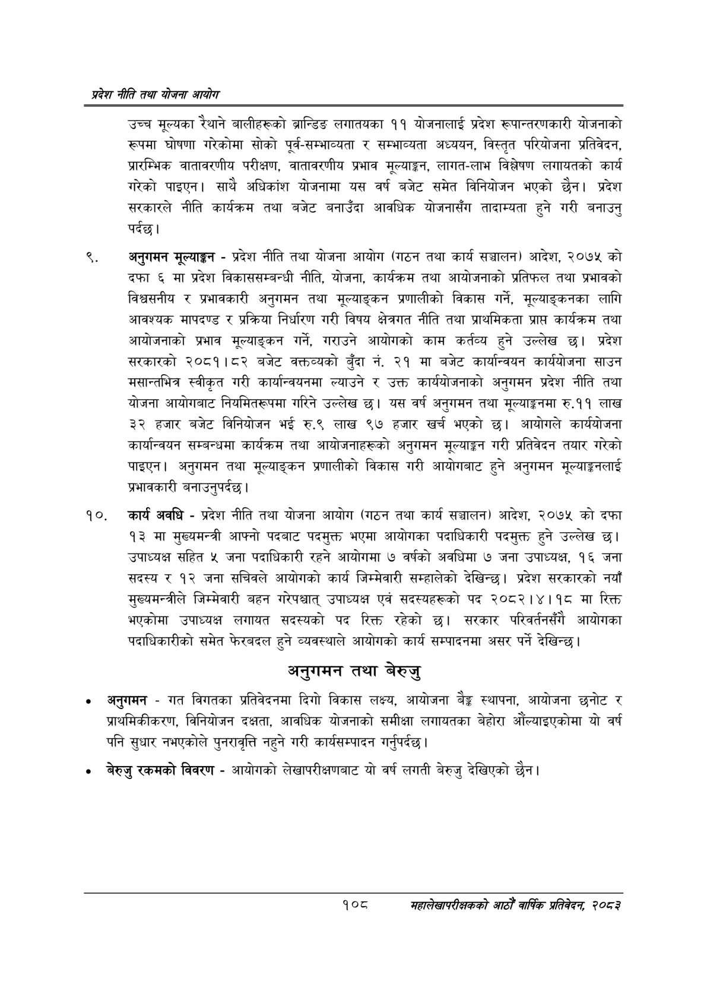

# Page 130 QA

## Rendered page


## Extracted text

```text
प्रदेश नीति तथा योजना आयोग
उच्च मूल्यका रेथाने बालीहरूको ब्रान्डिङ लगातयका ११ योजनालाई प्रदेश रूपान्तरणकारी योजनाको रूपमा घोषणा गरेकोमा सोको पूर्व-सम्भाव्यता र सम्भाव्यता अध्ययन, विस्तृत परियोजना प्रतिवेदन, प्रारम्भिक वातावरणीय परीक्षण, वातावरणीय प्रभाव मूल्याङ्कन, लागत-लाभ विश्लेषण लगायतको कार्य गरेको पाइएन। साथै अधिकांश योजनामा यस वर्ष बजेट समेत विनियोजन भएको छैन। प्रदेश सरकारले नीति कार्यक्रम तथा बजेट बनाउँदा आवधिक योजनासँग तादाम्यता हुने गरी बनाउनु पर्दछ।
अनुगमन मूल्याङ्कन -प्रदेश नीति तथा योजना आयोग (गठन तथा कार्य सञ्चालन) आदेश, २०७५ को दफा ६ मा प्रदेश विकाससम्बन्धी नीति, योजना, कार्यक्रम तथा आयोजनाको प्रतिफल तथा प्रभावको विश्वसनीय र प्रभावकारी अनुगमन तथा मूल्याङ्कन प्रणालीको विकास गर्ने, मूल्याङ्कनका लागि आवश्यक मापदण्ड र प्रक्रिया निर्धारण गरी विषय क्षेत्रगत नीति तथा प्राथमिकता प्राप्त कार्यक्रम तथा आयोजनाको प्रभाव मूल्याङ्कन गर्ने, गराउने आयोगको काम कर्तव्य हुने उल्लेख छ। प्रदेश सरकारको २०८१।८२ बजेट वक्तव्यको बुँदा नं. २१ मा बजेट कार्यान्वयन कार्ययोजना साउन मसान्तभित्र स्वीकृत गरी कार्यान्वयनमा ल्याउने र उक्त कार्ययोजनाको अनुगमन प्रदेश नीति तथा योजना आयोगबाट नियमितरूपमा गरिने उल्लेख छ। यस वर्ष अनुगमन तथा मूल्याङ्कनमा रु.११ लाख ३२ हजार बजेट विनियोजन भई रु.९ लाख ९७ हजार खर्च भएको छ। आयोगले कार्ययोजना कार्यान्वयन सम्बन्धमा कार्यक्रम तथा आयोजनाहरूको अनुगमन मूल्याङ्कन गरी प्रतिवेदन तयार गरेको पाइएन। अनुगमन तथा मूल्याङ्कन प्रणालीको विकास गरी आयोगबाट हुने अनुगमन मूल्याङ्गनलाई प्रभावकारी बनाउनुपर्दछ |
कार्य अवधि -प्रदेश नीति तथा योजना आयोग (गठन तथा कार्य सञ्चालन) आदेश, २०७५ को दफा १३ मा मुख्यमन्त्री आफ्नो पदबाट पदमुक्त भएमा आयोगका पदाधिकारी पदमुक्त हुने उल्लेख छ। उपाध्यक्ष सहित ५ जना पदाधिकारी रहने आयोगमा ७ वर्षको अवधिमा ७ जना उपाध्यक्ष, १६ जना सदस्य र १२ जना सचिवले आयोगको कार्य जिम्मेवारी सम्हालेको देखिन्छ। प्रदेश सरकारको नयाँ मुख्यमन्त्रीले जिम्मेवारी बहन गरेपश्चात्‌ उपाध्यक्ष एवं सदस्यहरूको पद २०८२।४।१व मा रिक्त भएकोमा उपाध्यक्ष लगायत सदस्यको पद रिक्त रहेको सरकार परिवर्तनसँगै आयोगका पदाधिकारीको समेत फेरबदल हुने व्यवस्थाले आयोगको कार्य सम्पादनमा असर पर्ने देखिन्छ।
अनुगमन तथा बेरुजु
अनुगमन -गत विगतका प्रतिवेदनमा दिगो विकास लक्ष्य, आयोजना बेङ्ग स्थापना, आयोजना छनोट र प्राथमिकीकरण, विनियोजन दक्षता, आवधिक योजनाको समीक्षा लगायतका बेहोरा औंल्याइएकोमा यो वर्ष पनि सुधार नभएकोले पुनरावृत्ति नहुने गरी कार्यसम्पादन गर्नुपर्दछ |
बेरुजु रकमको विवरण -आयोगको लेखापरीक्षणबाट यो वर्ष लगती बेरुजु देखिएको छैन।
१०८
महालेखापरीक्षकको आठौँ वाषिकि प्रतिवेदन २०८२
```

## Flags
- None
